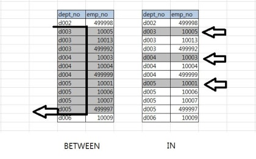
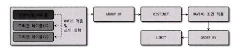
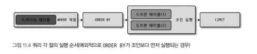
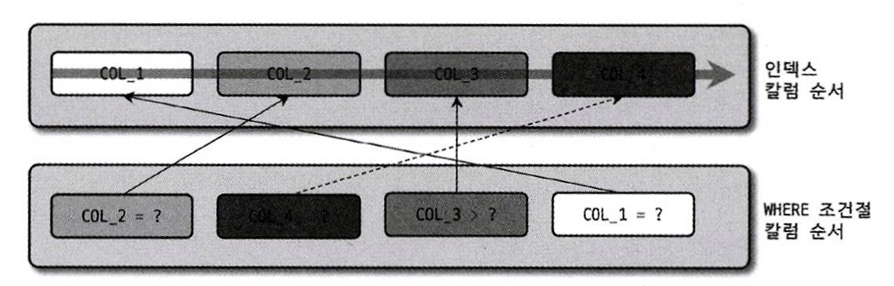
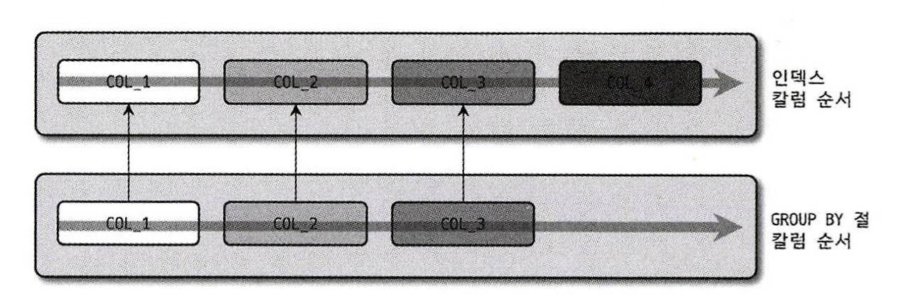
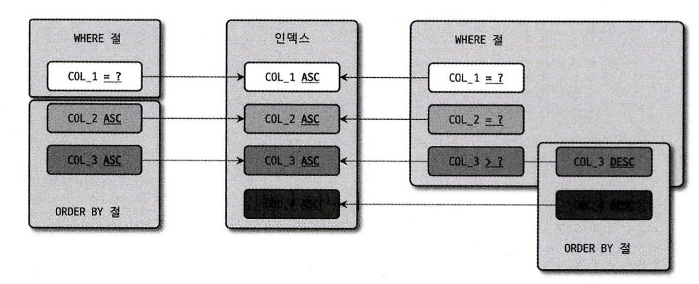
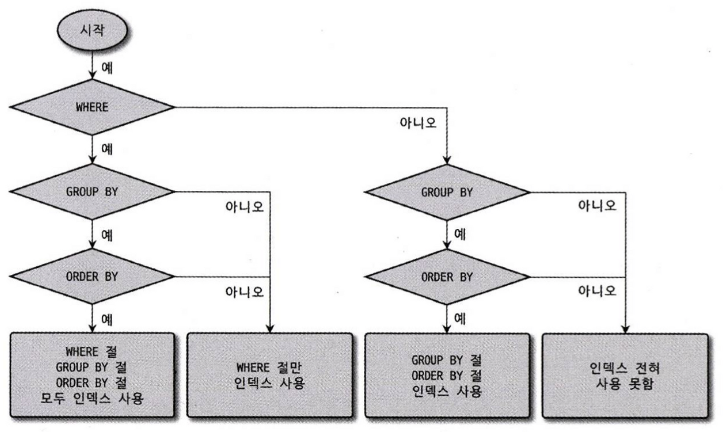
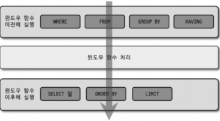

## 1. 쿼리 작성과 연관된 시스템 변수
- 대소문자 구분, 문자열 표기 방법 등과 같은 규칙은 설정에 따라 달라진다

### 1. SQL 모드
- `sql_mode`라는 시스템 설정에는 구분자(,)를 이용해 여러 개의 값이 동시에 설정될 수 있다
  - sql_mode에는 SQL 문장 작성 규칙뿐만 아니라 데이터 타입 변화 및 기본값 제어 등과 관련된 옵션도 있다
  - 테이블을 생성하고 데이터를 저장했다면 sql_mode 내용을 변경하지 않는 것이 좋다
  - 기본값
    - ONLY_FULL_GROUP_BY
    - STRICT_TRANS_TABLES
    - NO_ZERO_IN_DATE
    - NO_ZERO_DATE
    - ERROR_FOR_DIVISION_BY_ZERO
    - NO_ENGINE_SUBSTITUTION

- STRICT_ALL_TABLES & STRICT_TRANS_TABLES
  - INSERT나 UPDATE 문장으로 데이터를 변경하는 경우 타입이 다를 경우 자동으로 타입 변경을 수행한다
  - TRANS는 TRANSACTION의 약자로 InnoDB같은 트랜잭션을 지원하는 스토리지 엔진에만 엄격한 모드로 적용한다
  - STRICT_ALL_TABLES는 모든 스토리지 엔진에 대해 엄격한 모드로 적용한다
- ANSI_QUOTES
  - MySQL은 홑따옴표, 쌍따옴표 모두 문자열로 인식하지만, 해당 기능을 사용하면 홑따옴표만 문자열 값 표기로 사용할 수 있다
- ONLY_FULL_GROUP_BY
  - SELECT 절에 명시된 모든 컬럼이 GROUP BY 절에 또는 집합 함수로 사용되어야 한다
- PIPE_AS_CONCAT
  - MySQL에서 `||`는 OR 연산자로 사용되지만 해당 값을 설정하면 연결 연산자(CONCAT)로 사용할 수 있다
- PAD_CHAR_TO_FULL_LENGTH
  - CHAR은 VARCHAR와 같이 공백 문자는 제거되어 반환되지만 해당 값을 설정하면 공백 문자를 포함하여 반환한다
- NO_BACKSLASH_ESCAPES
  - 백슬래시(\)를 이스케이프 문자로 사용하지 않는다
- IGNORE_SPACE
  - 프로시저나 함수명과 괄호 사이의 공백을 무시한다
  - 해당 옵션이 활성화되면 내장 함수는 모두 예약어로 간주되어 테이블이나 칼럼의 이름으로 사용될 수 없다
- REAL_AS_FLOAT
  - REAL 타입이 FLOAT 타입의 동의어로 바뀐다
- NO_ZERO_IN_DATE & NO_ZERO_DATE
  - 두 옵션이 활성화 되면 `2020-00-00` 또는 `0000-00-00` 같은 잘못된 날짜를 저장하는 것이 불가능해진다
- ANSI
  - 앞에서 설명한 여러 가지 옵션을 조합해서 최대한 SQL 표준에 맞게 동작하게 만들어준다
  - ANSI 모드는 `REAL_AS_FLOAT, PIPES_AS_CONCAT, ANSI_QUOTES, IGNORE_SPACE, ONLY_FULL_GROUP_BY`조합이다
- TRADITIONAL
  - `STRICT_TRANS_TABLES`, `STRICT_ALL_TABLES`와 비슷하지만 더 엄격한 방법으로 경고로 처리되던 상황이 모두 에러로 바뀐다

### 2. 영문 대소문자 구분
- 윈도우는 대소문자를 구분하지 않지만 유닉스 계열은 대소문자를 구분한다
- 운영체제와 관계없이 대소문자 구분의 영향을 받지 않게 하려면 `lower_case_table_names` 시스템 변수를 설정해야한다
- `lower_case_table_names`의 설정값
  - 0(기본값): 대소문자를 구분한다
  - 1: 모두 소문자로만 저장된다
  - 2: 저장은 대소문자를 구분하지만 쿼리에서는 구분하지 않게 해준다

### 3. MySQL 예약어
- 예약어와 같은 키워드로 생성하려면 역따옴표나 쌍따옴표로 감싸야 한다
- MySQL의 예약어는 꽤 많으며, 예약어별로 문제가 되지 않는 키워들도 있어 역따옴표로 둘러싸지 않고 생성하는 것이 좋다

## 2. 매뉴얼의 SQL 문법 표기를 읽는 방법
- 대문자를 키워드를 의미한다
- 밑에 나열된 value나 value_list는 상세한 문법을 설명해준다
- 대괄호([])는 키워드나 표현식 자체가 선택 사항임을 의미한다
- 파이프(|)는 앞과 뒤의 키워드나 표현식 중에서 단 하나만 선택해서 사용할 수 있음을 의미한다
- 중괄호({})는 괄호 내의 아이템 중에서 반드시 하나를 사용해야 하는 경우를 의미한다
- `...`는 앞에 명시된 키워드나 표현식의 조합이 반복될 수 있음을 의미한다

```sql
INSERT [LOW_PRIORITY | DELAYED | HIGH_PRIORITY] [IGNORE]
    [INTO] tbl_name
    [PARTITION (partition_name [, partition_name] ...)]
    [(col_name [, col_name] ...)]
    { {VALUES | VALUE} (value_list) [, (value_list)] ... }
    [AS row_alias[(col_alias [, col_alias] ...)]]
    [ON DUPLICATE KEY UPDATE assignment_list]

value:
    {expr | DEFAULT}

value_list:
    value [, value] ...

row_constructor_list:
    ROW(value_list)[, ROW(value_list)][, ...]

assignment:
    col_name = 
          value
        | [row_alias.]col_name
        | [tbl_name.]col_name
        | [row_alias.]col_alias

assignment_list:
    assignment [, assignment] ...
```

## 3. MySQL 연산자와 내장 함수
- MySQL 전용 연산자와 ANSI 표준 연산자가 있다

### 1. 리터럴 표기법 문자열

#### 1). 문자열
- SQL 표준에서는 홑따옴표를 사용하지만 MySQL에서는 쌍따옴표도 문자열로 인식한다
- ANSI_QUOTES를 설정하면 쌍따옴표는 문자열에 사용할 수 없고 예약어 충돌을 피하기 위해 역따옴표가 아닌 쌍따옴표를 사용해야 한다

#### 2). 숫자
- 따옴표없이 숫자 값을 입력하면 되고 따옴표를 사용하더라도 숫자 타입이라면 자동 변환한다
```sql
-- 첫 번째 쿼리는 상수값을 숫자로 변환하는데, 상숫값을 변환하므로 성능과 관련된 문제가 발생하지 않는다
SELECT * FROM tab_test WHERE number_column = '10001';
-- 문자열이 숫자로 변환해서 비교를 수행해야 하므로 인덱스가 있더라도 이를 이용하지 못한다
SELECT * FROM tab_test WHERE string_column = 10001;
```

#### 3). 날짜
- 정해진 형태의 날짜 포맷을 표기하면 자동으로 DATE나 DATETIME 값으로 변환해준다
```sql
-- 두 쿼리의 차이점은 없다
SELECT * FROM dept_emp WHERE from_date = '2011-04-29';
SELECT * FROM dept_emp WHERE from_date=STR_TO_DATE('2011-04-29', '%Y-%m-%d');
```

#### 4). 불리언
- BOOL이나 BOOLEAN 타입이 있지만 사실 TINYINT 타입에 대한 동의어일 뿐이다
- C/C++ 언어처럼 TRUE, FALSE를 정수로 매핑해서 사용한다
- 주의할 점은 TRUE는 1만 의미한다

### 2. MySQL 연산자
#### 1). 동등(Equal) 비교(=, <=)
- 동등 비교에는 `=`와 `<=>`가 있다
- `<=>`는 `=`과 같지만 NULL 값에 대한 비교까지 수행한다
  - NULL은 `IS NULL` 연산자 이외에 비교할 방법이 없지만 `<=>`를 사용하면 NULL과 NULL을 비교할 수 있다

#### 2). 부정(Not-Euqal) 비교
- `<>`, `!=` 둘 다 사용이 가능하다

#### 3). NOT 연산자(!)
- 연산의 결과를 반대로 만드는 연산자이다
- `NOT`, `!` 모두 사용이 가능하다

#### 4). AND(&&)와 OR(||) 연산자
- 오라클에서는 `||`을 문자열 결합 연산자(CONCAT)으로 사용한다
  - `sql_mode`를 PIPE_AS_CONCAT으로 설정하면 `||`을 문자열 결합 연산자로 사용할 수 있다
  - 이렇게 설정하면 `||`는 OR 연산자로는 사용할 수 없게 된다
- SQL 가독성을 위해 AND 나 OR을 사용하는 것이 좋다

#### 5). 나누기(/, DIV)와 나머지(%, MOD) 연산자
- 나누기 연산자는 `/`이고 정수 부분만 가져오려면 `DIV` 연산자를 사용한다
- 결과 몫이 아닌 나머지를 가져오는 연산자는 `%` 또는 `MOD`연산자를 사용한다

#### 6). REGEXP 연산자
- 정규 표현식을 연산자이다
- 인덱스 레인지 스캔을 사용할 수 없으므로 주의하는 것이 좋다
- `SELECT 'abc' REGXEP '^[x-z]';`

#### 7). LIKE 연산자
- 인덱스를 사용할 수 있도록 할 수 있다
- 사용할 수 있는 와일드카드로는 `%`와 `_`가 있다
- `%`는 0개 이상의 문자를 의미하고, `_`는 정확히 1개의 문자를 의미한다

#### 8). BETWEEN 연산자
- 크다와 작다 비교를 하나로 묶어둔 것으로 `IN`과는 다른 형태로 인덱스를 사용한다
- 필터 조건절(IN 같은 동등조건)을 먼저하고 범위 조건절(BETWEEN)을 나중에 처리하는 것이 성능에 좋다


#### 9). IN 연산자
- 여러 번의 동등 비교로 실행하기 떄문에 빠르게 처리된다
- 튜플과 `IN (subquery)` 최적화가 많이 안정됐다
- `NOT IN`의 경우 인덱스를 효과적으로 사용할 수 없고 가끔 인덱스 레인지 스캔이라고 표시되기도 하지만 실제로 효율적으로 실행되는 것을 의미하지는 않는다

### 3. MySQL 내장함수
- 내장함수와 사용자 정의함수로 구분된다
- 내장함수나 사용자 정의 함수는 스토어드 프로그램으로 작성되는 프로시저나 스토어드 함수와는 다르다

#### 1). NULL 값 비교 및 대체(IFNULL, ISNULL)
- IFNULL
  - 두 개의 인자를 전달하는데, 첫 번째가 NULL인지 확인하고 NULL이면 두 번째 인자를 반환한다
  - NULL이 아니면 첫 번째 인자를 반환한다
  - `SELECT IFNULL(NULL, 1); -> 1`
- ISNULL
  - 인자가 NULL이면 1을 반환하고 NULL이 아니면 0을 반환한다
  - `SELECT ISNULL(NULL); -> 1`

#### 2). 현재 시각 조회(NOW, SYSDATE)
- NOW(): 하나의 SQL내에서는 같은 값을 가진다
- SYSDATE(): 호출되는 시점에 따라 결과값이 달라진다
- NOW를 사용하는 것이 좋지만 이미 사용했을 경우 설정 파일(my.ini)에 sysdate-is-now를 활성화하면 NOW()와 동일하게 작동한다

```sql
-- 2초 동안 멈춘 후 다시 SYSDATE()를 호출하면 다른 값을 반환한다
SELECT SYSDATE(), SLEEP(2), SYSDATE();
```

#### 3). 날짜와 시간의 포맷(DATE_FORMAT, STR_TO_DATE)
- 지정자를 통해 필요한 포맷 또는 필요한 부분만 문자열로 변환할 수 있다
- 표준 형태(yyyy-MM-dd HH:mm:ss)로 입력된 경우 자동으로 `DATETIME` 타입으로 변환된다

| 포맷 | 의미 | 예시 결과 |
|------|------|----------|
| %Y | 4자리 연도 | 2026 |
| %m | 월 (2자리, 00~12) | 03 |
| %d | 일 (2자리, 01~31) | 04 |
| %H | 시 (24시간, 00~23) | 21 |
| %i | 분 (00~59) | 07 |
| %s | 초 (00~59) | 05 |

```sql
SELECT DATE_FORMAT(NOW(), '%Y-%m-%d') AS current_dt;

SELECT STR_TO_DATE('2020-08-23 15:06:45', '%Y-%m-%d %H:%i:%s') AS current_dt;
```

#### 4). 날짜와 시간의 연산(DATE_ADD, DATE_SUB)
- 날짜와 시간을 연산할 때 사용하고, `DATE_ADD()`로 더하거나 빼는 처리를 모두 할 수 있다
- 첫번째 인자에 연산을 수행할 날짜, 두 번째 인자는 계산하고 싶은 월의 수나 일자의 수 등을 입력하면 된다
- `SELECT DATE_ADD(NOW(), INTERVAL 1 DAY) AS tomorrow;`

#### 5). 타임스탬프 연산(UNIX_TIMESTAMP, FROM_UNIXTIME)
- UNIX_TIMESTAMP(): `1970-01-01 00:00:00`을 기준으로 지난 시간을 초 단위로 반환한다
  - `SELECT UNIX_TIMESTAMP();`
  - `SELECT UNIX_TIMESTAMP('2020-08-23 15:06:45');`
- FROM_UNIXTIME(): `UNIX_TIMESTAMP()`의 반대로 타임스탬프 값을 `DATETIME` 타입으로 변환한다
  - `SELECT FROM_UNIXTIME(1709539545);`

#### 6). 문자열 처리(RPAD, LPAD / RTRIM, LTRIM, TRIM)
- RPAD()와 LPAD()는 좌측 또는 우측에 문자를 붙여서 지정된 길이의 문자열로 만드는 함수이다
  - `SELECT RPAD('Cloee', 10, '_')`
- TRIM은 연속된 공백 문자(Space, NewLine, Tab)을 제거하는 함수이다

#### 7). 문자열 결합(CONCAT)
- 여러 개의 문자열을 연결해 하나의 문자열로 반환하는 함수다.
- 비슷한 함수로 `CONCAT_WS`가 있는데, 각 문자열을 연결할 때, 구분자를 넣어준다
  - `SELECT CONCAT_WS(',', 'Cloee', 'Lee', 'Park'); -> Cloee,Lee,Park`

#### 8). GROUP BY 문자열 결합(GROUP_CONCAT)
- COUNT, MAX 등과 같은 그룹 함수 중 하나이다
- 주로 GROUP BY와 함께 사용하며, GROUP BY로 묶인 데이터를 하나의 문자열로 결합한다
- 값들을 먼저 정렬한 후 연결하거나 각 값의 구분자 설정, 중복 제거하고 연결하는 등 다양한 처리를 할 수 있다
- 제한적인 메모리 버퍼 공간을 사용하고 지정된 크기를 초과할 경우 JDBC는 에러로 취급되어 실패한다
  - `group_concat_max_len`으로 크기를 조정하고 기본값은 1KB이며 래터럴 조인이나 윈도우 함수를 이용할 수 있다

```sql
SELECT GROUP_CONCAT(dept_no) FROM departments

SELECT GROUP_CONCAT(dept_no SEPARATOR ',') 
FROM departments
WHERE emp_no BETWEEN 10001 AND 10005

-> d009,d005,d003,d002,d001

SELECT GROUP_CONCAT(DISTINCT dept_no ORDER BY dept_no DESC SEPARATOR '|') 
FROM departments
WHERE emp_no BETWEEN 10001 AND 10005

-> d009|d005|d003|d002|d001
```

#### 9). 값의 비교와 대체(CASE WHEN .. THEN .. END)
- 동등 비교 또는 비교 연산자등 여러 조건으로 사용할 수 있다
- CASE WHEN으로 서브쿼리를 감싸면 필요한 경우에만 서브쿼리를 실행할 수 있다

```sql
SELECT emp_no, first_name,
      CASE WHEN hire_date < '1995-01-01' THEN 'Old'
      ELSE 'New' END AS employee_type
FROM employees
LIMIT 10;

SELECT emp_no, first_name,
      CASE WHEN 'M' THEN 'Man'
      WHEN 'F' THEN 'Woman'
      ELSE 'Unknown' END AS gender
FROM employees
LIMIT 10;
```

#### 10). 타입의 변환(CAST, CONVERT)
- 프리페어 스테이트먼트를 제외하면 SQL은 텍스트 기반으로 작동하기 때문에 모든 입력값은 문자열로 취급된다
- 명시적으로 타입 변환이 필요하면 `CAST()`함수를 이용하면 된다.
  - `CONVERT()`함수도 비슷하며 인자 사용 규칙만 조금 다르다
- CONVERT는 DATE, TIME, DATETIME, BINARY, CHAR, SIGNED INTENGER, UNSIGNED INTENGER만 변환할 수 있다

```sql
SELECT CAST('1234' AS SIGNED INTEGER) AS converted_integer;
SELECT CAST('2000-01-01' AS DATE) AS converted_date;

SELECT CONVERT('ABC' USING 'utf8mb4');
```

#### 11). 이진값과 16진수 문자열(Hex String)변환(HEX, UNHEX)
- `HEX()`함수는 이진값을 16진수 문자열로 변환한다
- `UNHEX()`함수는 16진수 문자열을 이진값으로 변환한다

#### 12). 암호화 및 해시 함수(MD5, SHA, SHA2)
- SHA는 SHA-1 알고리즘을 쓰며 160비트 해시 값을 반환한다
- SHA2는 224비트 ~ 512비트 해시 값을 반환한다
- MD5는 메시지 다이제스트 알고리즘을 사용해 128비트 해시 값을 반환한다
- 저장공간을 줄이고 싶다면 바이너리로 데이터타입을 변환하고 위에 있는 함수를 이용해 바이너리를 저장하면 된다

```sql
SELECT MD5('abc')
SELECT SHA('abc')

SELECT HEX(MD5('abc'))
```

#### 14). 벤치마크(BENCHMARK)
- 디버깅이나 성능 테스트용으로 사용한다
- 첫 번째 인자는 반복 횟수, 두 번째 인자는 실행할 SQL문을 입력한다
- 10번 반복하더라도 단 1번의 네트워크, 쿼리 파싱 및 최적화 비용이 소요된다는 점을 고려해야 한다

```sql
SELECT BENCHMARK(1000000, (SELECT COUNT(*) FROM employees));
```

#### 15). IP 주소 변환(INET_ATON, INET_NTOA)
- IPv4를 문자열이 아닌 정수 타입으로 저장할 수 있게 한다
- INET6_ATON, INET6_NTOA을 이용하면 IPv4와 IPv6 주소도 변환할 수 있다
- IP주소를 저장하고자 한다면 BINARY 또는 VARBINARY 타입을 사용해야 하는데, VARBINARY을 권장한다

```sql
SELECT HEX(INET6_ATON('fdfe::5a55:caff:fefa:9089'));
SELECT INET6_NTOA(UNHEX('fdfe00005a55cafffeaf9089'));
```

#### 18). JSON 필드 추출(JSON_EXTRACT)
- JSON 특정 필드의 값을 가져오는 함수이다
- 첫 번째 인자는 JSON 데이터가 저장된 칼럼 또는 JSON 도큐먼트 자체이며, 두 번쨰 인자는 가져오고자 하는 필드의 JSON 경로이다

```sql
SELECT JSON_EXTRACT(doc, "$.first_name") FROM employee_docs;

-- JSON_EXTRACT는 결과를 따옴표가 붙는데, 이 함수는 따옴표를 제거한다
SELECT JSON_UNQUOTE(JSON_EXTRACT(doc, "$.first_name")) FROM employee_docs;

-- 람다도 제공한다
SELECT doc -> "$.first_name" FROM employee_docs;

-- JSON_UNQUOTE와 JSON_EXTRACST를 조합한 것과 같다
SELECT doc -> "$.first_name" FROM employee_docs;
```

#### 19). JSON 오브젝트 포함 여부 확인(JSON_CONTAINS)
- JSON 데이터를 가지고 있는지 확인한다

```sql
-- 해당 데이터에 두번째 인자가 존재하는지 검사한다
SELECT emp_no FROM employee_docs 
WHERE JSON_CONTAINS(doc, '{"first_name": "John"}');

-- 세 번째 인자가 있다면 해당 경로에 JSON 오브젝트가 존재하는지 검사한다
SELECT emp_no FROM employee_docs 
WHERE JSON_CONTAINS(doc, '"Christian"', '$.first_name');
```

#### 20). JSON 오브젝트 생성(JSON_OBJECT)
- RDBMS 칼럼 값을 이용해 JSON 오브젝트를 생성한다

```sql
SELECT 
  JSON_OBJECT("empNo", emp_no,
              "salary", salary) AS as_json
FROM employees
LIMIT 10;
```

#### 21). JSON 칼럼으로 집계(JSON_OBJECTAGG & JSON_ARRAYAGG)
- `GROUP BY`와 사용되는 집계함수로 RDBMS 칼럼 값들을 모아 JSON 오브젝트나 JSON 배열로 반환한다

```sql
-- 첫 번째인자가 키, 두 번째 인자가 값으로 해서 키-밸류 쌍으로 JSON 도큐먼트를 만든다
SELECT dept_no, JSON_OBJECTAGG(emp_no, first_name) AS employees
FROM employees
GROUP BY dept_no;

-- 하나의 인자를 필요로 하며 해당 값으로 JSON 배열을 만든다
SELECT dept_no, JSON_ARRAYAGG(emp_no) AS employees
FROM employees
GROUP BY dept_no;
```

#### 22). JSON 데이터를 테이블로 변환(JSON_TABLE)
- JSON 데이터로 RDBMS 테이블로 만든다
- 항상 임시테이블을 이용하기 때문에 많이 저장되지 않도록 주의해야 한다

```sql
SELECT e2.emp_no, e2.first_name, e2.gener
FROM employee_docs e1,
  JSON_TABLE(doc, "$" COLUMN (emp_no INT PATH "$.emp_no",
                              first_name VARCHAR(50) PATH "$.first_name",
                              gener VARCHAR(1) PATH "$.gender")) e2
```

## 4. SELECT

### 1. SELECT 절의 처리 순서
- 실행 순서를 벗어나는 쿼리가 필요하다면 서브쿼리로 작성된 인라인 뷰를 사용해야 한다
- 하지만 인라인 뷰를 사용할 경우 임시 테이블이 사용되기 때문에 주의해야 한다

```sql
SELECT s.emp_no, COUNT(DISCOUNT e.first_name) AS cnt
FROM salaries s
JOIN employees e ON s.emp_no = e.emp_no
WHERE s.salary > 60000
GROUP BY s.emp_no
HAVING COUNT(e.first_name) > 1
ORDER BY s.emp_no
LIMIT 10;
```





- 예외적으로 GROUP BY 절 없이 ORDER BY만 사용된 쿼리에서는 위와 같이 실행될 수 있다

### 2. WHERE 절과 GROUP BY 절, ORDER BY 절의 인덱스 사용
- 각 절에서 어떤 요건을 갖췄을 떄 인덱스를 이용할 수 있는지 확인해보자

#### 1). 인덱스를 사용하기 위한 기본 규칙
- 칼럼 값을 변환하지 않고 그대로 사용해야 한다
  - `MD5()`와 같이 해시 값을 만들어서 비교해야 할 경우 가상 칼럼을 추가하고 함수 기반 인덱스를 사용하면 된다
- WHERE절의 비교 조건에서는 양쪽의 데이터 타입이 일치해야 한다
  - 숫자값이 먼저이기 때문에 `ingeter_column = '2'`일 경우에는 상관없다

#### 2). WHERE 절의 인덱스 사용
- WHERE 조건이 인덱스를 사용하는 방법은 크게 작업 범위 결정 조건과 체크 조건으로 구분할 수 있다
  - 작업 범위 결정은 동등 비교나 IN으로 구성된 조건이 인덱스 순서와 비교했을 때 얼마나 일치하느냐에 따라 달라진다
- WHERE 조건은 GROUP BY나 ORDER BY와 달리 순서는 중요하지 않고 인덱스가 있는지가 중요하다



- `COL_3`이 비교조건으로 사용됐기 때문에 `COL_4`는 체크 조건으로 사용된다

```sql
SELECT *
FROM employees
WHERE first_name = 'John' OR last_name = 'Doe';
```

- `first_name`에 인덱스가 있어도 `last_name`이 인덱스를 사용할 수 없다면 풀 테이블 스캔을 사용하게 된다
  - (인덱스 레인지 스캔) + (풀 테이블 스캔)보다 그냥 풀 테이스 스캔이 더 빠르기 때문이다
  - 물론 각각 인덱스가 있다면 `ingex_merge`로 실행할 수 있다

#### 3). GROUP BY 절의 인덱스 사용
- 비교 연산자를 가지지 않으므로 작업 범위나 체크 조건을 구분해서 생각할 필요없다
- 인덱스를 구성하는 순서와 같으면 인덱스를 이용할 수 있다


- GROUP BY 절에 명시된 칼럼이 인덱스 칼럼의 순서와 위치가 같아야 한다
- WHERE 조건절과 달리 GROUP BY 절에 명시된 칼럼이 하나라도 없으면 인덱스를 이용하지 못한다
- 뒤쪽에 있는 칼럼은 GROUP BY 절에 명시하지 않아도 되지만 앞쪽에 있는 칼럼은 GROUP BY 절에 명시되어야 한다

```sql
-- WHERE절과 GROUP BY절을 혼용해서 사용할 수 있 다
WHERE COL_1 = 'value' AND COL_2 = 'value'
GROUP BY COL_3, COL_4
```

#### 4). ORDER BY 절의 인덱스 사용
- GROUP BY와 비슷하지만 조건이 하나 더 있다
  - 오름차순 및 내림차순 옵션이 인덱스와 같거나 정반대일 경우에만 사용할 수 있다
  - 정렬 순서가 생략되면 오름차순(ASC)으로 해석된다

#### 5). WHERE 조건과 ORDER BY(또는 GROUP BY)절의 인덱스 사용
- WHERE 조건은 A 인덱스를 사용하고 ORDER BY는 B 인덱스를 사용하도록 할 순 없다
- 중간에 빠지는 칼럼이 있다면, 주로 WHERE 절만 인덱스를 이용할 수 있다
- WHERE 절과 ORDER BY 절이 같이 사용된 쿼리는 3가지 중 한 가지 방법으로만 이용한다
  - WHERE절과 ORDER BY 절이 같이 인덱스를 이용
    - 두 개의 절이 하나의 인덱스를 사용할 때 사용할 수 있다
  - WHERE 절만 인덱스를 이용
    - 인덱스를 통해 검색된 결과를 별도의 정렬 처리를 거쳐 수행한다
  - ORDER BY 절만 인덱스 이용
    - ORDER BY 순서대로 인덱스를 읽으면서 레코드 한 건씩 WHERE 조건을 확인한다



```sql
-- COL_1이 범위 조건이지만 ORDER BY에서 해당 컬럼을 명시했으므로 인덱스를 사용할 수 있다
SELECT * FROM tb_test
WHERE COL_1 > 10
ORDER BY COL_1, COL_2, COL_3;

-- COL_1이 범위조건이고 ORDER BY에서 해당 칼럼이 없으므로 인덱스를 사용할 수 없다
SELECT * FROM tb_test
WHERE COL_1 > 10
ORDER BY COL_2, COL_3;
```

#### 6). GROUP BY 절과 ORDER BY 절의 인덱스 사용
- GROUP BY 절과 ORDER BY에 명시된 칼럼의 순서와 내용이 모두 똑같아야 한다
- 둘 중 하나라도 인덱스를 이용할 수 없을 경우 둘 다 인덱스를 사용할 수 없다
- 8.0부터 GROUP BY 절이 정렬까지 보장하지 않기 때문에 그루핑과 정렬을 모두 원할경우 모두 명시해야 한다

#### 7). WHERE 조건과 ORDER BY 절, GROUP BY 절의 인덱스 사용



### 3. WHERE 절의 비교 조건 사용 시 주의사항
- 최적으로 실행되려면 적합한 인덱스와 함께 비교 표현식을 적절하게 사용해야 한다

#### 1). NULL 비교
- MySQL은 NULL도 하나의 값으로 인정하고 인덱스로 관리한다
  - SQL표준에서는 NULL은 비교할 수 없는 값이라 두 값이 동등한지 비교하는 것이 불가능하다
  - 그래서 NULL인지 비교하려면 `IS NULL` 또는 `<=>` 연산자를 사용해야 한다

```sql
-- 첫번째와 두번째는 인덱스 레인지 스캔을 사용할 수 있지만
-- 세번째와 네번째는 인덱스나 테이블 풀스캔으로 처리된다
SELECT * FROM tb_test WHERE COL_1 IS NULL;
SELECT * FROM tb_test WHERE ISNULL(COL_1);
SELECT * FROM tb_test WHERE ISNULL(COL_1) = 1;
SELECT * FROM tb_test WHERE ISNULL(COL_1) = true;
```

#### 2). 문자열이나 숫자 비교
- 문자열 칼럼이나 숫자 칼럼을 비교할 때는 그 타입에 맞는 상숫값을 사용할 것을 권장한다
- 숫자 칼럼에 문자열 리터럴을 한다면 문제 없지만, 문자열 칼럼에 숫자 리터럴을 한다면 숫자가 우선이기 때문에 인덱스를 사용하지 못한다

#### 3). 날짜 비교
- MySQL에서는 DATE, DATETIME, TIMESTAMP 타입 등이 있다

#### (1). DATE 또는 DATETIME과 문자열 비교
- 문자열과 비교할 때는 자동으로 `DATETIME` 타입으로 변환해서 수행한다
- 그래서 굳이 `STR_TO_DATE('2011-07-23', '%Y-%m-%d');`를 사용안해도 된다
- 날짜 포맷 변환이나 연산작업으로 변형을 하면 인덱스를 사용할 수 없다
  - `WHERE DATE_FORMAT(hire_date, '%Y-%m-%d') > '2011-07-23'`
  - `WHERE DATE_ADD(hire_date, INTERVAL 1 YEAR) > '2011-07-23'`

#### (2). DATE와 DATETIME의 비교
- DATE값을 DATETIME으로 변환해서 비교를 수행한다
  - `2011-06-30` -> `2011-06-30 00:00:00`
- DATETIME과 DATE타입의 비교에서 타입변환은 인덱스 사용 여부에 영향을 미치지 않기 때문에 성능보다는 쿼리의 결과에 주의해서 사용하면 된다

#### (3). DATETIME과 TIMESTAMP의 비교
- 실행계획도 인덱스 레인지 스캔을 사용하는 것처럼 보이지만 사실은 그렇지 않다
- 칼럼의 데이터 타입대로 변환해서 비교해야 한다
  - 칼럼이 DATETIME 이라면 `TIMESTAMP`값을 DATETIME 타입으로 만들어서 비교해야 한다
  - 칼럼이 TIMSTAMP라면 `UNIX_TIMESTAMP`함수를 이용해 TIMESTAMP로 변환해서 비교해야 한다

#### (4). Short-Curcuit Evaluation
- 선행 표현식 결과에 따라 후행 표현식을 평가할지 말지를 결정하는 최적화를 말한다
  - `if ( false && has_modified() ){}` -> 앞선 결과가 false라면 뒤에있는 함수는 실행하지 않는다
- WHERE절에서 AND로 나열된 조건의 순서에 따라 성능이 달라진다
- 인덱스를 사용할 수 있다면 `Short-Curcuit Evaluation`과 무관하게 그 조건을 최우선으로 사용하게 되고, 풀 테이블 스캔일 경우 조건의 순서가 중요하다

```sql
SELECT * FROM salaries
WHERE to_date < '1985-01-01'
AND CONVERT_TZ(from_date, '+00:00', '+09:00') > '1991-01-01'
=> 0.73 sec

SELECT * FROM salaries
WHERE CONVERT_TZ(from_date, '+00:00', '+09:00') > '1991-01-01'
AND to_date < '1985-01-01'
=> 0.52 sec
```

### 4. DISTINCT
- 특정 칼럼의 유니크한 값을 조회하기 위해 사용한다
- 조인 쿼리를 작성하는 경우 1:1인지 1:M인지 잘 확인해서 사용해야 의도대로 결과가 나온다

### 5. LIMIT n
- 지정된 순서에 위치한 레코드만 가져올 때 사용한다
- LIMIT에서 필요한 레코드 건수만 준비되면 즉시 쿼리를 종료한다
- `GROUP BY` 또는 `ORDER BY`와 함꼐 쓸 경우 해당 절이 완료되어야 LIMIT를 진행하기 때문에 실질적인 작업 내용을 크게 줄여주지는 못한다
  - 인덱스를 이용해 처리할 수 있다면 필요한 만큼만 레코드를 읽게 하기 때문에 작업량을 상당히 줄여준다
- `LIMIT n, m으로 사용할 수도 있다
  - n은 몇번째 부터 시작할 것인지, m은 몇 개를 가져올 것인지를 나타낸다
  - 페이징 처리시 사용할 때도 있는데 n개를 다 읽은 후 m개를 가져오기 때문에 `WHERE`로 찾고 가져오는 것이 효율적이다

```sql
-- 1. employees 테이블에서 where절에 일치하는 레코드를 전부 읽는다
-- 2. first_name 칼럼에 따라 정렬한다
-- 3. 정렬된 결과에서 상위 5건만 반환한다
SELECT * 
FROM employees
ORDER BY first_name
LIMIT 0, 5;
```

### 6. COUNT()
- 레코드 건수를 반환함수로 `*`을 사용할 수 있지만 이는 모든 칼럼이 아니라 레코드 자체를 의미한다
  - `COUNT(프라이머리 키 칼럼)`, `COUNT(1)`과 동일한 성능을 보인다
- InnoDB에서는 데이터나 인덱스를 읽어야만 레코드 건수를 가져올 수 있기 떄문에 큰 테이블에서는 주의해야 한다
- `COUNT()`함수에 컬럼명이나 표현식이 인자로 사용되면 NULL이 아닌 레코드 건수만 반환한다
  - `COUNT(column1)`을 사용할 경우 column1이 NULL이 아닌 레코드 건수를 가져온다

>#### 흔히하는 실수
> LEFT JOIN이나 ORDER BY같이 레코드 건수에 차이가 없을 경우 제거하는 것이 좋다
> 8.0부터는 ORDER BY는 무시한다

### 7. JOIN

#### 1). JOIN의 순서와 인덱스
- 인덱스 레인지 스캔은 인덱스 탐색과 인덱스 스캔으로 구분할 수 있다
  - 조인 작업에서 드라이빙 테이블은 인덱스 탐색은 한 번만 수행하고, 그 이후부터는 스캔만 실행하면 된다
  - 드리븐 테이블에서는 인덱스 탐색 작업과 스캔 작업을 드라이빙 테이블 레코드 건수만큼 반복된다
  - 그래서 옵티마이저는 드리븐 테이블을 최적으로 읽을 수 있게 실행 계획을 세운다

```sql
-- 둘 다 인덱스가 있을 경우 통계 정보의 레코드 건수에 따라 드라이빙, 드리븐 테이블을 선택한다
-- employees에만 인덱스가 있을 경우 dept_emp을 드라이빙으로 하고 employees를 드리븐으로 선택한다
-- dept_emp만 인덱스가 있는 경우 위에 있는 경우와 반대로 처리된다 (반복된 풀 스캔을 피하기 위해서이다)
-- 두 칼럼 모두 인덱스가 없는 경우 레코드 건수가 적은 테이블을 드라이빙 테이블로 선택한다

SELECT *
FROM employees e, dept_emp de
WHERE e.emp_no = de.emp_no;
```

#### 2). JOIN 칼럼의 데이터 타입
- WHERE에서의 데이터 타입을 동일하게 사용해야 되는 것과 같은 이유이다
- 데이터 타입이 일치하지 않으면 인덱스를 효율적으로 이용할 수 없다
- 대표적으로 문제가 되는 상황
  - CHAR 타입과 INT 타입의 비교 등 데이터 타입이 완전히 다른 경우
  - 같은 CHAR 타입이더라도 문자 집합이나 콜레이션이 다른 경우
  - 같은 INT 타입이더라도 부호의 존재 여부가 다른 경우

#### 3). OUTER JOIN의 성능과 주의사항
- 아우터 조인하는 테이블은 드라이빙 테이블로 선택하지 못하기 때문에 쿼리의 성능이 떨어질 수 있다
  - 이너 조인으로 사용해도 되는 쿼리를 아우터로 작성하면 옵티마이저가 조인 순서를 변경하면서 수행하는 최적화의 기회를 빼앗게 된다
- 아우터 조인을 작성하면서 WHERE절도 함꼐 명시하는 경우에는 `INNER JOIN`으로 실행해버린다
  - 아우터 조인으로 하려면 WHERE절의 조건을 JOIN의 ON절로 옮겨야 한다

```sql
SELECT * FROM employees e 
LEFT JOIN dept_emp de ON e.emp_no = de.emp_no 
WHERE de.dept_no = 'd001';

-- 예외적으로 안티 조인효과를 기대하는 경우에는 WHERE절을 적어도 된다
-- 아래 쿼리는 매니저가 아닌 사용자들만 조회하는 쿼리인데 이런 경우에는 WHERE절을 적어도 된다
SELECT *
FROM employees e
LEFT JOIN dept_manager dm ON dm.emp_no = e.emp_no
WHERE dm.emp_no IS NULL;
LIMIT 10;
```

#### 5)> 지연된 조인(Delayed Join)
- 조인이 실행되기 전에 `GROUP BY`나 `ORDER BY`를 처리하는 방식을 의미한다
- 주로 LIMIT가 함께 사용된 쿼리에서 더 큰 효과를 얻을 수 있다
- 임시 테이블을 사용하지만 레코드 건수가 확실히 줄기 때문에 더 빠르게 실행된다

```sql
SELECT e.*
FROM (SELECT s.emp_no
      FROM salaries s
      WHERE s.emp_no BETWEEN 10001 AND 13000
      GROUP BY s.emp_no
      ORDER BY SUM(s.salary) DESC
      LIMIT 10) x,
      employees e
WHERE x.emp_no = e.emp_no;
```

#### 6). 래터럴 조인(Lateral Join)
- 8.0부터 래터럴 조인 기능을 이용해 특정 그룹별 서브쿼리를 실행해서 조인하는 것이 가능해졌다
- 일반 서브쿼리(derived table)는 외부 컬럼을 참조할 수 없지만 LATERAL을 붙이면 왼쪽 테이블 컬럼을 참조 가능하다
- LATERAL 키워드를 가진 서브쿼리는 조인 순서상 후순위이고, 레코드 단위로 임시 테이블이 생성되기 때문에 꼭 필요한 경우에만 사용해야 한다

```sql
-- 아래 쿼리는 이름이 `Matt`인 사원에 대해 사원별로 가장 최근 급여 변경 내역을 최대 2건씩 반환한다
SELECT *
FROM employees e
LEFT JOIN LATERAL (SELECT *
                   FROM salaries s
                   WHERE s.emp_no = e.emp_no
                   ORDER BY s.from_date DESC LIMIT 2) s2 ON s2.emp_no = e.emp_no
WHERE e.first_name = 'Matt';
```

#### 7). 실행 계획으로 인한 정렬 흐트러짐
- 8.0부터 해시 조인이 도입돼서 순서가 다르게 출력된다
  - 여전히 네스티드 루프 방식으로 조인되면 드라이빙 테이블을 읽는 순서대로(인덱스) 조회된다
- 정렬된 결과가 필요하다면 ORDER BY절을 명시적으로 사용해야 된다

### 8. GROUP BY
#### 1). WITH ROLLUP
- 그루핑과 그룹별로 소계를 가져올 수 있는 `롤업`기능을 사용할 수 있다
  - 단순히 최종 합만 가져오는 것이 아니라 GROUP BY에 사용된 칼럼의 개수에 따라 소계의 레벨이 달라진다
  - 엑셀의 피벗 테이블과 거의 동일하다고 생각하면 된다
- 그룹 레코드에 표시되는 NULL을 사용자가 변경할 수 있게 GROUPING() 함수도 지원한다

```sql
-- dept_no 칼럼 1개만 있기 때문에 소계가 1개만 존재하고 dept_no 칼럼값은 NULL로 표기됐다
SELECT dept_no, COUNT(*)
FROM dept_emp
GROUP BY dept_no WITH ROLLUP;

d001	20211
d002	17346
d003	17786
d004	73485
d005	85707
d006	20117
d007	52245
d008	21126
d009	23580
	    331603

SELECT
	IF(GROUPING(first_name), 'All first_name', first_name) AS first_name,
	IF(GROUPING(last_name), 'All last_name', last_name) AS last_name,
	count(*)
FROM employees
group by first_name, last_name with rollup;
```

#### 8). 레코드를 칼럼으로 변환해서 조회
- `CASE WHEN... END`으로 칼럼으로 변환시킬 수 있다
  - 엑셀의 피봇테이블과 동일하다

##### (1). 레코드를 칼럼으로 변환

```sql
SELECT
  SUM(CASE WHEN dept_no='d001' THEN emp_count ELSE 0 END) AS count_d001,
  SUM(CASE WHEN dept_no='d002' THEN emp_count ELSE 0 END) AS count_d002,
  SUM(CASE WHEN dept_no='d003' THEN emp_count ELSE 0 END) AS count_d003,
  SUM(CASE WHEN dept_no='d004' THEN emp_count ELSE 0 END) AS count_d004,
  SUM(CASE WHEN dept_no='d005' THEN emp_count ELSE 0 END) AS count_d005,
  SUM(CASE WHEN dept_no='d006' THEN emp_count ELSE 0 END) AS count_d006,
  SUM(CASE WHEN dept_no='d007' THEN emp_count ELSE 0 END) AS count_d007,
  SUM(CASE WHEN dept_no='d008' THEN emp_count ELSE 0 END) AS count_d008,
  SUM(CASE WHEN dept_no='d009' THEN emp_count ELSE 0 END) AS count_d009,
  SUM(emp_count) AS total
FROM (
  SELECT dept_no, COUNT(*) AS emp_count
  FROM dept_emp
  GROUP BY dept_no
) AS subquery;
```

#### (2). 하나의 칼럼을 여러 칼럼으로 분리

```sql
SELECT
  SUM(CASE WHEN e.hire_date BETWEN '1980-01-01' AND '1989-12-31' THEN 1 ELSE 0 END) AS cnt_1980,
  SUM(CASE WHEN e.hire_date BETWEN '1990-01-01' AND '1999-12-31' THEN 1 ELSE 0 END) AS cnt_1990,
  SUM(CASE WHEN e.hire_date BETWEN '2000-01-01' AND '2009-12-31' THEN 1 ELSE 0 END) AS cnt_2000,
FROM dept_emp de, employees e
WHERE de.emp_no = e.emp_no
GROUP BY dept_no;
```

### 9. ORDER BY
- ORDER BY를 사용하지 않으면 아래와 같은 순서로 정렬된다
  - 인덱스를 사용한 경우 인덱스 순서대로 정렬
  - 풀 테이블 스캔을 하는 경우 프라이머리 키 순서대로 레코드를 가져온다
  - 임시 테이블을 거쳐 처리되면 순서를 예측하기 어렵다
- `ORDER BY`가 없는 경우 어떠한 정렬도 보장하지 않는다

#### 1). ORDER BY 사용법 및 주의사항
- 정렬할 대상은 칼럼명이나 표현식으로 명시하거나 칼럼의 순번을 명시할 수 있다
  - `ORDER BY 2`라고 적는 경우 SELECT 칼럼 중 2번째 칼럼으로 정렬하라는 의미가 된다
  - `ORDER BY "last_name"`라고 적는 경우 옵티마이저는 ORDER BY 절 자체를 무시한다 (문자 리터럴이기 때문이다)
  - MySQL 기본모드는 쌍따옴표는 문자열 리터럴이기 때문에 문자열은 ORDER BY에서 무시된다

#### 3). 함수나 표현식을 이용한 정렬
- 하나 또는 여러 칼럼의 연산 결과를 이용해 정렬하는 것도 가능하다
- 8.0부터 함수 기반 인덱스를 지원하기 때문에 연산의 결괏값을 기준으로 정렬하는 작업이 인덱스를 사용하도록 튜닝하는 것이 가능해졌다

### 10. 서브쿼리
- 사용되는 위치에 따라 쿼리의 성능 영향도와 MySQL 서버의 최적화 방법은 달라진다

#### 1). SELECT 절에 사용된 서브쿼리
- 임시 테이블을 만들거나 쿼리를 비효율적으로 실행하지 않기 때문에 적절히 인덱스를 사용할 수 있다면 크게 **주의할 사항은 없다**
- 로우 서브쿼리를 사용할 수 없고(여러 개의 칼럼) 오로지 스칼라 서브쿼리만 사용할 수 있다
- 서브쿼리보다 조인이 조금 더 빠르기 때문에 가능하다면 조인으로 바꾸는 것이 좋다

```sql
-- 8.버전부터 도입된 래터럴 조인을 이용하면 레코드의 각 칼럼을 가져오기 위해 서브쿼리를 사용하지 않아도 된다
SELECT 
  (SELECT s.sarlary FROM salaries s
   WHERE s.emp_no = e.emp_no
   ORDER BY s.from_date DESC LIMIT 1) AS salary,

   (SELECT s.from_date FROM salaries s
   WHERE s.emp_no = e.emp_no
   ORDER BY s.from_date DESC LIMIT 1) AS salary_from_date,

   (SELECT s.to_date FROM salaries s
   WHERE s.emp_no = e.emp_no
   ORDER BY s.from_date DESC LIMIT 1) AS salary_to_date,
   FROM employees e
   WHERE e.emp_no = 499999;

-- LATERAL 조인을 이용한 쿼리
SELECT e.emp_no, e.first_name,
       s2.salary, s2.from_date, s2.to_date
FROM employees e
INNER JOIN LATERAL (
  SELECT * FROM salaries s
  WHERE s.emp_no = e.emp_no
  ORDER BY s.from_date DESC
  LIMIT 1) S2 ON s2.emp_no = e.emp_no
WHERE e.emp_no = 499999;
```

#### 2). FROM 절에 사용된 서브쿼리
- 5.7부터 옵티마이저가 FROM 절의 서브쿼리를 외부 쿼리로 병합하는 최적화를 수행한다
- 몇몇 상황에서는 외부 쿼리로 병합하지 못한다
  - 집합 함수 사용(SUM(), MIN(), MAX() 등)
  - DISTINCT
  - GROUP BY 또는 HAVING
  - LIMIT
  - UNION(UNION DISTINCT) 또는 UNION ALL
  - SELECT 절에 서브쿼리가 사용된 경우
  - 사용자 변수 사용(사용자 변수에 값이 할당되는 경우)

#### 3). WHERE 절에 사용된 서브쿼리
- 다양한 형태(연산자)로 사용될 수 있는데 크게 3가지가 있다
  - 동등 또는 크다 작다 비교(= (subquery))
  - IN 비교(IN (subquery))
  - NOT IN 비교(NOT IN (subquery))

#### (1). 동등 또는 크다 작다 비교
- 5.5 버전부터는 서브쿼리를 먼저 실행한 후 상수로 변환하고 서브쿼리를 대체하여 처리한다
- 동등 대신 크다 또는 작다 비교를 사용해도 동일하다
- 하지만 튜플 형태는 아직 최적화가 완벽하지 않기 때문에 주의해야 한다

#### (2). IN 비교 (IN (subquery))
- WHERE 절에 사용된 IN 형태의 조건을 세미 조인이라고 본다
- 세미 조인 최적화는 쿼리 특성이나 조인 관계에 맞게 5개의 최적화 전략을 사용한다
  - 테이블 풀-아웃
  - 퍼스트 매치
  - 루스 스캔
  - 구체화
  - 중복 제거

#### (3). NOT IN 비교(NOT IN (subquery))
- 안티 세미 조인으로 최적화할 수 있는 방법이 많지 않다
- 안티 세미 조인 쿼리가 사용되면 다음 두 가지 방법으로 최적화를 수행한다
  - NOT EXISTS
  - 구체화
- 두 가지 모두 성능 향상에 도움이 되지 않으므로 다른 조건으로 검색 범위를 좁힐 수 있게 하는 것이 좋다

### 11. CTE(Common Table Expression)
- 임시 테이블로 SQL 문장이 종료되면 자동으로 삭제된다
- 재귀적 반복 실행 여부를 기준으로 Non-recursive CTE와 Recursive CTE로 나뉜다
- 다양한 SQL 문장에서 사용할 수 있다
  - SELECT, UPDATE, DELETE 문장 제일 앞쪽 `WITH cte1 AS (SELECT ...) SELECTS ...`
  - 서브쿼리의 제일 앞쪽 `SELECT ... FROM (WITH cte1 AS (SELECT ...) SELECTS ...)`
  - SELECT 절의 바로 앞쪽 `INSERT ... WITH cte1 AS (SELECT ...) SELECTS ...`

#### 1). 비 재귀적 CTE(Non-Recursive CTE)
- WITH 절로 정의하고 바로 뒤에 **이름**을 정의한다
- 임시 테이블은 한 번만 사용되기 때문에 FROM 절의 서브쿼리로 바꿔 사용할 수 있다
- CTE은 FROM 절에 사용되던 서브쿼리에 비해 3가지 장점이 있다
  - CTE 임시 테이블은 재사용 가능하므로 FROM 절의 서브쿼리보다 효율적이다
  - CTE로 선언된 임시 테이블은 다른 CTE 쿼리에서 참조할 수 있다
  - CTE는 임시 테이블의 생성 부분과 사용 부분의 코드를 분리할 수 있으므로 가독성이 좋다
  
```sql
-- 두 쿼리는 실행 계획까지 동일하게 사용한다
WITH cte1 AS 
  (SELECT * FROM departments) 
SELECT * FROM cte1;

SELECT *
FROM (SELECT * FROM departments) cte1;
```

#### 2). 재귀적 CTE(Recursive CTE)
- 비 재귀적 파트와 재귀적 파트의 칼럼이 다른 경우 **비 재귀적 파트**에 정의된 결과를 사용한다

```sql
1. CTE 쿼리의 비 재귀적 파트 쿼리를 실행
2. 1번 결과를 이용해 cte라는 임시 테이블 생성
3. 1번 결과를 cte라는 임시 테이블에 저장
4. 1번 결과를 입력으로 사용해 CTE 쿼리의 재귀적 파트를 실행
5. 4번의 결과를 cte라는 임시 테이블에 저장
6. 전 단계의 결과를 입력으로 사용해 CTE 쿼리의 재귀적 파트 쿼리를 실행
7. 6번 단계에서 쿼리 결과가 없으면 CTE 쿼리를 종료
8. 6번의 결과를 cte라는 임시 테이블에 저장
9. 6번으로 돌아가서 반복 실행
WITH RECURSIVE cte(no) AS(
  SELECT 1
  UNION ALL
  SELECT (no + 1) FROM cte WHERE no < 5
)
SELECT * FROM cte
```

### 12. 윈도우 함수(Window Function)
- 조회하는 현재 레코드를 기준으로 연관된 레코드 집합의 연산을 수행한다
- 집계 함수는 GROUP BY별로 하나의 레코드로 묶어서 출력하지만 윈도우 함수는 일치하는 레코드 건수는 변하지 않고 유지한다
  - 결과 집합은 그대로 유지하면서 하나의 레코드 연산에 다른 레코드의 칼럼값을 참조할 수 있다

#### 1). 쿼리의 각 절의 실행 순서
- 아래 순서를 벗어나는 쿼리를 작성하고 싶으면 서브쿼리를 사용해야 한다



#### 2). 윈도우 함수 기본 사용법
- `AGGREGATE_FUNC() OVER(<partition> <order>) AS widnow_func_column`
- OVER 절을 이용해 연산 대상을 파티션하기 위한 옵션을 명시할 수 있고, 이렇게 만들어진 그룹을 파티션 또는 윈도우라고 한다

```sql
SELECT e.*,
  RANK() OVER(ORDER BY e.hire_date) AS hire_date_rank
FROM employees e;

-- 부서별로 입사 순위를 매기고 싶을 때 파티션을 사용하면 된다
SELECT de.dept_no, e.emp_no, 
  RANK() OVER(PARTITION BY de.dept_no ORDER BY e.hire_date) AS hire_date_rank
FROM employees e
JOIN dept_emp de ON de.emp_no = e.emp_no
ORDER BY de.dept_no, e.hire_date;
```

- 각 파티션 안에서도 연산을 수행할 소그룹이 사용되는데 이를 **프레임**이라고 한다
- 프레임을 명시적으로 지정하지 않아도 상황에 맞게 묵시적으로 선택한다
- 프레임은 레코드 순서대로 현재 레코드 기준 앞뒤 몇 건을 연산 범위로 제한하는 역할을 한다

```sql
AGGREGATE_FUNC() OVER(<partition> <order> <frame>) AS window_func_column
frame: {ROWS | RANGE} {frame_start | frame_between}
frame_between: BETWEEN frame_start AND frame_end

frame_start, frame_end: {
  CURRENT ROW -> 현재 레코드
  | UNBOUNDED PRECEDING -> 파티션의 첫 번째 레코드
  | UNBOUNDED FOLLOWING -> 파티션의 마지막 레코드
  | expr PRECEDING -> 현재 레코드로부터 n번째 이전 레코드
  | expr FOLLOWING -> 현재 레코드로부터 n번째 이후 레코드
}
```
- 프레임을 만드는 기준으로 ROWS와 RANGE 중 하나를 선택할 수 있다

```sql
SELECT emp_no, from_date, salary,
  -- 현재 레코드의 from_date를 기준으로 1년 전부터 지금까지 급여 중 최소 급여
  MIN(salary) OVER(ORDER BY from_date RANGE INTERVAL 1 YEAR PRECEDING) AS min_1
  -- 현재 레코드의 from_date를 기준으로 1년 전부터 2년 후까지의 급여 중 최대 급여
  MIN(salary) OVER(ORDER BY from_date RANGE BETWEEN INTERVAL 1 YEAR PRECEDEING AND INTERVAL 2 YEAR FOLLWING) AS max_1,
  -- from_date 기준으로 정렬 후, 첫 번째 레코드로부터 현재 레코드까지의 평균
  AVG(salary) OVER(ORDER BY from_date ROWS UNBOUNDED PRECEDING) AS avg_1,
  -- from_date 칼럼으로 정렬 후 현재 레코드를 기준으로 이전 건부터 이후 레코드까지의 급여 평균
  AVG(salary) OVER(ORDER BY from_date ROWS BETWEEN 1 PRECEDING AND 1 FOLLOWING) AS avg_2
FROM salaries
WHERE emp_no = 10001;
```

#### 3). 윈도우 함수
- 윈도우 함수는 집계 함수와 비 집계 함수를 모두 사용할 수 있다
  - 집계 함수: GROUP BY 절과 함께 사용하는 함수들을 의미하는데, `OVER()`절 없이 단독으로도 사용될 수 있다
  - 비 집계 함수: 반드시 `OVER()`절을 가지고 있어야 하며 윈도우 함수로만 사용될 수 있다

##### (1). 집계 함수

| 함수명 | 설명 |
|---|---|
| `SUM()` | 파티션(그룹) 내 값들의 합계를 계산 |
| `AVG()` | 파티션 내 값들의 평균 계산 |
| `COUNT()` | 파티션 내 행(row)의 개수 계산 |
| `MIN()` | 파티션 내 최소값 반환 |
| `MAX()` | 파티션 내 최대값 반환 |
| `STDDEV()` | 파티션 내 표준편차 계산 |
| `STDDEV_POP()` | 모집단 표준편차 계산 |
| `STDDEV_SAMP()` | 표본 표준편차 계산 |
| `VAR_POP()` | 모집단 분산 계산 |
| `VAR_SAMP()` | 표본 분산 계산 |
| `VARIANCE()` | 분산 계산 |

##### (2). 비집계 함수

| 함수명              | 설명                             |
| ---------------- | ------------------------------ |
| `ROW_NUMBER()`   | 파티션 내에서 행 번호를 순서대로 부여          |
| `RANK()`         | 동일 값이 있으면 같은 순위 부여 후 다음 순위 건너뜀 |
| `DENSE_RANK()`   | 동일 값이 있어도 순위를 건너뛰지 않음          |
| `NTILE(n)`       | 파티션을 n개의 그룹으로 나눔               |
| `LAG()`          | 이전 행의 값을 가져옴                   |
| `LEAD()`         | 다음 행의 값을 가져옴                   |
| `FIRST_VALUE()`  | 파티션에서 첫 번째 값 반환                |
| `LAST_VALUE()`   | 파티션에서 마지막 값 반환                 |
| `NTH_VALUE()`    | 파티션에서 N번째 값 반환                 |
| `CUME_DIST()`    | 누적 분포 값 반환                     |
| `PERCENT_RANK()` | 백분위 순위 반환                      |

#### 4). 윈도우 함수와 성능
- 8.0에 처음 도입되었으며 인덱스를 이용한 최적화가 아직은 부족하다
- 온라인 트랜잭션 처리에서는 많은 레코드에 윈도우 함수를 적용하는 것은 가능하면 피하는 것이 좋다

### 13. 잠금을 사용하는 SELECT
- InnoDB는 잠금 없는 읽기를 사용한다
- 잠금이 필요할 때가 있는데 이때 사용하는 옵션이 `FOR SHARE`와 `FOR UPDATE`이다
  - FOR SHARE: SELECT 쿼리로 읽은 레코드에 대해서 읽기 잠금을 건다
    - 해당 레코드를 변경하지 못하게 하지만 읽는 것은 가능하다
  - FOR UPDATE: SELECT 쿼리가 읽은 레코드에 대해서 쓰기 잠금을 건다
    - 레코드 변경뿐만 아니라 락을 사용한 읽기(FOR SHARE 절을 사용하는 SELECT 쿼리)도 수행할 수 없다
- 두 옵션 모두 트랜잭션이 시작된 상태에서만 잠금이 유지된다

```sql
SELECT * FROM employees
WHERE emp_no = 10001 FOR SHARE;

SELECT * FROM employees
WHERE emp_no = 10001 FOR UPDATE;
```

#### 1). 잠금 테이블 선택
```sql
-- 아래 쿼리는 3개 테이블 모두 쓰기 잠금을 걸게 된다
SELECT * 
FROM employees e
JOIN dept_emp de ON de.emp_no = e.emp_no
JOIN departments d ON d.dept_no = de.dept_no
FOR UPDATE

-- 테이블을 선택해서 잠금할 수 있다
SELECT * 
FROM employees e
JOIN dept_emp de ON de.emp_no = e.emp_no
JOIN departments d ON d.dept_no = de.dept_no
FOR UPDATE OF e
```

#### 2). NOWAIT & SKIP LOCKED
- 8.0부터 레코드가 잠긴 경우 무시하고 진행하게 할 수 있다
  - 기본 SELECT 쿼리는 잠금 대기 자체가 없어서 `NOWAIT`옵션을 사용하는 의미가 없다
- NOWAIT: 해당 레코드가 잠겨진 상태라면 에러를 반환하면서 즉시 종료된다
- SKIP LOCKED: 잠긴 레코드는 무시하고 잠금이 걸리지 않은 레코드만 가져온다

```sql
SELECT *
FROM emp_no = 10001
FOR UPDATE NOWAIT;

SELECT *
FROM emp_no = 10001
FOR UPDATE SKIP LOCKED;
```

> #### 참고
> SKIP LOCKED 절을 확정적이지 않은 쿼리라고 하는데, 이는 실행 시점마다 다른 결과를 반환한다는 의미이다
> 이렇게 비확정적인 쿼리는 문장(STATEMENT) 기반 복제에서 소스 서버와 레플리카 서버의 데이터를 다르게 만들 수 있다
> 가능하다면 바이너리 로그 포맷으로 STATEMENT 보다는 ROW 또는 MIXED를 사용하자