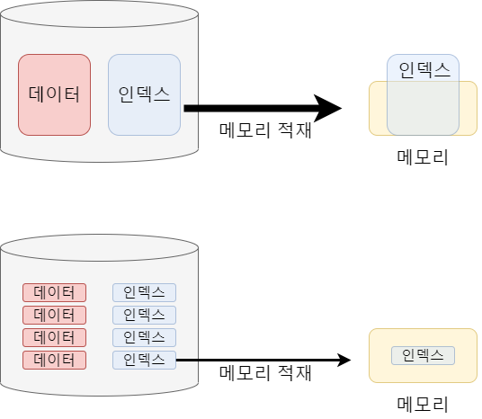
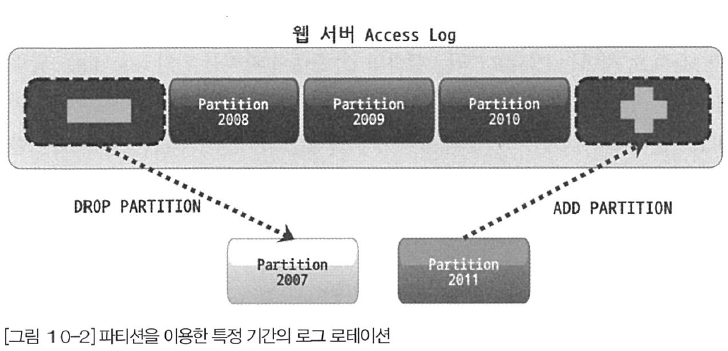
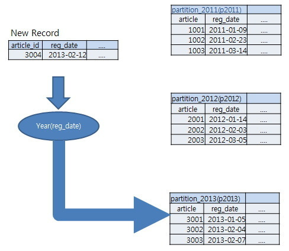
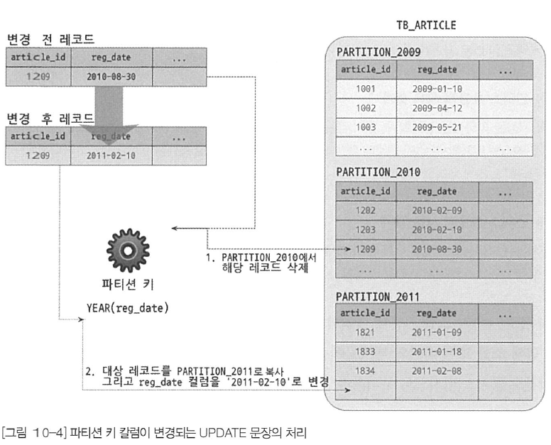
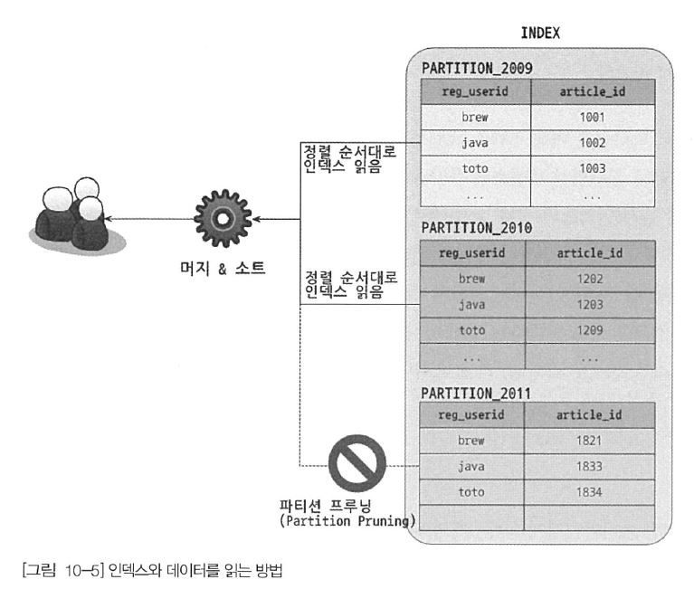
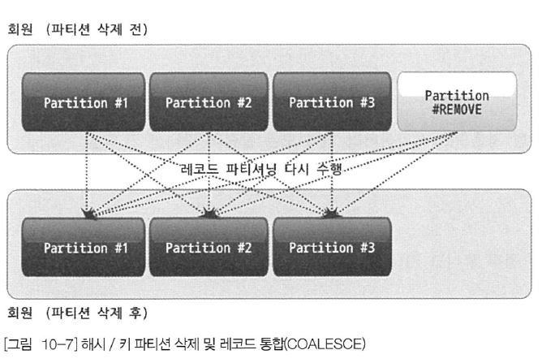
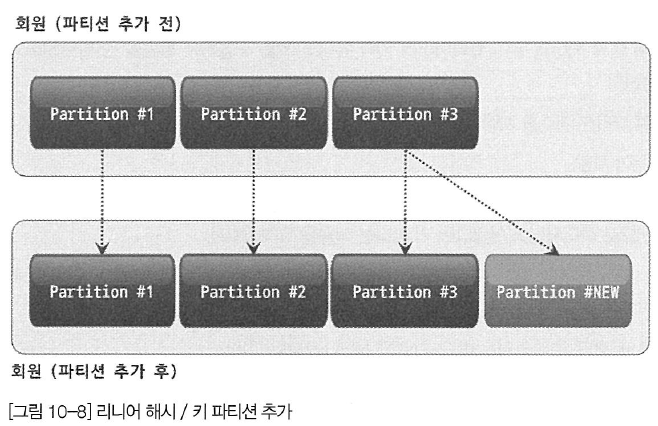

## 1. 개요
- 파티션은 논리적으로는 하나의 테이블이지만 물리적으로는 여러 개의 테이블로 분리해서 관리할 수 있게 해준다
- 주로 대용량 테이블을 여러 개의 소규모 테이블로 분산하는 목적으로 사용한다
- 하지만 무조건 성능이 빨라지는 것도 아니고 어떤 쿼리를 사용하냐에 따라 오히려 성능이 더 나빠질 수도 있다

### 1. 파티션을 사용하는 이유
- 데이터가 많아진다고 무조건 파티션을 적용하는 것이 효율적인 것은 아니다
- 하나의 테이블이 너무 커서 인덱스의 크기가 물리적인 메모리보다 훨씬 크거나 데이터 특성상 주기적인 삭제 작업 필요한 경우 등이 파티션이 필요한 대표적인 예이다

#### 1. 단일 INSERT와 단일 또는 범위 범위 SELECT의 빠른 처리
- 인덱스는 SELECT 뿐만 아니라 처리 대상을 검색하기 위해 UPDATE, DELETE에서도 필수적이다
- 하지만 인덱스가 커질수록 SELECT는 물론, INSERT, UPDATE, DELETE 성능도 함께 저하된다
- 특히 워킹 셋이 물리 메모리보다 크다면 쿼리 처리가 상당히 느려질 것이다
- 파티션은 이러한 단점을 보완할 수 있다
- 파티션으로 데이터와 인덱스를 조각화해서 물리적 메모리를 효율적으로 사용할 수 있게 해준다



>#### 참고
> 테이블의 데이터가 10GB이고 인덱스가 3GB라고 가정했을 때, 대부분의 테이블은 13GB 전체를 사용하는 것이 아니라
> 최신 20% ~ 30% 정도만 사용된다. 대부분 테이블 데이터가 이런 형태로 사용된다고 볼 수 있는데, 활발하게 사용되는 데이터를 `워킹 셋(Working Set)`이라고 표현한다
> 워킹 셋과 그렇지 않은 부분으로 나눠서 파티션할 수 있다면 상당히 효과적으로 성능을 개선할 수 있다

#### 2. 데이터의 물리적인 저장소를 분리
- 데이터 파일이나 인덱스 파일이 크다면 백업이나 관리 작업이 어려워진다
- 더욱이 데이터나 인덱스를 파일 단위로 관리하는 MySQL에서는 치명적인 될 수 있다
- 이러한 문제는 파티션을 통해 파일의 크기를 조절하거나 파티션별 저장될 위치나 디스크를 구분해서 지정해 해결할 수 있다
- 하지만 파티션 단위로 인덱스를 생성하거나 파티션별로 다른 인덱스를 가지는 형태는 지원하지 않는다

#### 3. 이력 데이터의 효율적인 관리
- 로그는 일정 기간이 지나면 쓸모가 없어져 시간이 지나면 아카이빙하거나 백업 후 제거하는 것이 일바넉이다
- 로그 테이블에서 불필요해진 데이터를 백업하거나 삭제하는 작업은 일반 테이블에서는 고부하 작업으로 이를 파티션 테이블로 관리한다면 단순히 파티션을 추가하거나 삭제하는 방식으로 간단하고 빠르게 해결할 수 있다



### 2. MySQL 파티션의 내부 처리
- 등록 일자(reg_date)가 파티션 키로 어느 파티션에 저장될지를 결정한다
```sql
CREATE TABLE tb_article(
    article_id INT NOT NULL,
    reg_date DATETIME NOT NULL,
    PRIMARY KEY(article_id, reg_date)
) PARTITION BY RANGE ( YEAR(reg_date)) (
    PARTITION p2009 VALUES LESS THAN (2010)
    PARTITION p2010 VALUES LESS THAN (2011)
    PARTITION p2011 VALUES LESS THAN (2012)
    PARTITION p9999 VALUES LESS THAN MAXVALUE
)
```

#### 1. 파티션 테이블의 레코드 INSERT
- 파티션 키(reg_date)의 값을 이용해 파티션 표현식을 평가하고, 그 결과를 이용해 적절한 파티션을 결정한다
- 파티션이 결정되면 나머지는 일반 테이블과 동일하게 처리된다



#### 2. 파티션 테이블의 UPDATE
- UPDATE 쿼리에 WHERE 조건에 `파티션 키 칼럼`이 존재한다면 빠르게 대상을 검색할 수 있다
- 하지만 WHERE 절에 명시되지 않았으면 모든 파티션을 검색해야 한다
- 실제 레코드를 변경하는 절차는 어떤 칼럼의 값을 변경하느냐에 따라 큰 차이가 생긴다
  - 파티션 키 이외의 칼럼만 변경할 때는 일반 테이블과 마찬가지로 칼럼 값만 변경한다
  - 파티션 키 칼럼이 변경되면 해당 레코드를 삭제하고 새로운 파티션에 다시 INSERT 해야 한다



#### 3. 파티션 테이블의 검색
- 파티션 테이블 검색할 때 성능에 크게 영향을 미치는 조건을 다음과 같다
  - WEHRE 조건으로 검색해야 할 파티션을 선택할 수 있는가?
  - WHERE 조건이 인덱스를 효율적으로 사용(인덱스 레인지 스캔)할 수 있는가?
- 파티션 선택 기능 + 인덱스 효율적 사용
  - 파티션 개수와 상관없이 꼭 필요한 파티션 인덱스만 레인지 스캔한다
- 파티션 선택 불가 + 인덱스 효율적 사용 가능
  - 모든 파티션을 검색하지만 각 파티션에 대해서 레인지 스캔을 때문에, 파티션 개수 만큼 레인지 스캔해서 그 결과를 병합해서 가져오는 것과 같다
- 파티션 선택 가능 + 인덱스 효율적 사용 불가
  - 필요한 파티션만 읽지만 풀 테이블 스캔을 한다. 레코드 건수가 많다면 상당히 느리게 처리된다
- 파티션 선택 불가 + 인덱스 효율적 사용 불가
  - 모든 파티션을 검색을 해야 하는데, 파티션 검색 작업도 인덱스 레인지 스캔을 사용할 수 없어서 풀 테이블 스캔을 수행해야 한다

#### 4. 파티션 테이블의 인덱스 스캔과 정렬
- 파티션 테이블에서 인덱스는 전부 로컬 인덱스에 생성된다. 파티션 단위로 생성되며 테이블 전체 단위로 통합된 인덱스는 지원하지 않는다
- 여러 파티션에 인덱스 스캔을 수행할 때 우선선위 큐에 임시 저장하고 사용하기 때문에 정렬된 결과를 얻을 수 있다



#### 5. 파티션 프루닝
- 필요한 파티션만 골라내고 불필요한 것들은 실행 계획에서 배제하는 것을 파티션 프루닝이라고 한다
- 위에 사진처럼 위에 2개만 읽어도 된다고 판단하는 것을 의미한다

## 2. 주의사항
### 1. 파티션의 제약 사항
- 스토어드 루틴이나 UDF, 사용자 변수 등을 파티션 표현식에 사용할 수 없다
- 파티션 표현식은 칼럼 그 자체 또는 내장 함수를 사용할 수 있는데, 일부 함수들은 파티션 생성은 가능하지만 파티션 프루닝을 지원하지 않을 수 있다
- 프라이머리 키를 포함해서 모든 유니크 인덱스는 파티션 키 칼럼을 포함해야 한다
- 인덱스는 모두 로컬 인덱스이며, 모든 테이블에 소속된 모든 파티션은 같은 구조의 인덱스만 가질 수 있다. 또한 파티션 개별로 인덱스를 변경하거나 추가할 수 없다
- 동일 테이블에 속한 모든 파티션은 동일 스토리지 엔진만 가질 수 있다
- 최대(서브 파티션 포함) 8192개의 파티션을 가질 수 있다
- 파티션 생성 이후 sql_mode 변경은 일관성을 꺠뜨릴 수 있다
- 외래키를 사용할 수 없다
- 공간 데이터를 저장하는 칼럼 타입(POINT, GEOMETRY)은 사용할 수 없다
- 임시 테이블은 파티션 기능 사용할 수 없다

```sql
-- PARTITION BY RANGE은 레인지 파팃녀을 사용한다는 것을 의미한다
-- 파티션 칼럼은 reg_date이며, 파티션 표현식으로는 YEAR(reg_date)가 사용된다
-- YEAR 함수를 통해 연도만 추출하고 연도 범위로 파티션하고 있다
CREATE TABLE tb_article(
    article_id INT NOT NULL AUTO_INCREMENT,
    reg_date DATETIME NOT NULL,
    PRIMARY KEY(article_id, reg_date)
) PARTITION BY RANGE ( YEAR(reg_date)) (
    PARTITION p2009 VALUES LESS THAN (2010)
    PARTITION p2010 VALUES LESS THAN (2011)
    PARTITION p2011 VALUES LESS THAN (2012)
    PARTITION p9999 VALUES LESS THAN MAXVALUE
)
```

### 2. 파티션 사용시 주의사항
- 파티션 테이블의 경우 유니크 키에대한 제약 사항이 있다
- 파티션의 목적이 작업 범위를 좁히는 것인데, 유니크 인덱스는 중복 레코드에 대한 체크 작업 때문에 범위가 좁혀지지 않는다
- 파티션은 일반 테이블과 같이 별도의 파일로 관리되는데, 이와 관련하여 MySQL 서버가 조작할 수 있는 파일의 개수와 연관된 제약도 있다

#### 1. 파티션과 유니크 키(프라이머리 키 포함)
- 파티션 키는 모든 유니크 인덱스에 포함되어야 한다

#### 2. 파티션과 open_files_limit 시스템 변수 설정
- MySQL에서는 테이블을 파일 단위로 관리하기 떄문에 open_files_limit으로 오픈할 수 있는 적절할 파일의 개수를 조절한다
- 일반 테이블은 테이블 1개당 오픈된 파일의 개수가 2~3개 수준이지만 파티션 테이블은 **파티션 개수 * 2~3개**가 된다
- 파티션을 많이 사용하는 경우에는 open_files_limit를 충분히 설정해야 한다

## 3. MySQL 파티션 종류
- 4가지 기본 파티션 기법을 제공하며, 해시와 키 파티션에 대해서는 리니어(Linear) 파티션과 같은 기법도 제공한다
  - 레인지 파티션
  - 리스트 파티션
  - 해시 파티션
  - 키 파티션

### 1. 레인지 파티션
- 파티션 키의 연속된 범위로 파티션을 정의하는 방법으로 `MAXVALUE`키워드를 이용해 명시되지 않은 범위의 키 값도 정의할 수 있다

#### 1. 레인지 파티션의 용도
- 다음과 같은 성격은 레인지 파티션을 사용하는 것이 좋다
  - 날짜 기반으로 데이터가 누적되고 연도나 월, 또는 일 단위로 분석하고 삭제해야 할 때
  - 범위 기반으로 데이터를 여러 파티션에 균등하게 나눌 수 있을 때
  - 파티션 키 위주로 검색이 자주 실행될 때
- DB에서 파티션은 장점은 다음과 같다
  - 큰 테이블을 작은 크기의 파티션으로 분리
  - 필요한 파티션만 접근(쓰기와 읽기 모두)
- 파티션에서 두 가지 장점을 모두 취하기는 어렵지만 레인지 파티션은 모두 어렵지 않게 취할 수 있다

#### 2. 레인지 파티션 테이블 생성
```sql
-- PARTITION BY RANGE 키워드로 레인지 파티션을 정의한다
-- 칼럼 또는 내장 함수를 이용해 파티션 키를 명시한다
-- VALUES LESS THAN으로 명시된 값보다 작은 값만 파티션에 저장하게 설정한다 단 LESS THAN 절에 명시된 값은 그 파티션에 포함되지 않는다
-- MAXVALUE가 없다면 2011 레코드가 저장되면 에러가 발생한다
CREATE TABLE employees (
    id INT NOT NULL,
    first_name VARCHAR(30),
    last_name VARCHAR(30),
    hired DATE NOT NULL DEFAULT '1970-01-01',
)PARTITION BY RANGE( YEAR(hired)) (
    PARTITION p0 VALUES LESS THAN (1991),
    PARTITION p1 VALUES LESS THAN (1996),
    PARTITION p2 VALUES LESS THAN (2001),
    PARTITION p3 VALUES LESS THAN MAXVALUE,
);
```

#### 3. 레인지 파티션의 분리와 병합
#### 1). 단순 파티션의 추가
- 2001 ~ 2010년 이하인 새로운 파티션 p4를 추가하는 명령이다
  - `ALTER TABLE employees ADD PARTITION (PARTITION p4 VALUES LESS THAN (2011));`
  - 만약 `MAXVALUE` 파티션을 가지고 있다면 이미 MAXVALUE가 2001년 이후 레코드를 가지고 있기 때문에 `ALTER TABLE ... REORGANIZE PARTITION` 명령을 사용해야 한다

```sql
ALTER TABLE employees ALGORITHM=INPLACE, LOCK=SHARED,
    REORGANIZE PARTITION p3 INTO(
        PARTITION p3 VALUES LESS THAN (2011),
         PARTITION p3 VALUES LESS THAN MAXVALUE
    )
```

- 일반적으로 `LESS THAN MAXVALUE`를 추가하지 않고 미래에 사용될 파티션을 2~3개 미리 만들어 두는 형태로 사용한다

#### 2). 파티션 삭제
- `DROP PARTITION` 키워드로 삭제하면 된다
  - `ALTER TABLE employees DROP PARTITION p0`
- 파티션은 가장 오래된 파티션 순서로만 삭제할 수 있고, 중간에 있는 파티션을 먼저 삭제할 수는 없다
- 마찬가지로 가장 마지막 파티션만 새로 추가할 수 있다

#### 3). 기존 파티션 분리
- 두 개 이상의 파티션으로 분리할 때는 `REORGANIZE PARITION`명령을 사용하면 된다
- 기존 파티션을 새로운 파티션으로 복사하기 때문에 레코드가 많다면 온라인 DDL로 실행할 수 있도록 ALGORITHM과 LOCK 절을 사용하면 좋다
- 파티션 재구성은 최소한 읽기 잠금(Shared Lock)이 필요하다

```sql
-- MAXVALUE 뿐만 아니라 다른 파티션도 분리할 수 있다
-- MAXVALUE 파티션을 p3와 MAXVALUE 두 개의 파티션으로 나누는 명령이다
ALTER TABLE employees ALGORITHM=INPLACE, LOCK=SHARED,
    REORGANIZE PARTITION p3 INTO(
        PARTITION p3 VALUES LESS THAN (2011),
        PARTITION p4 VALUES LESS THAN MAXVALUE
    )
```

#### 4. 기존 파티션의 병합
- 여러 파티션을 하나의 파티션으로 병합하는 작업도 `REORGANIZE PARITION`으로 처리할 수 있다

```sql
ALTER TABLE employees ALGORITHM=INPLACE, LOCK=SHARED,
    REORGANIZE PARTITION p2, p3 INTO (
        PARTITION p23 VALUES LESS THAN (2011)
    );
```

### 2. 리스트 파티션
- 레인지 파티션과 비슷하지만 가장 큰 차이점은 레인지 파티션은 파티션 키 값의 범위로 파티션을 구성할 수 있지만 리스트 파티션은 키 값 하나하나를 리스트로 나열해야 한다 또한 `MAXVALUE` 파티션을 정의할 수 없다

#### 1. 리스트 파티션의 용도
- 파티션 키 값이 코드 값이나 카테고리와 같이 고정적일 때
- 키 값이 연속되지 않고 정렬 순서와 관계없이 파티션을 해야 할 때
- 파티션 키 값을 기준으로 레코드 건수가 균일하고 검색 조건에 파티션 키가 자주 사용될 때

#### 2. 리스트 파티션 테이블 생성
- 정수 타입 뿐만 아니라 문자열 타입도 가능하다
```sql
CREATE TABLE product(
  id INT NOT NULL,
  name VARCHAR(30),
  category_id INT NOT NULL
)PARTITION BY LIST( category_id )(
  PARTITION p_appliance VALUES IN (3),
  PARTITION p_computer VALUES IN (1,9),
  PARTITION p_sports VALUES IN (2,6,7),
  PARTITION p_etc VALUES IN (4,5,6,NULL),
)
```

#### 3. 리스트 파티션의 분리와 병합
- `VALUES IN`을 사용하는 것 외에는 레인지 파티션의 추가 및 삭제 ,병합과 모두 같다
- 파티션을 분리하거나 병합하려면 `REORGANIZE PARTITION` 명령을 사용하면 된다

#### 4. 리스트 파티션 주의사항
- 명시되지 않은 나머지 값을 저장하는 MAXVALUE 파티션을 정의할 수 없다
- 레인지 파티션과 달리 NULL을 저장하는 파티션을 별도로 생성할 수 있다

### 3. 해시 파티션
- 해시 함수에 의해 레코드가 저장될 파티션을 결정하는 방법이다
- MySQL에서 정의한 해시 함수는 복잡한 알고리즘이 아니라 파티션 표현식의 결괏값을 파티션의 개수로 나눈 나머지로 저장될 파티션을 결정하는 방식이다
- 파티션 키는 항상 정수 타입의 칼럼이거나 정수를 반환하는 표현식만 사용할 수 있다

#### 1. 해시 파티션의 용도
- 레인지 파티션이나 리스트 파티션으로 데이터를 균등하게 나누는 것이 어려울 때
- 모든 레코드가 비슷한 사용 빈도를 보이지만 테이블이 너무 커서 파티션을 적용해야 할 때
- 회원 테이블이 대표적인 용도로 가입 일자에 따라 빈도에 영향은 없다
  - 이처럼 특정 칼럼의 값에 영향을 받지 않고, 전체적으로 비슷한 사용 빈도를 보일 때 적합하다

#### 2. 해시 파티션 테이블 생성
- PARTITION BY HASH 키워드로 뒤에 파티션 키를 명시한다
- 해시 파티션의 파티션 키 또는 표현식은 반드시 정수 타입을 반환해야 한다
- PARTITIONS n으로 몇 개의 파티션을 생성할 것인지 명시한다
- 파티션 개수뿐만 아니라 이름을 명시하려면 각 파티션을 나열하면 된다
- 해시나 키 파티션에서는 특정 파티션을 삭제하거나 병합하는 작업이 거의 불필요하기 때문에 파티션의 이름을 부여하는 것은 의미가 없다
- 이름은 기본적으로 p0, p1, p2 ... 같은 규칙으로 생성된다
```sql
CREATE TABLE employees(
  id INT NOT NULL,
  first_name VARCHAR(30),
  last_name VARCHAR(30),
  hired DATE NOT NULL DEFAULT '1970-01-01'
)PARTITION BY HASH(id) 
 PARTITIONS 4 (
  PARTITION p0 ENGINE=INNODB,
  PARTITION p1 ENGINE=INNODB,
  PARTITION p2 ENGINE=INNODB,
  PARTITION p3 ENGINE=INNODB
 )
```

#### 3. 해시 파티션의 분리와 병합
- 해시 파티션은 레인지 파티션이나 리스트 파티션처럼 파티션의 추가 및 삭제, 병합이 자유롭지 않다
- 모든 파티션에 저장된 레코드를 재분배하는 작업이 필요하다

#### 1). 해시 파티션 추가
- 특정 파티션 키 값을 테이블의 파티션 개수로 `MOD`연산한 결괏값에 의해 파티션을 결정한다
- 즉 파티션의 개수에 의해 파티션 알고리즘이 변한다
- 따라서 새로운 파티션이 추가된다면 기존의 파티션은 재배치가 되어야 한다
- 파티션을 추가할 때는 몇 개의 파티션을 더 추가할 것인지만 지정하면 된다
- 파티션을 추가하거나 생성하는 작업은 많은 부하를 발생시키며, 다른 트랜잭션에 데이터를 변경하는 작업은 허용되지 않는다

```sql
-- 파티션 1개만 추가하면서 파티션 이름을 부여하는 경우
ALTER TABLE employees ALGORITHM=INPLACE, LOCK=SHARED,
  ADD PARTITION(PARTITION p5 ENGINE=INNODB);

-- 동시에 6개의 파티션을 별도의 이름 없이 추가하는 경우
ALTER TABLE employees ALGORITHM=INPLACE, LOCK=SHARED,
  ADD PARTITION PARTITIONS 6
```



#### 2). 해시 파티션 삭제
- 해시나 키 파티션은 파티션 단위로 레코드를 삭제하는 방법이 없다
- 파티션 키 값을 가공해서 각 파티션으로 분산한 것이므로 각 파티션에 저장된 레코드가 어떤 부류의 데이터인지 사용자가 예측할 수 없다
- 파티션 단위로 데이터를 삭제하는 작업은 의미가 없으며 해서도 안 될 작업이다

#### 3). 해시 파티션 분할
- 분할하는 기능은 없으며, 전체적으로 파티션 개수를 늘리는 것만 가능하다

#### 4). 해시 파티션 병합
- 파티션 통합 기능은 제공하지 않고, 단지 파티션의 개수를 줄이는 것만 가능하다
- `COALESCE PARTITION`명령으로 파티션을 재구성한다
  - 해당 명령어 뒤에 명시된 숫자가 줄이고자 하는 파티션의 개수이다
  - 즉 원래 4개가 있다면 1을 적는다면 3개만 사용하게 될 것이다
```sql
ALTER TABLE employees ALGORITHM=INPLACE, LOCK=SHARED
  COALESCE PARTITION 1
```

##### 5). 해시 파티션 주의사항
- 특정 파티션만 삭제하는 것은 불가능하다
- 새로운 파티션을 추가하는 작업은 기존 모든 데이터의 재배치 작업이 필요하다
- 해시 파티션은 레인지나 리스트 파티션과 상당히 다른 방식으로 관리하기 때문에 용도에 적합한지 확인이 필요하다
- 일반적으로 익숙한 파티션 조작이나 특성은 대부분 리스트 파티션이나 레인지 파티션에만 해당되는 것들이 많다

### 4. 키 파티션
- 해시 파티션과 비슷하지만 키 파티션은 해시 값 계산도 MySQL 서버가 수행한다
- 정수 타입이나 정숫값을 반환하는 표현식뿐만 아니라 대부분 데이터 타입에 파티션 키를 적용할 수 있다
- 파티션 키 값을 `MD5()`함수를 이용해 해시값을 계산하고, 그 값을 MOD 연산해서 각 파티션에 분배한다

#### 1. 키 파티션의 생성
```sql
-- 프라이머리 키가 있는 경우 자동으로 프라이머리 키가 파티션 키로 사용됨
CREATE TABLE k1 (
  id INT NOT NULL,
  name VARCHAR(30),
  PRIMARY KEY (id)
)
-- 괄호의 내용을 비워두면 자동으로 프라이머리 키의 모든 칼럼이 파티션 키가 됨
-- 그렇지 않고 프라이머리 키의 일부만 명시할 수 있다
PARTITION BY KEY()
  PARTITIONS 2;

-- 프라이머리 키나 유니크 키의 칼럼 일부를 파티션 키로 명시적으로 설정
CREATE TABLE dept_emp (
  emp_no INT NOT NULL,
  dept_no CHAR(4) NOT NULL,
  PRIMARY KEY (dept_no, emp_no)
)
-- 괄호의 내용에 프라이머리 키나 유니크 키를 구성하는 칼럼 중에서
-- 일부만 선택해 파티션 키로 설정하는 것도 가능하다
PARTITION BY KEY(dept_no)
  PARTITIONS 2;
```

#### 2. 키 파티션의 주의사항 및 특이사항
- 내부적으로 MD5 함수를 이용해 파티션을 하기 때문에 정수 타입이 아니여도 된다
- 프라이머리 키나 유니크 키를 구성하는 칼럼 중 일부만으로 파티션할 수 있다
- 유니크 키를 파티션 키로 사용할 때 해당 유니크 키는 반드시 NOT NULL 이어야 한다
- 해시 파티션에 비해 파티션 간의 레코드를 더 균등할 수 있기 때문에 키 파티션이 더 효율적이다

### 5. 리니어 해시 파티션/리니어 키 파티션
- 기존 해시/키 파티션은 새로운 파티션을 추가하거나 통합할 때 저장된 레코드의 재분배 작업이 발생한다
- 이러한 단점을 최소화 하기 위해 탄생한 것으로 각 레코드 분배를 위해 `Power-of-two(2의 승수)` 알고리즘을 이용해 다른 파티션에 미치는 영향을 최소화해준다

#### 1. 리니어 해시 파티션/리니어 키 파티션의 추가 및 통합
- 단순히 나머지 연산으로 결정하지 않고 `Power-of-two`분배 방식을 사용하기 때문에 특정 파티션의 데이터만 이동하면 된다

#### 1). 리니어 해시 파티션/리니어 키 파티션의 추가



#### 2). 리니어 해시 파티션/리니어 키 파티션과 관련된 주의사항
- 파티션 추가나 통합할 때 작업의 범위을 최소화하는 대신 각 파티션이 가지는 레코드의 건수는 일반 해시 파티션이나 키 파티션보다 덜 균등해질 수 있다
- 새로운 파티션을 추가하거나 삭제해야 할 요건이 많다면 적용하는 것이 좋다

### 6. 파티션 테이블의 쿼리 성능
- 파티션 테이블에 쿼리가 실행될 때 모든 파티션을 읽을 지 일부 파티션만 읽을지는 성능에 아주 큰 영향을 미친다
- 불필요한 파티션은 모두 배제하고 꼭 필요한 파티션만을 걸러내는 과정을 `파티션 프루닝`이라고 하는데, 쿼리의 성능은 얼마나 많은 파티션을 프루닝할 수 있는지가 관건이다
- 만약 `user`테이블이 1024개의 파티션으로 쪼개져 있다면 B-Tree가 해당 레코드를 찾는 작업을 1024번 해야 한다
- 10개를 파티션하고 균등하게 사용한다면 성능 향상보다는 오버헤드만 심해질 수 있다
- 대용량 테이블을 샤딩한다면 효율적일 테지만 파티션은 아니다. 
- 레인지 파티션 이외의 파티션을 적용할 때 파티션 프루닝을 더 많이 고민해 보고 적용할 것을 권장한다

