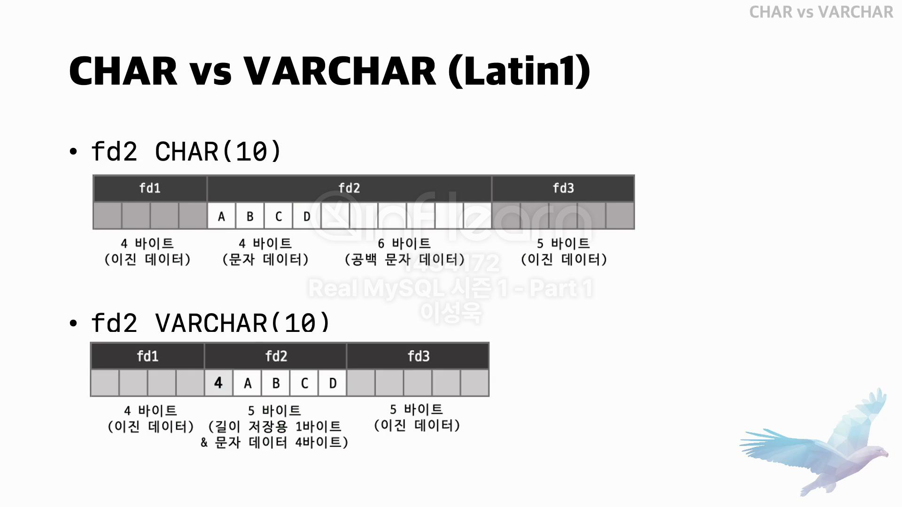
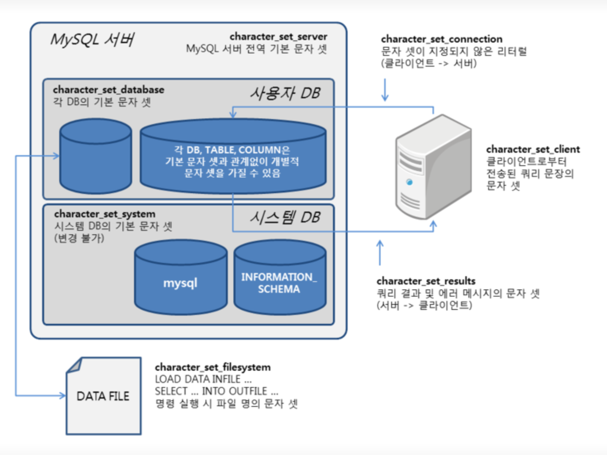
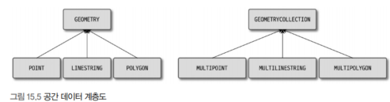

## 0. 개요
- 데이터 타입은 중요한 작업으로 칼럼의 타입과 길이를 선정할 때 주의할 사항은 다음과 같다
  - 저장되는 값의 성격에 맞는 최적의 타입을 선정
  - 가변 길이 칼럼은 최적의 길이를 지정
  - 조인 조건으로 사용되는 칼럼은 똑같은 데이터 칼럼으로 선정

## 1. 문자열(CHAR와 VARCHAR)
### 1. 저장 공간
- CHAR과 VARCHAR의 공통점은 문자열을 저장할 수 있는 데이터타입이라느 점이고, 가장 큰 차이는 고정 길이냐 가변 길이냐 이다
- 두 문자열 타입 모두 한 글자를 저장할 때 문자 집합에 따라 1~4바이트까지 사용한다
- 하지만 **CHAR**타입은 추가 공간이 필요하지 않지만 VARCHAR 타입은 문자열의 길이를 관리하기 위한 1~2바이트 공간을 추가로 더 사용한다
  - VARCHAR 타입의 길이가 255바이트 이하면 1바이트를 사용하고, 256바이트 이상이면 2바이트를 사용한다
  - 최대가 2바이트이다. 즉 최대 길이인 65,536바이트 이상으로 설정할 수 없다

>#### 주의
> MySQL에서 하나의 레코드에서 TEXT와 BLOB 타입을 제외한 칼럼의 전체 크기가 64KB를 초과할 수 없다
> 테이블에 VARCHAR 타입의 칼럼 하나만 있다면 최대 64KB 크기의 데이터를 저장할 수 있다
> 하지만 다른 칼럼에서 40KB의 크기를 사용하고 있다면 VARCHAR 칼럼은 24KB의 크기를 사용할 수 있다
> 24KB를 초과하는 타입을 생성하려고 하면 에러가 발생하거나 자동으로 TEXT 타입으로 대체된다

- VARCHAR이 고작 1바이트만 더 사용할 뿐인데라고 생각하지만 타입을 결정할 때 중요한 판단 기준을 다음과 같다
  - 저장되는 문자열의 길이가 대게 비슷한가?
  - 칼럼의 값이 자주 변경되는가?

```sql
CREATE TABLE tb_test(
  fd1 INT NOT NULL,
  fd2 CHAR(10) NOT NULL,
  fd3 DATETIME NOT NULL
);
-- fd1은 INTEGER 이므로 고정길이 4바이트를 사용하며, DATETTIME은 고정길이 8바이트를 사용한다
-- fd2 칼럼이 10바이트를 사용하면서 4바이트만 유효한 값으로 채워졌고 나머지는 공백 문자로 채워져 있다
INSERT INTO tb_test (fd1, fd2, fd3) VALUES (1, 'ABCD', '2011-06-27 11:02:11');

-- 만약 VARCHAR(10)으로 변경한다면 총 5바이트를 사용하게 된다
```


- 만약 값이 `ABCDE`로 업데이트 했다고 가정한다
  - CHAR 타입은 이미 공간이 10바이트가 준비돼 있으므로 값만 업데이트하면 된다
  - VARCHAR 타입은 4바이트밖에 저장할 수 없으므로, 레코드 자체를 다른 공간으로 옮겨서(Row migration) 저장해야 한다
- 값이 고정적일 때나 2~3바이트씩 차이가 나는 건 CHAR 타입을 사용하는 것이 좋다
  - 레코드의 이동이나 분리는 2~3바이트 공간 낭비보다 더 큰 공간이나 자원을 낭비한다
- CHAR(10) 또는 VARCHAR(10)의 의미는 10글자(문자)를 저장할 수 있는 공간을 의미한다
  - 영어를 포함한 서구권 언어는 각 문자가 1바이트를 사용하므로 10바이트를 사용한다
  - 아시아권 언어는 최대 2바이트를 사용하므로 20바이트를 사용한다
  - UTF-8과 같은 유니코드는 최대 4바이트를 사용하므로 40바이트까지 사용할 수 있다

### 2. 저장 공간과 스키마 변경(Online DDL)
- 데이터가 변경되는 중에 스키마를 변경할 수 있도록 `Online DDL`이라는 기능을 제공한다
- 모든 스키마 변경이 가능한 것은 아니고 어떤 경우에는 테이블에 대해 읽기 잠금을 걸고 레코드를 복사하는 작업이 필요할 수 있다

```sql
-- varchar(63)까지는 잠금 없이 빠르게 변경되지만 64로 늘리는 경우는 INPLACE 알고리즘으로 변경이 허용되지 않는다
ALTER TABLE test MODIFY value VARCHAR(64), ALGORITHM=INPLACE, LOCK=NONE;

-- COPY 알고리즘을 통해 읽기 잠금까지 걸어야 한다
ALTER TABLE test MODIFY value VARCHAR(64), ALGORITHM=COPY, LOCK=SHARED;
```

- varchar(63) 까지는 문자열 값의 길이를 저장하는 공간이 1바이트이지만, 그 이상은 2바이트를 사용하기 때문에 잠그고 복사하는 작업이 필요하다

### 3. 문자 집합(캐릭터 셋)
- 문자열 타입인 CHAR, VARCHAR, TEXT는 서로 다른 문자 집합을 사용해 문자열 값을 저장할 수 있다
- MySQL에서는 문자집합을 설정한느 시스템 변수가 여러가지가 있다
  - character_set_system
    - 식별자(테이블명이나 컬럼 명 등)를 저장할 때 사용하는 문자 집합으로 기본값은 utf8이다
  - character_set_server
    - 기본 문자 집합으로, DB나 테이블에 아무런 문자 집합을 설정하지 않으면 이 변수에 명시된 문자 집합이 사용된다. 기본값은 utf8mb4이다
  - character_set_database
    - 기본 문자 집합으로, DB를 생성할 때 문자 집합을 설정하지 않으면 이 변수에 명시된 문자 집합이 사용된다. 이 값도 설정되지 않으면 `character_set_server`의 값이 사용된다
  - character_set_filesystem
    - `LOAD DATA INFILE ... 또는 SELECT ... INTO OUTFILE`을 실행할 때 파일의 일므을 해석할 때 사용하는 문자 집합이다
  - character_set_client
    - 클라이언트가 보낸 SQL문장을 여기에 설정된 문자 집합으로 인코딩해서 서버로 전송한다
  - character_set_connection
    - 서버가 클라이언트로부터 전달받은 SQL 문장을 처리하기 위해 사용되는 문자 집합이다
    - 전달받은 숫자 값을 문자열로 반환할 때도 이 문자 집합을 사용한다
  - character_set_results
    - 쿼리의 처리 결과를 클라이언트로 보낼 때 사용하는 문자 집합을 설정하는 시스템 변수다



#### 1. 클라이언트로부터 쿼리를 요청헀을 때의 문자 집합 변환
- MySQL 서버는 클라이언트로부터 받은 메시지가 `character_set_client`로 인코딩되어 전송된다고 판단하고, 받은 문자열 데이터를 `character_set_connection`으로 변환한다
  - 하지만 SQL 문장에 별도의 **문자 집합**이 지정된 리터럴은 변환 대상에 포함되지 않는다
  - `SELECT emp_no, first_name FROM employees WHERE first_name = _utf8mb4 '김민수';`

#### 2. 처리 결과를 클라이언트로 전송할 때의 문자 집합 변환
- `character_set_connection`에 정의된 문자 집합으로 변환해 SQL을 실행한 다음에, 쿼리의 결과를 `character_set_results`로 설정된 문자 집합으로 변환해 클라이언트로 전송한다
  - 칼럼의 값이나 칼럼명과 같은 메타데이터도 모두 `character_set_results`로 변환한다
- `charater_set_client`와 `character_set_connection`이 같다면 문자 집합 변환 작업은 모두 생략한다

### 4. 콜레이션(Collation)
- 문자열 칼럼의 값에 대한 비교나 정렬 순서를 위한 규칙을 의미한다
  - 영문 대소문자를 같은 것으로 처리할지, 아니면 더 크거나 작은 것으로 판단할지에 대한 규칙을 정의하는 것이다
- 콜레이션은 값을 비교하거나 정렬하는 기준이 되기 때문에 일치 여부에 따라 결과가 달라지며, 쿼리의 성능 또한 상당한 영향을 받는다

#### 1. 콜레이션 이해
- 문자 집합은 2개 이상의 콜레이션을 가지고 있는데, 하나의 콜레이션은 특정 문자 집합에 속하며 다른 문자 집합과 공유되지 않는다.
- `SHOW COLLATION`으로 사용 가능한 콜레이션 목록을 확인할 수 있다
- 일반적으로 콜레이션은 2개 또는 3개의 파트로 구분되어 있다
  - 3개의 파트로 구성된 콜레이션 이름
    - 첫 번째 파트는 문자 집합의 이름이다
    - 두 번째 파트는 해당 문자 집합의 하위 분류를 나타낸다
    - 세 번째 파트는 대소문자 구분 여부를 나타낸다. `ci(Case Insensitive)`이면 대소문자를 구분하지 않고, `cs(Case Sensitive)`이면 대소문자를 구분한다
    - 예를 들어 `utf8mb4_general_ci`는 `utf8mb4` 문자 집합의 `general` 하위 분류를 사용하고 `ci`로 대소문자를 구분하지 않는다는 의미를 가진다
  - 2개의 파트로 구성된 콜레이션 이름
    - 첫 번째 파트는 문자 집합의 이름이다
    - 두 번째 파트는 항상 `bin`이라는 키워드를 사용한다. bin은 이진 데이터(binary)를 의미하며, 이진 데이터로 관리되는 문자열 칼럼은 별도의 콜레이션을 가지지 않는다
    - `xxx_bin`이라면 비교 및 정렬은 실제 문자 데이터의 바이트 값을 기준으로 수행된다
- `utfmb4_0900`으로 시작되는 콜레이션의 `0900`은 UCA(Unicode Collation Algorithm)의 버전을 의미한다
  - 예를 들어 `utf8mb4_unicode_520_ci`의 **520**은 UCA 5.2.0 버전을 의미한다. 
  - `ai`나 `as`를 포함하는 경우가 있는데 이는 액센트를 가진 문자(Accent Sensitive)와 그렇지 않은 문자(Accent Insensitive)들을 정렬 순서상 동일 문자로 판단할지 여부를 나타낸다
- 문자열 칼럼의 정렬이나 비교는 콜레이션에 의해 판단되므로, 콜레이션까지 같아야 인덱스를 효율적으로 사용할 수 있다

```sql
CREATE DATABASE db_test CHARATER SET=utf8mb4;

CREATE TABLE tb_member (
  member_id VARCHAR(20) NOT NULL COLLATE latin1_general_cs,
  member_name VARCHAR(20) NOT NULL COLLATE utf8_bin,
  member_email VHRCHAR(100) NOT NULL,
);
```

#### 2. utf8mb4 문자 집합의 콜레이션
- 대부분의 경우 utf8mb4를 사용한다
- `utf8mb4_unicode_ci`와 같이 별도의 숫자 값이 명시돼 있지 않은 경우 UCA 버전 4.0.0을 의미한다
- `0900`은 **NO PAD** 옵션으로 인해 문자열 뒤에 존재하는 공백도 유효 문자로 취급하기 때문에 주의해야 한다
- 5.7은 general_ci를 쓰기 때문에 0900과 조인하면 에러가 발생하는데, 이럴 때 `default_collation_for_utf8mb4`를 general로 설정하면 문자 집합이 utf8mb4인 테이블은 모두 general_ci를 사용하게 된다

### 5. 비교 방식
- CHAR과 VARCHAR 타입을 비교할 때 두 문자열의 길이를 동일하게 만든 후 비교를 수행한다

```sql
-- general의 경우
SELECT 'ABC'='ABC     '; => TRUE

-- 0900의 경우
SELECT 'ABC'='ABC     '; => FALSE
```

## 2. 숫자
- 값의 정확도에 크게 참값(Exact value)과 근삿값 타입으로 나눌 수 있다
  - 참값
    - 정확히 그 값 그대로 유지하는 것을 의미한다. INTEGER를 포함해 INT로 끝나는 타입과 DECIMAL이 여기에 속한다
  - 근삿값
    - 흔히 부동 소수점으로 불리는 값으로 의미하며, 정확하게 일치하지 않고 최대한 비슷한 값으로 관리하는 것을 의미한다. FLOAT와 DOUBLE이 여기에 속한다
- 또한 저장되는 포맷에 따라 십진 표기법(DECIMAL)과 이진 표기법으로 나눌 수 있다
  - 이진 표기법
    - 흔히 프로그래밍 언어에서 사용하는 정수나 실수 타입을 의미한다
    - 한 바이트로 256까지의 숫자를 표현할 수 있기 때문에 숫자 값을 적은 메모리나 디스크 공간에 저장할 수 있다
  - 십진 표기법(DECIMAL)
    - 각 자리값을 표현하기 위해 4비트나 한 바이트를 사용해서 표기하는 방법이다
    - 정확하게 소수점까지 관리돼야 하는 값을 저장할 때 사용한다
    - 65자리 숫자까지 표현할 수 있다
- 근삿값으로 저장할 때는 `STATEMENT` 포맷을 사용하는 복제에서 레플리카 서버와 데이터 차이가 발생할 수 있다
- 십진 표기법을 사용하는 DECIMAL의 경우에는 이진 표기법보다 저장 공간을 2배 이상 필요로 한다

### 1. 정수
- DECIMAL을 제외하고 정수를 저장하는데 사용할 수 있는 데이터 타입은 5가지가 있다
- 음수와 양수 저장하냐에 따라 숫자 타입이 달라지는데(SIGNED, UNSIGNED) 이는 인덱스 사용 여부까지 영향을 미치지 않는다

| 데이터타입 | Bytes | 최솟값 (Signed) | 최솟값 (Unsigned) | 최대값 (Signed) | 최대값 (Unsigned) |
|---|---|---|---|---|---|
| TINYINT | 1 | -128 | 0 | 127 | 255 |
| SMALLINT | 2 | -32,768 | 0 | 32,767 | 65,535 |
| MEDIUMINT | 3 | -8,388,608 | 0 | 8,388,607 | 16,777,215 |
| INT (INTEGER) | 4 | -2,147,483,648 | 0 | 2,147,483,647 | 4,294,967,295 |
| BIGINT | 8 | -9,223,372,036,854,775,808 | 0 | 9,223,372,036,854,775,807 | 18,446,744,073,709,551,615 |

### 2. 부동 소수점
- 부동 소수점의 부동(Floating point)은 소수점 위치가 고정적이지 않다는 의미이다
  - 숫자 값의 길이에 따라 유효 범위의 소수점 자릿수가 바뀐다
- 부동 소수점은 근삿값을 저장하는 방식이라 동등 비교는 사용할 수 없다
- FLOAT는 4바이트를 사용해 유효 자릿수를 8개까지 유지하지만 정밀도가 명시된 경우에는 최대 8바이트까지 사용할 수 있다
- DOUBLE은 8바이트를 사용하고 최대 유효 자릿수를 16개까지 유지할 수 있다
- 바이너리 로그 포맷이 `STATEMENT`타입인 경우 소스 서버와 레플리카 서버 간의 데이터가 달라질 수 있다

### 3. DECIMAL
- 부동 소수점에서는 정확한 값을 보장할 수 없어, 금액이나 대출 이자 등과 같이 정확하게 관리해야 할 때는 사용하면 안된다
- DECIMAL은 십진 표기법을 사용하기 때문에 정확한 값을 보장한다
- 숫자 하나를 저장하는 데 `1/2`바이트가 필요하므로 10자리 숫자를 저장하려면 5바이트가 필요하다

### 4. 정수 타입의 칼럼을 생성할 때의 주의사항
- 부동 소수점이나 DECIMAL을 사용할 때는 정밀도를 표시하는 것이 일반적이다
  - `DECIMAL(20, 5)`라고 한다면 정수부를 15자리까지, 소수부를 5자리까지 저장할 수 있는 타입을 생성한다
- 정수 타입도 값의 크기를 명시할 수 있는데, 이는 길이를 제한하는 것이 아니라 화면에 표시할 자릿수를 의미한다
  - `BIGINT(10)`은 10자리까지 표시하겠다는 의미이지, 10자리 이상의 숫자를 저장할 수 없다는 의미가 아니다
  - 이미 Deprecated되었고, MySQL 8.0부터는 무시된다

### 5. 자동 증가(AUTO_INCREMENT) 옵션 사용
- `auto_increment_increment`와 `auto_increment_offset`으로 자동 증가값이 얼마가 될지 변경할 수 있다
- INNODB에서는 AUTO_INCREMENT 칼럼을 프라이머리 키의 뒤쪽에 배치하면 오류가 발생한다
  - 유니크 키를 제일 선두에 제일 선두에 위치하면 정상적으로 생성된다
- 테이블당 하나만 사용할수 있으며, 현재 증가 값은 메타 정보에 저장돼 있고 다음 증가 값이 얼마인지는 `SHOW CREATE TABLE`로 확인할 수 있다

## 3. 날짜와 시간
- 밀리초 단위를 몇 자리까지 저장하느냐에 따라 저장 공간 크기가 달라진다
- 밀리초 단위는 2자리당 1바이트씩 공간이 더 필요하다
  - `DATETIME(6)`는 8바이트(5바이트+3바이트)를 사용한다
- `NOW()`함수도 NOW(6)과 같이 같이 가져올 밀리초의 자릿수를 명시하지 않으면 NOW(0)으로 실행되어 밀리초 단위는 0으로 반환된다

| 데이터 타입 | 5.6.4 이전 저장 공간 | 5.6.4 이후 저장 공간 |
|---|---|---|
| YEAR | 1 byte | 1 byte |
| DATE | 3 bytes | 3 bytes |
| TIME | 3 bytes | 3 bytes (+ fractional seconds 사용 시 0~3 bytes 추가) |
| DATETIME | 8 bytes | 5 bytes (+ fractional seconds 사용 시 0~3 bytes 추가) |
| TIMESTAMP | 4 bytes | 4 bytes (+ fractional seconds 사용 시 0~3 bytes 추가) |

- 날짜 타입은 타임존 정보가 저장되지 않지만 `TIMESTAMP`는 항상 UTC 타임존으로 저장되므로 타임존이 달라져도 값이 자동으로 보정된다

```sql
SET time_zone = 'Asia/Seoul';

INSERT INTO tb_timezone VALUES (NOW(), NOW());

SET time_zone = 'America/New_York';

-- 현재 타임존에 따라 값이 달라진다
SELECT * FROM tb_timezone;
```

- MySQL 서버의 타임존을 변경해야 된다면 `DATETIME` 타입의 값도 `CONVERT_TZ` 함수를 이용해 변환해야 한다
- 하지만 `TIMESTAMP`는 항상 UTC 타임존으로 저장되므로 타임존이 달라져도 값이 자동으로 보정된다
- 타임존은 `mysqld_safe`를 실행할 때 `--default-time-zone` 옵션으로 변경할 수 있다
-   - 기본값은 SYSTEM으로 `system_time_zone` 값을 그대로 사용한다

### 1. 자동 업데이트
- TIMESTAMP와 DATETIME 모두 INSERT와 UPDATE 문장이 실행될 때마다 해당 시점으로 자동 업데이트되게 하려면 칼럼 정의 뒤에 다음 옵션을 정의해야 한다
- 예전에는 TIMESTAMP만 가능했지만 이제는 DATETIME도 가능해졌다

```sql
CREATE TABLE tb_auto_update (
    id INT AUTO_INCREMENT PRIMARY KEY,
    created_at DATETIME DEFAULT CURRENT_TIMESTAMP ON UPDATE CURRENT_TIMESTAMP,
    updated_at TIMESTAMP DEFAULT CURRENT_TIMESTAMP ON UPDATE CURRENT_TIMESTAMP
);
```

## 4. ENUM과 SET
- ENUM과 SET 모두 문자열을 MySQL 내부적으로 숫자 값으로 매핑해서 관리하는 타입이다

### 1. ENUM
- 테이블의 구조(메타 데이터)에 나열된 목록 중 하나의 값을 가질 수 있다
- 가장 큰 용도는 코드화된 값을 관리하는 것이다
- ENUM 타입에 사용할 수 있는 개수는 65,535개이며 255개 미만이면 저장 공간이 1바이트이고, 그 이상은 2바이트를 사용한다
- 새로 추가하는 아이템은 ENUM의 제일 마지막으로 저장되는 형태로 추가된다 (구조 변경만으로 즉시 완료)
  - 하지만 구조를 완전 바꾸는 경우에는 읽기 잠금까지 필요하다
- ENUM으로 정렬을 수행하면 매핑된 코드 값으로 정렬이 수행되기 때문에(정수 값) 문자열 기준으로 정렬하고 싶다면 문자열 칼럼을 만들거나 `CAST()`함수로 변환해 정렬할 수 밖에 없다

```sql
CREATE TABLE tb_enum (
    id INT AUTO_INCREMENT PRIMARY KEY,
    status ENUM('active', 'inactive')
);

INSERT INTO tb_enum (status) VALUES ('active');

-- ENUM이나 SET 타입의 칼럼에 숫자 연산을 수행하면 내부적으로 저장된 숫자 값으로 연상이 실행된다
SELECT status * 1 AS fd_enum_real_vaelue FROM tb_enum; => 1, 2

SELECT * AS fd_enum_real_vaelue FROM tb_enum WHERE fd_enum = 1; => active

-- ENUM 구조 변경
ALTER TABLE tb_enum MODIFY status ENUM('inactive', 'pending', 'active'), ALGORITHM=COPY, LOCK=SHARED;
```

### 2. SET
- 정숫값으로 매핑해서 저장하는 방식은 똑같지만 SET은 하나의 칼럼에 1개 이상의 값을 저장할 수 있다
- 내부적으로 `BIT-OR` 연산을 거쳐 1개 이상의 선택된 값을 저장한다
  - 여러 개의 값을 저장할 수 있지만 실제 여러 개의 값을 저장하는 공간을 가지는 것이 아니라 각 아이템에 매핑된 정숫값은 1씩 증가하는 것이 아니라 `2n`의 값을 갖게 된다
- 아이템 값의 멤버 수가 8개 이하이면  1바이트의 저장 공간을 사용하며 9개 ~ 16개이면 2바이트이고 최대 8바이트까지 사용한다

```sql
CREATE TABLE tb_set(
  fb_set SET('TENNIS', 'SOCCER', 'BASEBALL', 'VOLLEYBALL', 'FOOTBALL', 'BASKETBALL', 'HANDBALL', 'GOLF', 'CRICKET', 'TARIFF')
);

INSERT INTO tb_set (fb_set) VALUES ('TENNIS,SOCCER');

-- FIND_IN_SET() 함수나 LIKE 검색으로 조회할 수 있다
-- 하지만 해당 함수는 인덱스를 사용할 수 없다
SELECT * FROM tb_set WHERE FIND_INT_SET('GOLF', fd_set);

-- 하나의 특정 값을 포함하고 있는지 확인할 수 있다
SELECT * FROM tb_set WHERE FIND_INT_SET('GOLF', fd_set) > 1;

-- 동등 비교는 저장된 순서대로 문자열을 나열해야만 검색할 수 있다
SELECT * FROM tb_set WHERE fd_set = 'TENNIS,SOCCER';

-- 마지막에 새로운 아이템을 추가하는 건 즉시 완료되지만 8개에서 9개로 넘어갈 때는 읽기 잠금까지 필요하다
ALTER TABLE tb_set MODIFY fb_set SET('TENNIS', 'SOCCER', 'BASEBALL', 'VOLLEYBALL', 'FOOTBALL', 'BASKETBALL', 'HANDBALL', 'GOLF', 'CRICKET', 'TARIFF'), ALGORITHM=COPY, LOCK=SHARED;
```

## 5. TEXT와 BLOB
- 대량의 데이터를 저장하기 위해 사용되는 타입으로 거의 비슷하다
  - 유일한 차이점은 TEXT는 콜레이션을 가진다는 것이고, BLOB은 이진 데이터 타입이라 콜레이션을 가지지 않는다는 점이다
- LONG이나 LONG VARCHAR 이라는 타입도 있는데 MEDIUMTEXT와 동의어이다

| 데이터 타입 | 필요 저장공간 <br>(L = 저장하고자 하는 데이터의 바이트 수) | 저장 가능한 최대 바이트 수 |
|---|---|---|
| TINYTEXT / TINYBLOB | L + 1 byte | 255 bytes |
| TEXT / BLOB | L + 2 bytes | 65,535 bytes (64 KB) |
| MEDIUMTEXT / MEDIUMBLOB | L + 3 bytes | 16,777,215 bytes (16 MB) |
| LONGTEXT / LONGBLOB | L + 4 bytes | 4,294,967,295 bytes (4 GB) |

| 구분 | 고정 길이 | 가변 길이 | 대용량 |
|---|---|---|---|
| 문자 데이터 | CHAR | VARCHAR | TEXT |
| 이진 데이터 | BINARY | VARBINARY | BLOB |

- TEXT와 BLOB 타입은 레코드 전체 크기가 64KB를 초과하는 경우 사용하는 것이 좋다
- MySQL에서 인덱스 레코드의 모든 칼럼의 최대 크기를 가지고 있는데 이 제한을 넘어서는 인덱스를 생성할 수 없다
  - utf8mb4는 768까지만 인덱스를 생성할 수 있다
- 또한 정렬을 수행할 때도 `max_sort_length`의 길이까지만 정렬을 수행한다
- 쿼리의 특성상 임시 테이블을 생성해야 할 때도 있는데 TempTable이 TEXT나 BLOB타입을 지원하기 때문에 사용하는 것이 좋다
  - MEMORY 엔진도 사용할 수 있는데 TEXT나 BLOB 타입을 지원하지 않는다
- INSERT나 UPDATE 문장을 실행할 때 SQL 문장이 길어질 수 있는데 `max_allowed_packet` 값보다 크면 오류가 발생할 수 있다

## 6. 공간 데이터 타입
- MySQL은 OpenGIS 표준을 준수하고 있으며 WKT와 WKB를 이용해 관리할 수 있다
- POINT, LINESTRING, POLYGON, MULTIPOINT, MULTILINESTRING, MULTIPOLYGON, GEOMETRYCOLLECTION 타입을 사용할 수 있다

- POINT는 하나의 점 정보만 저장할 수 있다
- LINESTRING은 하나의 라인, POLYGON은 하나의 다각형만 저장할 수 있다
- 저장하고자 하는 공간 데이터가 점과 선, 다각형 등으로 다양한 타입의 데이터를 저장해야 한다면 `GEOMETRY`타입으로 생성하면 된다
  - 공간 데이터 대부분은 POINT와 POLYGON으로 충분한 경우가 많다
- GEOMETRY과 모든 자식 타입은 BLOB 객체로 관리되고 클라이언트로 전송할 때도 BLOB으로 전송된다
- JDBC에서는 공간 데이터를 지원하지 않기 때문에 공간 함수(ST_AsText, ST_X, ST_Y 등)을 이용해 JDBC에서 지원하는 데이터 타입으로 변환한 후 조회하는 방법도 생각할 수 있다



### 1. 공간 데이터 생성
-- 데이터 생성 함수 이름에서 `FromText` 대신 `FromWKB`를 사용하면 WKB를 이용해 생성할 수 있다
```sql
-- POINT 타입
WKT 포맷 : POINT(x, y)

객체 생성 : ST_PointFromTEXT('POINT(x y)')

-- POLYGON 타입
WKT 포맷 : POLYGON((x1 y1, x2 y2, ...))

객체 생성 : ST_PolygonFromTEXT('POLYGON((x1 y1, x2 y2, ...))')

-- SRID를 명시하지 않으면 0으로 설정된다
ST_PointFromText('POINT(1 1)', 4326);
```

### 2. 공간 데이터 조회
- 공간 데이터를 조회하는 방법에는 여러 가지가 있다
  - 이진 데이터 조회(WKB 포맷 또는 MySQL 이진 포맷)
  - 텍스트 데이터 조회(WKT 포맷)
  - 공간 데이터의 속성 함수를 이용한 조회

```sql
SELECT location AS internal_fomrat -- MySQL 이진 데이터 그대로 조회
      ST_AsText(location) AS wkt_format -- WKT 포맷으로 조회
      ST_AsBinary(location) AS wkb_format -- WKB 포맷으로 조회
FROM tb_location;

-- 공간 데이터 각 속성을 구분해서 조회
SET @poi:=ST_PointFromText('POINT(37.544738, 127.039074)', 4326);

SELECT ST_SRID(@poi) AS srid
      , ST_X(@poi) AS x_coordinate
      , ST_Y(@poi) AS y_coordinate
      , ST_Latitude(@poi) AS latitude -- 해당 함수와 아래는 위도와 경도를 사용하는 공간 데이터에서만 사용할 수 있다
      , ST_Longitude(@poi) AS longitude;
```

## 7. JSON 타입
- 5.7부터 JSON 타입은 문자열이 아니라 `MongoDB`같은 바이너리 포맷의 BSON으로 변환해서 저장한다

### 1. 저장방식
- 내부적으로 JSON의 값을 BLOB 타입에 저장된다
- 바이너리 포맷인 BSON으로 변환해서 저장하기 때문에 공간 효율이 높은 편이다

```sql
SELECT JSON_TYPE(fd -> "$.user_id") AS field_type,
       JSON_STORAGE_SIZE(fd) AS byte_size
FROM tb_json;
``` 

- 이진 데이터는 24개의 필드로 구성돼 있는데 값의 특성에 맞게 1개 이상 바이트를 차지한다
- 용량이 큰 JSON 도큐먼트가 저장되면 16KB 단위로 여러 개의 데이터 페이졸 나뉘어 저장된다
  - BLOB 페이지들의 인덱스를 관리하고 각 인덱스는 실제 BLOB 데이터를 가진 페이지들의 링크를 갖도록 개선됐다

### 2. 부분 업데이트 성능
- JSON 타입에 대해 부분 업데이트 기능이 있다
  - JSON_SET, JSON_REPLACE, JSON_REMOVE를 통해 특정 필드의 값을 변경하거나 삭제하는 경우에 사용한다
- 실제 JSON 칼럼은 최대 4GB까지 저장할 수 있는데, 1MB JSON 데이터를 저장하기만 해도 16KB 데이터 페이지가 64개나 사용된다
  - 부분 업데이트가 가능하다면 단 하나만 변경하면 되지만, 부분 업데이트를 사용할 수 없다면 64개 데이터 페이지를 다시 디스크로 기록해야 한다
  - 최초 저장된 `user_id`칼럼이 10바이트인데 11바이트 문자열로 업데이트 된다면 부분 업데이트가 불가능하다

```sql
UPDATE tb_json
  SET fd = JSON_SET(fd, '$.user_id', 100)
WHERE id = 1;
```

- 변경된 내용들만 바이너리 로그에 기록되도록 `binlog_row_value_options` 시스템 변수와 `binlog_row_image` 변수값을 변경하면 JSON 칼럼의 부분 업데이트 성능을 개선할 수 있다
- 정수 필드값을 변경하는 부분 업데이트는 항상 적용되지만, 문자열은 길이에 따라 부분 업데이트가 사용되지 못할 수 있다

### 3. JSON 타입 콜레이션 비교
- JSON 칼럼은 모두 utf8mb4_bin 콜레이션을 가진다
  - 대소문자 구분은 물론 액센트 문자 등도 구분해서 비교한다

### 4. JSON 칼럼 선택
- BLOB 타입이나 TEXT 타입에 JSON 문자열을 저장할수 있지만 컴팩션 저장 및 부분 업데이트같은 기능을 사용하지 못하기 때문에 JSON 칼럼을 선택하는 것이 좋다
- JSON은 디스크 공간만 줄이는 수준이지 메모리의 사용 효율까지는 높여주지 못하기 떄문에 정규화된 테이블이 성능 상으로는 낫다

## 8. 가상 칼럼(파생 칼럼)
- 가상 칼럼은 크게 가상 칼럼(Virtual Column)과 스토어드(Stored Column)으로 구분할 수 있다
  - 해당 키워드가 정의되지 않으면 VIRTUAL로 생성된다
- 가상 칼럼은 항상 동일한 표현식(DETERMINISTIC)만 사용할 수 있고 사용자 변수나 NOT-DETERMINISTIC 함수는 사용할 수 없다
- 가상 칼럼과 스토어드 칼럼 모두 새로운 값을 만들어서 관리한다는 공통점이 있지만 다음과 같은 차이점이 있다
  - 가상 칼럼
    - 칼럼의 값이 디스크에 저장되지 않음
    - 칼럼의 구조 변경은 테이블 리빌드를 필요로 하지 않음
    - 칼럼의 값은 레코드가 읽히기 전 또는 BEFORE 트리거 실행 직후에 계산되어 만들어짐
  - 스토어드 칼럼
    - 칼럼의 값이 물리적으로 디스크에 저장됨
    - 칼럼의 구조 변경은 다른 일반 테이블과 같이 필요 시 테이블 리빌드 방식으로 처리됨
    - INSERT와 UPDATE 시점에만 칼럼의 값이 계산됨
- 가상 칼럼에 인덱스를 생성하게 된다면 테이블의 레코드는 가상 칼럼을 포함하지 않지만 인덱스는 계산된 값을 저장한다
- 함수 기반 인덱스는 가상 칼럼에 인덱스를 생성하는 방식으로 작동한다

>#### 주의
> 가상 칼럼은 데이터 조회시점에 매번 계산되기 때문에 계산과정이 복잡하거나 오래 걸린다면 스토어드 칼럼이 성능 상 더 나을 수 있다
> 저장 공간을 많이 차지한다면 갓아 칼럼을 선택하는 것이 공간 절약과 메모리 효율을 높일 수 있다

```sql
-- 가상 칼럼 사용 예제
CREATE TABLE tb_virtual_column (
  id INT AUTO_INCREMENT PRIMARY KEY,
  first_name VARCHAR(50),
  last_name VARCHAR(50),
  full_name VARCHAR(101) AS (CONCAT(first_name, ' ', last_name)) VIRTUAL
);

-- 스토어드 칼럼 사용 예제
CREATE TABLE tb_stored_column (
  id INT AUTO_INCREMENT PRIMARY KEY,
  first_name VARCHAR(50),
  last_name VARCHAR(50),
  full_name VARCHAR(101) AS (CONCAT(first_name, ' ', last_name)) STORED
);
```