## 4. 복제 데이터 포맷
- SQL문을 바이너리 로그에 기록하는 `Statement`방식과 변경된 데이터 자체를 기록하는 `Row` 방식이 있다
- 두 가지 종류 중 하나로 설정하거나 혹은 혼합된 형태로 사용할 수 있다

### 1. Statement 기반 바이너리 로그 포맷
- 바이너리 로그가 도입됐을 때부터 있던 포맷으로, SQL문을 바이너리 로그에 기록하는 방식이다
- Statement 포맷을 사용하면 손쉽게 SQL문을 확인할 수 있으므로 감사에 더 용이하다고 할 수 있다
- 대표적인 단점으로는 아래와 같이 비확정적으로 처리될 수 있는 쿼리가 실행된 경우 소스와 레플리카 서버 간에 데이터가 달라질 수 있다
  - DELETE/UPDATE 쿼리에서 ORDER BY 절 없이 LIMIT 사용
  - SELECT ... FOR UPDATE 및 SELECT ... FOR SHARE 쿼리에서 NOWAIT나 SKIP LOCKED 옵션 사용
  - LOAD_FILE(), UUID(), UUID_SHORT(), USER(), FOUND_ROWS(), RAND(), VERSION() 등과 같은 함수를 사용하는 쿼리
  - 동일한 파라미터 값을 입력하더라도 결괏값이 달라질 수 있는 사용자 정의 함수나 스토어드 프로시저를 사용하는 쿼리
- 또 다른 단점은 ROW 포맷보다 복제될 때 락을 더 많이 건다는 점이다
- 그리고 트랜잭션 격리 수준이 반드시 `REPEATABLE-READ` 이상이어 한다는 제한사항이 있다
  - 그 이하는 쿼리 실행 시점마다 데이터 스냅샷이 달라질 수 있어 Statement 포맷 사용이 허용되지 않는다

### 2. Row 기반 바이너리 로그 포맷
- 변경된 값 자체가 바이너리 로그에 기록되는 방식이다
- 소스와 레플리카 서버의 데이터를 일관되게 하는 가장 안정한 방식이고 기본 포맷이다
- 락이 최소화되어 처리되고 쿼리가 실행되는 것이 아니라 데이터가 바로 적용되므로 더 적은 람을 점유하며 처리된다
- 다만 변경된 데이터가 기록되기 때문에 바이너리 로그가 매우 커질 수 있다
- 실행된 변경 내역을 SQL문 형태로 확인하려면 릴레이 로그나 바이너리 로그를 `mysqlbinlog` 프로그램을 사용해 변환해야 한다
- 모든 트랜잭션 격리 수준에서 사용 가능하며 Row 포맷으로 설정돼 있더라도 계정 생성, 권한부여 및 회수, 테이블과 뷰 트리거 생성등과 같은 DDL문은 전부 Statement 포맷 형태로 기록된다

### 3. Mixed 포맷
- `binlog_format` 변수를 MIXED 값으로 지정하면 되며 기본적으로는 Statement 포맷을 사용한다
- 실행된 쿼리와 스토리지 엔진 종류에 따라 필요시 Row 포맷으로 전환해서 기록한다
  - 대부분 쿼리는 Statement 포맷이지만, 앞서 말한 쿼리와 같이 문제가 될 가능성이 있으면 Row 포맷으로 변환되어 기록된다
- InnoDB의 경우 `REPEATABLE-READ` 이상인 경우에만 사용 가능하다

### 4. Row 포맷의 용량 최적화
- Row 포맷은 바이너리 로그 파일의 용량이 Statement보다 커질 수 있다는 단점이 있다
- 이러한 용량 문제가 보완될 수 있도록 용량을 줄일 수 있는 두 가지 방법을 제공한다

#### 1. 바이너리 로그 Row 이미지
- 변경된 데이터들이 전부 저장되기 때문에 더 많은 공간과 네트워크 트래픽을 유발할 가능성이 있다
- 바이너리 로그 용량을 최소화하기 위해 저장되는 변경 데이터의 칼럼 구성을 제어하는 binlog_row_image 시스템 변수를 제공한다
- Row 포맷을 사용할 경우 변경 전 레코드(Before-Image)와 변경 후 레코드(After-Image)가 함께 저장되는데, `binlog_row_image` 변수는 각 변경 전후 레코드들에 대해 테이블의 어떤 칼럼들을 기록할 것인지를 결정한다.
  - full
    - 기본값으로 모든 칼럼들의 값을 바이너리 로그에 기록한다
  - minimal
    - 변경 데이터에 대해 꼭 필요한 칼럼들의 값만 바이너리 로그에 기록한다
  - noblob
    - full 옵션과 동일하게 작동하지만 BLOB, TEXT 칼럼에 대해 변경이 발생하지 않은 경우 해당 칼럼들은 바이너리 로그 파일에 기록하지 않는다
- minimal일 때 레코드에 기록되는 내용은 표와 같다
  - PKE는 프라이머리 키를 의미하고 없으면 유니크인덱스 없으면 모든 칼럼 조합이다
- 해당 내용은 Row 포맷에 한해서만 적용된다

| DML 유형 | 변경 전 레코드 (Before Image) | 변경 후 레코드 (After Image) |
|----------|------------------------------|------------------------------|
| INSERT   | 없음                         | INSERT시 값이 명시됐던 모든 칼럼과 Auto-Increment 값 |
| UPDATE   | PKE | UPDATE시 값이 명시됐떤 몯느 칼럼 |
| DELETE   | PKE | 없음 |

#### 2. 바이너리 로그 트랜잭션 압축
- 바이너리 로그는 일정 기간 보관되며, 시점 복구를 고려하는 경우에는 원격 스토리지 서버에 바이너리 로그들을 백업해두기도 한다
- 생성되는 바이너리 로그 파일의 양이 많은 경우에는 디스크 저장 공간은 물론 네트워크 대역폭을 많이 소비하게 된다
- 8.0.20부터 Row 포맷으로 기록되는 트랜잭션에 대해 압축해서 기록하는 기능이 도입됐다

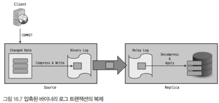

- zstd 알고리즘을 이용해 압축한 뒤 `Transaction_payload_event`라는 하나의 이벤트로 바이너리 로그에 기록한다
- 레플리카 서버로 복제될 때도 압축된 상태를 유지하며 그대로 릴레이 로그에 기록한다
- `binlog_transaction_compression` 변수로 활성화할 수 있으며 `binlog_transaction_compression_level`로 압축 시 사용될 zstd 알고리즘 레벨을 설정할 수 있다
  - binlog_transaction_compression: ON(1) 또는 OFF(0)로 설정 가능하며, 기본값은 OFF다
  - binlog_transaction_compression_level_zsted: 1~22까지 설정 가능하며 기본값은 3이다. 압축 레벨이 높을 수록 압축률이 증가하지만 CPU 메모리 사용량이 증가하고 처리 시간이 증가할 수 있다. 그리고 반드시 압축률이 좋아지는 것은 아니다
- 세션별로도 설정할 수 있어 트랜잭션 별로 선택적으로 압축 기능을 적용할 수 있다
  - 압축된 트랜잭션 데이터와 압축되지 않은 트랜잭션 데이터가 혼합되어도 문제없이 처리가능하다
- 다음과 같은 이벤트 타입들은 압축되지 않는다
  - GTID 설정 관련 이벤트
  - 그룹 복제에서 발생하는 View Change 이벤트 또는 소스 서버에서의 Heartbeat 이벤트와 같은 제어 이벤트
  - 복제 실패 및 소스 서버와 레플리카 서버 간 데이터 불일치를 시킬 수 있는 incident 타입의 이벤트
  - 트랜잭션을 지원하지 않는 스토리지 엔진에 대한 이벤트 및 그러한 이벤트를 포함하고 있는 트랜잭션 이벤트
  - Statement 포맷으로 기록되는 트랜잭션 이벤트
- 다음과 같은 경우 압축이 해제된다
  - 레플리케이션 SQL 스레드에 의해 복제된 트랜잭션이 적용될 때
  - mysqlbinlog를 사용해 트랜잭션을 재실행할 때
  - SHOW BINLOG EVENTS 혹은 SHOW RELAYLOG EVENTS 구문이 사용될 때
- 압축의 통계정보와 압축 및 해제에 소요된 시간도 Performance 스키마를 통해 확인할 수 있다

```sql
-- 해당 정보들을 수집하도록 Update 문을 사용해 설정을 변경해야 한다
UPDATE performance_schema.setup_instruments
SET ENABLED='YES', TIMED='YES'
WHERE NAME IN ('stage/sql/Compressing transaction changes.' ,
                'stage/sql/Decompressing transaction changes.')
```

## 5. 복제 동기화 방식
- 복제는 소스 서버와 레플리카 서버 간의 데이터 동기화 방식에 따라 비동기 복제와 반동기 복제로 나뉜다

### 1. 비동기 복제(Asyncronous replication)
- MySQL의 복제는 기본적으로 비동기 방식으로 동작한다
- 소스 서버의 커밋된 트랜잭션은 바이너리 로그에 기록되며, 레플리카 서버에서 주기적으로 바이너리 로그를 요청한다
- 소스 서버는 이벤트가 잘 전달됐는지, 실제로 적용됐는지 알지 못하며 이에 대한 어떠한 보장도 하지 않는다
   - 소스 서버에 장애가 발생하면 레플리카 서버로 전송되지 않을 수 있다
   - 즉 누라된 트랜잭션이 존재하게 되는데, 레플리카 서버를 승격시키는 경우 데이터를 직접 확인하고 필요 시 수동으로 적용해야 한다
- 동기화 여부를 보장하지 않는다는 점이 단점이다
- 다만 전송을 보장하지 않기 때문에 좀 더 빠르고, 레플리카 서버에 문제가 생기더라도 아무런 영향도 받지 않는다는 장점이 있다
  - 레플맄 ㅏ서버를 여러 대 연결한다 해도 큰 성능의 저하가 없으므로 읽기 트래픽을 분산하는 용도로 제격이다

>#### 참고
> 소스 서버에서 실행된 쿼리는 2~300밀리초 이내면 레플리카 서버에도 적용된다
> 즉각적으로 반영된 데이터를 조회해야 하는 경우에는 소스 서버에서 직접 읽도록 해야한다

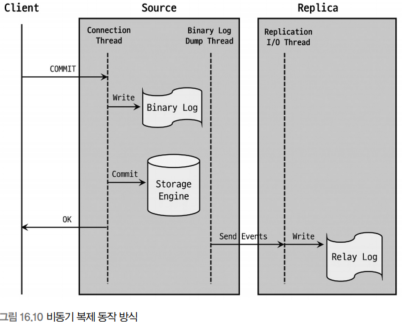

### 2. 반동기 복제(Semi-synchronous replication)
- 비동기보다 향상된 데이터 무결성을 제공하는 복제 동기화 방식으로 소스 서버는 레플리카 서버가 릴레인 로그에 기록 후 응답(ACK)을 보내면 그때 트랜잭션을 완전히 커밋시키고 클라이언트에 결과를 반환한다
  - 즉 적어도 하나의 레플리카 서버에 트랜잭션이 전송됐음을 보장한다
  - **전송**했음을 보장하는 것이지 **적용**되는 것까지 보장한다는 것은 아니다
- `rpl_semi_sync_master_wait_point` 시스템 변수를 통해 레플리카의 응답을 기다리는 지점을 제어할 수 있다
  - AFTER_SYNC와 AFTER_COMMIT 값으로 설정할 수 있다

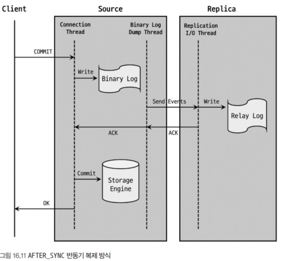

- 위 사진은 AFTER_SYNC로 설정된 경우로 소스 서버가 트랜잭션을 바이너리 로그에 기록하고 난 후 커밋하기 전 단계에서 레플리카 서버의 응답을 기다리게 된다
- 응답이 오면 커밋을 완료하고 클라이언트에 결과를 반환한다

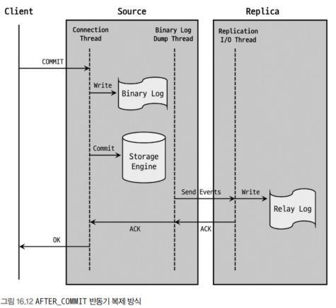

- AFTER COMMIT은 커밋까지 진행하고 나서 클라이언트에 결과를 반환하기 전에 레플리카 서버의 응답을 기다린다
- 레플리카 서버로부터 응답이 내려오면 그때 클라이언트는 처리 결과를 얻고 그다음 쿼리를 실행할 수 있게 된다

- AFTER SYNC가 기본값으로 AFTER_COMMIT과 비교해서 다음과 같은 장점이 있다
  - 소스 서버에 장애가 발생했을 때 팬텀 리드가 발생하지 않음
  - 장애가 발생한 소스 서버에 대해 좀 더 수월하게 복구 처리가 가능
- AFTER_COMMIT 이미 커밋된 상태이기 때문에 다른 세션에서 조회가 가능하다
  - 이로인해 소스 서버에 장애가 발생되어 레플리카가 승격된 경우 조회했던 데이터를 보지 못할 수 있다
  - 레플리카에서 장애가 발생한 경우에는 롤백 처리를 할 필요도 있다
- 타임아웃 시간을 설정할 수 있으며, 지정된 시간이 지나며 비동기 복제 방식으로 전환한다
- 레플리카 서버가 여러 대일 경우에 응답을 받아야 하는 레플리카 서버 수를 설정할 수 있다

#### 1. 반동기 복제 설정 방법
- 반동기 복제 기능은 플러그인 형태로 구현돼 있으며 플러그인이 설치돼 있어야 한다

```sql
-- 소스 서버
INSTALL PLUGIN rpl_semi_sync_master SONAME 'semisync_master_so';

-- 레플리카 서버
INSTALL PLUGIN rpl_semi_sync_slave SONAME 'semisync_slave_so';

-- 플러그인 조회
SELECT PLUGIN_NAME, PLUGIN_STATUS 
FROM information_schema.plugins 
WHERE PLUGIN_NAME LIKE '%semi%';
```

- 플러그인 설치 후 시스템 변수를 적절히 설정해야 한다
- 플러그인이 설치된 이후에 `SHOW GLOBAL VARIABLES`명령 등에서 확인할 수 있다
  - rpl_semi_sync_master_enabled
    - 소스 서버에서 반동기 복제 활성화 여부를 제어한다. ON(1), OFF(0)으로 설정 가능하다
  - rpl_semi_sync_master_timeout
    - 레플리카 응답시간으로 해당 시간만큼 응답이 오지않으면 비동기 복제로 전환된다
  - rpl_semi_sync_master_trace_level
    - 어느 수준까지 디버그 로그가 출력되게 할 것으로 설정한다. 1, 16, 32, 64 값으로 설정 가능하다
  - rpl_semi_sync_master_wait_for_slave_count
    - 소스서버에서 반드시 응답받아야 하는 레플리카 수를 결정한다 최대 65535까지 가능하다
  - rpl_semi_sync_master_wait_no_slave
    - 지정된 시간동안 연결된 레플리카 서버 수가 `rpl_semi_sync_master_wait_for_slave_count`보다 적어졌을 때 어떻게 처리할 것인지 결정한다
    - 기본값으로 ON(1)이면 레플리카 수에 상관없이 타임아웃 기간동안 반동기 복제를 유지한다
    - OFF(0)이면 레플리카 수가 적어지는 즉시 비동기 복제로 전환된다
  - rpl_semi_sync_master_wait_point
    - 소스 서버의 트랜잭션 처리 단계에서 레플리카의 응답을 대기하는 지점을 설정하는 옵션이다. AFTER_SYNC와 AFTER_COMMIT이 있다
  - rpl_semi_sync_slave_enabled
    - 레플리카 서버에서 반동기 복제 활성화 여부를 제어한다
  - rpl_semi_sync_slave_trace_level
    - 디버깅을 어느 수준으로 할 것인지 지정한다
  
```sql
SET GLOBAL rpl_semi_sync_master_enabled = 1;
SET GLOBAL rpl_semi_sync_master_timeout = 5000;

-- 레플리카 서버
SET GLOBAL rpl_semi_sync_slave_enabled = 1;
```

- 소스 서버와 레플리카 서버가 기존에 복제가 실행 중인 상태라면 반동기 복제 적용을 위해 레플리카 서버의 I/O 스레드를 재시작해야 한다

```sql
STOP REPLICA IO_THREAD
START REPLICA IO_THREAD
```

## 6. 복제 토폴로지

### 1. 싱글 레플리카 복제 구성
- 가장 기본적인 형태로 레플리카 서버는 장애 대비용 예비 서버 및 데이터 백업을 위한 용도로 많이 사용된다
- 이 형태에서 읽기 쿼리를 실행한다고 하면 레플리카 서버에 문제가 발생한다면 서비스 장애 상황이 도래할 수 있다

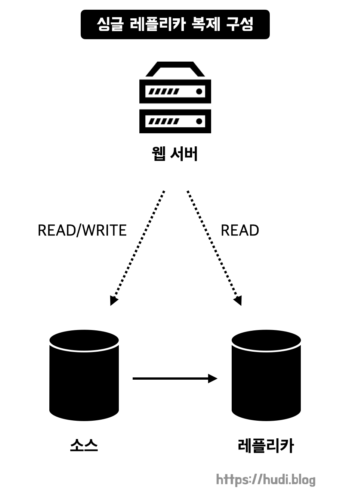

### 2. 멀티 레플리카 복제 구성
- 2개 이상의 레플리카 서버를 연결한 형태로 읽기 쿼리를 분산하는 용도로 많이 사용된다
- 배치나 통계, 분석 등 하나의 MySQL 서버 내에 있는 데이터에 대해 수행돼야 하는 경우 용도별로 전용으로 사용하게 할 수 있다
- 읽기 요청 처리를 분산하는 용도일 경우 한 대는 예비용으로 남겨두는 것이 좋다

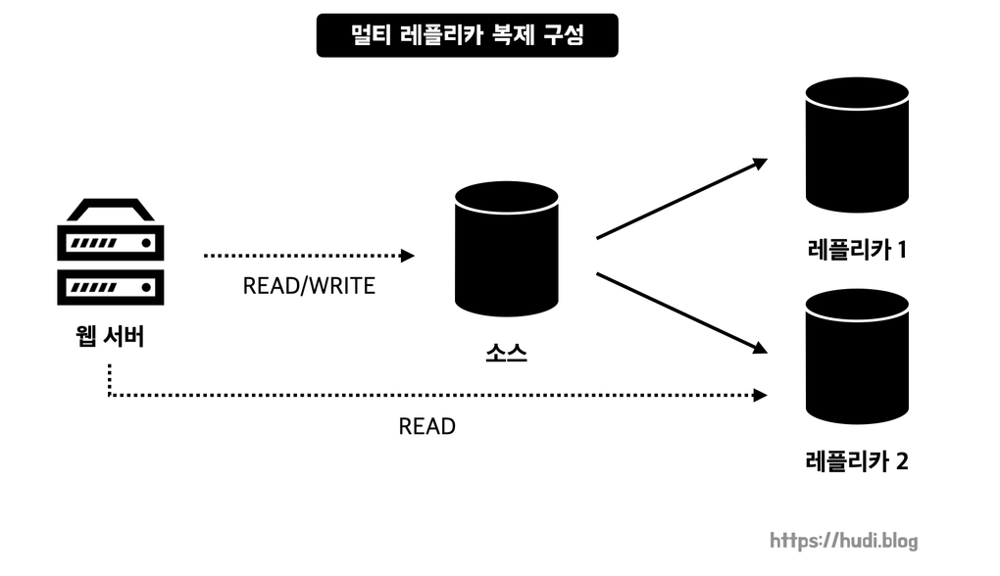

### 3. 체인 복제 구성
- 멀티 레플리카가 너무 많아 소스 서버 성능에 악영향이 예상된다면 고려해볼 수 있다
  - 소스 서버는 레플리카가 요청할 때마다 계속 바이너리 로그를 읽어 전달해야 하므로 부하가 될 수 있다
  - 소스 서버가 해야 할 바이너리 로그 배포 역할을 새롭게 만들 수 있다
- MySQL 서버를 업그레이드 하거나 장비를 교체할 때도 많이 사용된다

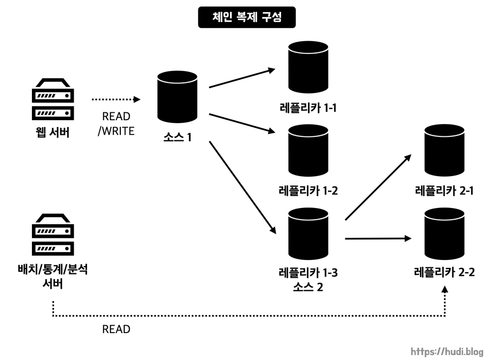

### 4. 듀얼 소스 복제 구성
- 두 개의 MySQL 서버가 서로 소스 서버이자 레플리카 서버로 구성돼 있는 형태이다
- 목적에 따라 ACTIVE-PASSIVE 또는 ACTIVE-ACTIVE 형태로 사용할 수 있다
  - ACTIVE-PASSIVE
    - 하나의 서버에만 쓰기 작업이 수행되는데, 예비 서버도 바로 쓰기 작업이 가능한 상태이기 때문에 별도의 설정 변경 없이 바로 예비용 서버로 쓰기 작업을 전환할 수 있다
    - 다른 서버로 바로 쓰기가 전환될 수 있는 환경이 필요한 경우에 주로 사용된다
  - ACTIVE-ACTIVE
    - 두 서버 모두 쓰기 작업을 수행하는 형태로, 지리적으로 멀리 떨어진 위치에서 유입되는 쓰기 요청도 원활히 처리하기 위해 주로 사용된다
    - 서로 다른 지역에 있는 서버로 거리상 떨어져 있기 때문에 복제에는 다소 시간이 걸릴 수 있다
- 듀얼 소스 복제 구성을 사용할 때는 다음과 같은 부분에서 문제가 발생할 수 있다
  - 동일한 데이터를 각 서버에서 변경
  - 테이블에서 Auto-Increment 키 사용
- `ACTIVE-ACTIVE` 형태일 때 재고 업데이트 쿼리를 실행하면 각 MySQL 서버 처리속도에 따라 다른 순서로 데이터가 업데이트 될 수 있다
- `Auto-Increment`도 마찬가지로 같은 키 값을 갖게 될 수 있으며, 중복 키 에러가 발생할 수 있다
- `ACTIVE-ACTIVE` 형태에서는 동시점에 동일한 데이터를 변경하는 트랜잭션이 있어서는 안되며, 자동 증가 키는 `increment_offset`과 `auto_increment_increment` 변수 값을 적절히 설정한 후 사용해야 한다
- `ACTIVE-PASSIVE` 형태는 양쪽 서버 모두에 쓰기 요청이 유입되는 상황이 절대 발생하지 않는다는 조건하에서만 해당되지 않는다고 할 수 있다

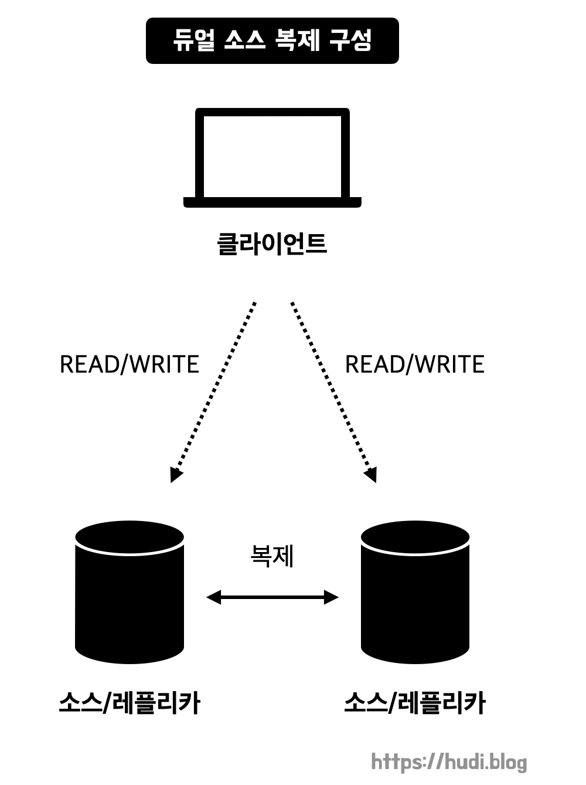

>#### 참고
> 듀얼 소스 구성 및 멀티 소스 복제 구성이 쓰기처리량 향상에 도움될 것이라고 생각하지만
> 복제를 통해 자신에게도 똑같이 실행해야 하기 때문에 쓰기 확장 효과는 크지 않다
> 오히려 트랜잭션 충돌이나 롤백이나 복제 멈춤 현상 등 역효과가 많은 편이다
> 쓰기 성능 확장이 필요하다면 샤딩을 권장한다

### 5. 멀티 소스 복제 구성
- 하나의 레플리카 서버에 둘 이상 소스 서버를 갖는 형태를 말한다
- 주로 다음과 같은 목적으로 사용된다
  - 여러 MySQL 서버에 존재하는 각기 다른 데이터를 하나의 MySQL 서버로 통합
  - 여러 MySQL 서버에 샤딩돼 있는 테이블 데이터를 하나의 테이블로 통합
  - 여러 MySQL 서버의 데이터들을 모아 하나의 MySQL 서버에서 백업을 수행
- 분석에 필요한 데이터들이 여러 곳에 나눠져 있을 때 한 곳에 모아 편리하게 분석할 때 효율적이다
- 각 소스 서버로부터 유입되는 이벤트들이 복제됐을 때 서로 충돌을 일으킬 만한 부분이 없는지 충분한 검토가 필요하다

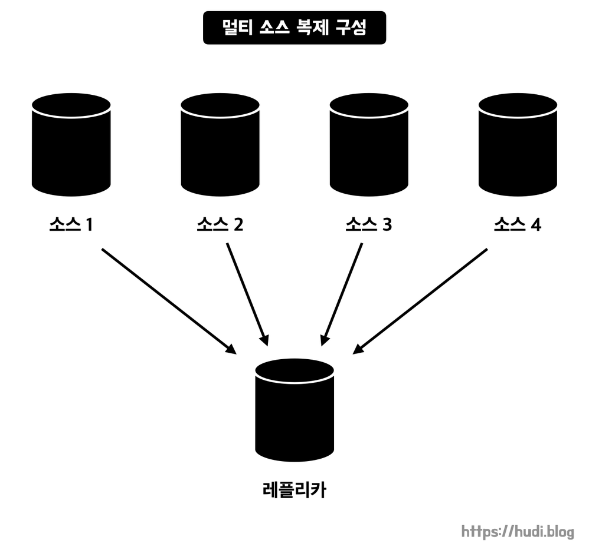

#### 1. 멀티 소스 복제 동작
- 레플리카 서버는 자신과 연결된 소스 서버들의 이벤트들을 동시점에 병렬로 동기화한다
  - 각 소스 서버들에 대한 복제가 독립적으로 처리되는 것을 의미하며, 독립된 복제 처리를 채널이라고 한다
  - 각 채널은 개별적인 레플리케이션 I/O 스레드, 릴레이 로그, 레플리케이션 SQL 스레드를 가지며 복제 연결지를 구별할 수 있는 식별자 역할을 한다
  - 최대 256개의 복제 채널을 생성할 수 있다
  - `CHANGE REPLICATION SOURCE TO` 명령에서 `FOR CHANNEL`구문을 통해 복제 채널명을 지정할 수 있다
  - 단일 소스 복제와 동일하게 GTID 설정이나 반동기 복제 방식 설정 등 모두 가능하며, 각 복제 채널별로 멀티 스레드로 복제하거나 소스 서버의 변경 이벤트를 필터링하돌고 설정하는 것도 가능하다

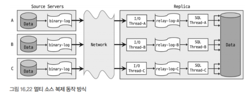

```sql
CHANGE [REPLICATION SOURCE | MASTER ] TO ... FOR CHANNEL ["channel_name"];
START [REPLICA | SLAVE ] [IO_THREAD | SQL_THREAD] FOR CHANNEL ["channel_name"];

-- FOR CHANNEL을 명시하지 않으면 전체 복제 채널에 대해 명령이 수행된다
STOP [REPLICA | SLAVE ] [IO_THREAD | SQL_THREAD];
```

#### 2. 멀티 소스 복제 구축
- 단일 소스와 큰 차이는 없고 복제를 연결하기 위해 소스 서버들의 백업 데이터를 레플리카 서버로 적재해야 하는데, 기존과 달리 여러 대의 소스 백업 데이터를 가져와야 하므로 이 부분의 작업이 까다롭다고 생각할 수 있다
  - 소스 서버와 레플리카 서버 모두 데이터를 가지고 있지 않다면 그냥 멀티 소스 복제 ㅇ녀결만 하면 된다
  - 두 개 이상 소스 서버에서 가져와야 한다면 공통 데이터베이스와 InnoDB의 테이블 스페이스 충돌과 병합을 고려해야 한다
- mysqldump와 같은 논리 수준의 백업 도구 이용
  - mysqldump를 이용하면 테이블 스페이스를 물리적으로 백업하는 것이 아니므로 적재할 때 병합과 관련된 문제가 발생하지 않는다
  - 프로시저나 함수, 유저 정보나 권한 관련 테이블은 중복될 가능성이 있지만 수작업으로 해야 한다
- XtraBackup과 같은 물리 수준의 백업 도구
  - 대용량 데이터베이스를 빠르게 레플리카 서버로 가져올 수 있다
  - 물리 수준 백업은 테이블 스페이스를 포함해서 MySQL 서버의 모든 데이터 파일을 그대로 복사해서 백업하기 때문에 두 소스 서버에서 데이터를 가져와야 한다면 시스템 테이블 스페이스 문제없이 병합할 수 있는 방법이 없다
- 데이터 크기에 따라 두 백업 도구를 혼합해서 사용하는 것이 좋다
  - 데이터가 큰 테이블을 물리 백업 도구 작은 것은 mysqldump를 이용하는 방식이다
  - 이러면 테이블스페이스 문제도 안생긴다. 프로시저나 함수같은 경우는 수작업으로 해야 한다
- 복제 연결 전에 `master_info_repository`, `relay_log_info_repository`를 반드시 TABLE로 설정해야 한다
  - 두 값이 FILE이면 멀티 소스 복제를 설정할 수 없다

```sql
-- 소스 서버와 A와 복제 연결
mysql_Replica> CHANGE REPLICATION SOURCE TO SOURCE_HOST='hostname_A', SOURCE_PORT=3306,
               SOURCE_USER='replication_user', SOURCE_PASSWORD='replication_password',
               SOURCE_LOG_FILE='binary-log.000087', SOURCE_LOG_POS=100
               FOR CHANNEL 'source_A';

-- 소스 서버와 B와 복제 연결
mysql_Replica> CHANGE REPLICATION SOURCE TO SOURCE_HOST='hostname_B', SOURCE_PORT=3306,
               SOURCE_USER='replication_user', SOURCE_PASSWORD='replication_password',
               SOURCE_LOG_FILE='binary-log.000087', SOURCE_LOG_POS=100
               FOR CHANNEL 'source_B';

-- 복제 시작
mysql_Replica> START REPLICA FOR CHANNEL 'source_A';
mysql_Replica> START REPLICA FOR CHANNEL 'source_B';

-- 복제 상태 확인
mysql_Replica> SHOW REPLICA STATUS FOR CHANNEL 'source_A';
mysql_Replica> SHOW REPLICA STATUS FOR CHANNEL 'source_B';
```

- GTID를 이용한 복제를 연결하기 전에는 GTID 값을 `gtid_executed` 시스템 변수에 설정해야 한다
  - GTID 관련 값을 초기화하고 `gtid_purged`에 소스 서버들의 GTID 값을 쉼표(,)로 연결해서 설정해야 한다

```sql
-- 소스 서버 A와 복제 연결
mysql_Replica> CHANGE REPLICATION SOURCE TO SOURCE_HOST='hostname_A', SOURCE_PORT=3306,
               SOURCE_USER='replication_user', SOURCE_PASSWORD='replication_password',
               SOURCE_AUTO_POSITION=1
               FOR CHANNEL 'source_A';

-- 소스 서버 B와 복제 연결
mysql_Replica> CHANGE REPLICATION SOURCE TO SOURCE_HOST='hostname_B', SOURCE_PORT=3306,
               SOURCE_USER='replication_user', SOURCE_PASSWORD='replication_password',
               SOURCE_AUTO_POSITION=1
               FOR CHANNEL 'source_B';

-- 복제 시작
mysql_Replica> START REPLICA FOR CHANNEL 'source_A';
mysql_Replica> START REPLICA FOR CHANNEL 'source_B';

-- 복제 상태 확인
mysql_Replica> SHOW REPLICA STATUS FOR CHANNEL 'source_A';
mysql_Replica> SHOW REPLICA STATUS FOR CHANNEL 'source_B';
```

## 7. 복제 고급 설정
### 1. 지연된 복제(Delayed Replication)
- 소스 서버에서 중요한 테이블이나 데이터를 삭제했을 때 레플리카 서버에 즉시 반영되지 않도록 설정하는 기능이다
- `CHANGE REPLICATION SOURCE TO` 구문에 SOURCE_DELAY옵션을 사용해 얼마나 지연시킬 것인지 지정할 수 있다
  - `CHANGE REPLICATION SOURCE TO SOURCE_DELAY=86400;`
  - `SOURCE_DELAY`는 초 단위로 지정하며, 86400초는 1일이다
- 8.0부터 바이너리 로그에 `original_commit_timestamp(OCT)`와 `immediate_commit_timestamp(ICT)`라는 타임스탬프가 추가됐다
  - OCT: 원본 소스에서 커밋된 시각이다
  - ICT: 직계 소스서버에서 커밋된 시각이다
  - 체인 복제 구성를 떠올리면 이해하기 쉽다. A->B->C로 복제된다면 A가 원본 소스, B가 직계 소스, C가 레플리카 서버가 된다
  - A에서 트랜잭션이 발생하면 OCT와 ICT가 동일하다
  - B에서 A의 트랜잭션을 복제해서 적용하면 ICT가 A의 OCT와 동일하다
  - C에서 B의 트랜잭션을 복제해서 적용하면 ICT가 B의 OCT와 동일하다
  - 지연시간은 원 소스서버 기준으로 계산됐지만, 타임존이 다른 경우 예상한 값과 다르게 표기됐다. 하지만 8.0부터 ICT값을 사용함에 따라 이러한 문제점이 모두 사라졌다

### 2. 멀티 스레드 복제(Multi-threaded Replication)
- 코디네이터 스레드가 워커 스레드와 협업해서 동기화를 진행한다
- 복제된 트랜잭션들을 어떻게 병렬로 처리할 것인가에 따라 데이터베이스 기반과 LOGICAL GLOCK 기반으로 나뉜다
  - `slave_parallel_type`으로 타입을 설정할 수 있고, `slave_parallel_workers`로 워커 스레드 개수를 지정할 수 있다
  - 기본값은 0으로 멀티 스레드 복제 동기화를 사용하지 않는다

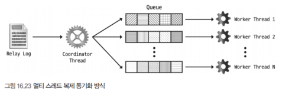

#### 1. 데이터베이스 기반 멀티 스레드 복제
- 스키마 기반처리 방식이라고도 하며, 처음 도입된 방식이다
- 말 그대로 데이터베이스 단위로 병렬을 수행하기 때문에 데이터베이스가 하나밖에 없다면 아무런 장점을 가지지 못한다
- 데이터베이스 개수만큼 워커 스레드 수를 설정하는 것이 좋다
- 워커 스레드별로 분산하지만 데이터베이스별로도 처리하기 때문에 같은 데이터베이스라고 같은 워커 스레드가 처리하여 충돌이 일어나지 않도록 한다
  - DML이 서로 독립적이라면 효율이 좋지만, 아니라면 효율이 낮다

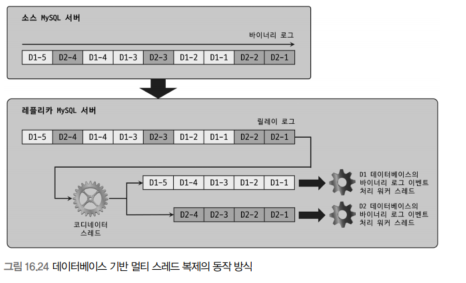

```sql
[mysqld]
slave_parallel_type='DATABASE'
slave_parallel_workers=4

-- 단일 스레드 복제가 진행되고 있는 상황에서 멀티 스레드 복제로 변경하고 싶은 경우
STOP REPLICA SQL_THREAD;
SET GLOBAL slave_parallel_type='DATABASE';
SET GLOBAL slave_parallel_workers=4;
START REPLICA SQL_THREAD;
```

#### 2. LOGICAL CLOCK 기반 멀티 스레드 복제
- 전체 트랜잭션들을 멀티 스레드로 처리할 수 있는 기능이다
- 바이너리 로그로 기록될 때 각 트랜잭션별로 논리적인 순번 값을 부여해 해당 값을 바탕으로 병렬로 실행할 수 있게 하는 방식이다
- 처리방식이 크게 3가지가 있다

#### 1). 바이너리 로그 그룹 커밋
- 

### 3. 크래시 세이프 복제(Crash-safe Replication)
- MySQL이 비정상 종료된 후에도 복제가 원활하게 재개될 수 있게 여러 설정을 제공한다
- 크래시 세이프 복제는 어떤 옵션 하나를 활성화해서 적용하는 것이 아니라 여러 옵션들을 적절히 설정했을 때 얻는 효과라고 할 수 있다

#### 1. 서버 장애와 복제 실패
- 테이블로 저장하게 되면서 하나의 이벤트를 원자적으로 저장할 수 있게 됐고 복제를 재개할 수 있게 됐다
- 다만 MySQL 서버만 비정상 종료에만 가능하지 서버 장비 또는 운영체제가 비정상 종료되는 경우에는 무용지물일 수 있다

```sql
relay_log_recovery=ON
relay_log_info_repository=TABLE
```

#### 2. 복제 사용 형태별 크래시 세이프 복제 설정

#### 1). 바이너리 로그 파일 위치 기반 복제 + 싱글 스레드 동기화
- 위와 같이 설정하면 된다

#### 2). 바이너리 로그 파일 위치 기반 복제 + 멀티 스레드 동기화
- 레플리카 서버에서 트랜잭션 커밋 순서가 소스 서버와 일치하도록 설정한 경우에는 크래시 세이프 복제가 된다
  - 커밋 순서가 일치하지 않는 경우에는 `sync_relay_log=`옵션을 추가해야 가능하다

#### 3). GTID 기반 복제
- `SOURCE_AUTO_POSITION=1`을 설정하면 된다

### 4. 필터링된 복제(Filtered Replication)
- 특정 이벤트만 레플리카 서버에 적용될 수 있도록 하는 기능이다
- 필터링 주체는 소스 서버와 레플리카 서버 둘 다 될 수 있으며, 레플리카 서버에서 좀 더 다양한 형태로 필터링이 가능하다
  - 소스 서버는 데이터베이스 단위로만 가능하다
  - 레플리카 서버는 동적으로 설정을 변경할 수 있고, 모든 이벤트들을 가져온 다음에 다음 이벤트를 실행할 때 필터링를 적용한다