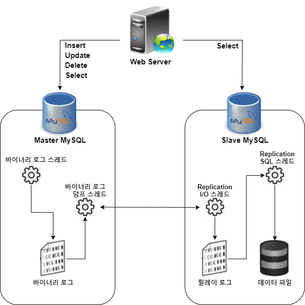
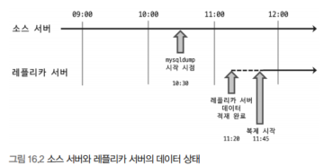
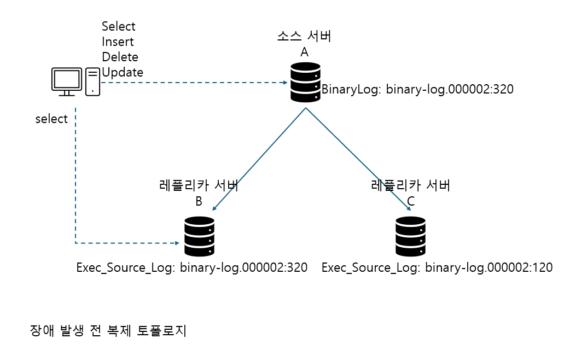
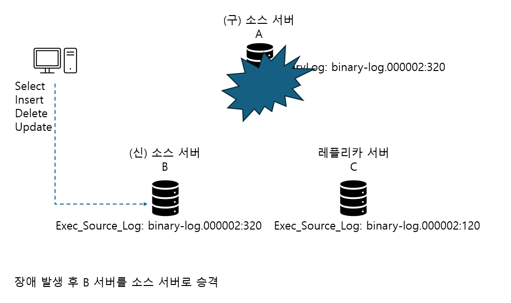
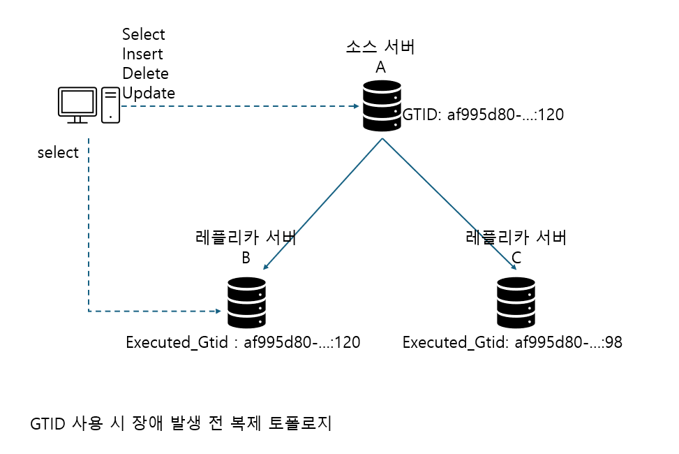
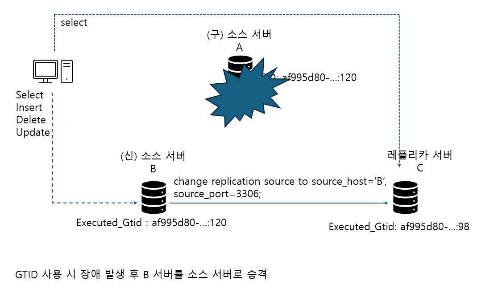

## 0. 시작하며
- 데이터베이스를 사용하고 운영할 때 가장 중요한 두 가지는 확장성과 가용성이다
- 대용량 트래픽을 안정적으로 처리하기 위해서는 확장이 필수적이며, 안정적인 서비스를 이용할 수 있게 하려면 가용성이 반드시 뒷받침돼야 한다
- 이 두 요소를 위해 가장 일반적으로 사용되는 기술이 바로 복제다

## 1. 개요
- 복제는 한 서버에서 다른 서버로 데이터가 동기화되는 것을 말하며, 원본 데이터를 가진 서버를 `소스`서버, 복제된 데이터를 가지는 서버를 `레플리카`서버라고 한다
  - 소스 서버에서 데이터 및 스키마에 변경이 최초로 일어나며, 레플리카 서버에서 이를 전달받아 자신이 가지고 있는 데이터에 반영함으로써 동기화시킨다
- 대부분 DBMS는 복제 기능을 제공하며 소스 서버에 문제가 생겼을 때를 대비하려는 목적이 제일 크지만 여러 가지 목적이 있다
  - 스케일 아웃(Scale-out)
    - DB 서버 사양을 업그레이드 하는 것을 스케일 업이라고 한다. 하지만 서버 사양을 업그레이드 하는 데는 한계가 있으며 비용도 많이 든다
    - DB 서버를 한 대 이상 사용하여 쿼리를 분산시키는 것을 스케일 아웃이라고 하며, 좀 더 유연하고 서비스를 안정적으로 운영할 수 있다
  - 데이터 백업
    - 백업은 서버의 자원을 공유하기 때문에 실행중인 쿼리에 영향을 받을 수 있다
    - 이를 복제를 이용해 레플리카를 구축하고, 데이터 백업은 레플리카 서버에서 실행한다
  - 데이터 분석
    - 분석용 쿼리는 대량의 데이터를 조회하고 집계 연산을 하는 등 복잡하고 무거운 경우가 대부분이라 서버의 리소스를 많이 사용하게 된다
    - 이로인해 다른 쿼리에 영향을 받을 수 있으므로 레플리카 서버에서 분석용 쿼리만 전용으로 실행한다
  - 데이터의 지리적 분산
    - DB와 애플리케이션의 거리가 멀리 떨어져있다면 통신 속도에 영향을 받으므로 복제를 이용해 가까운 곳에 레플리카를 구축해 응답 속도를 개선할 수 있다

## 2. 복제 아키텍처
- MySQL 서버에서 발생하는 모든 변경 사항은 별도의 로그 파일에 기록되는데 이를 **바이너리 로그(Binary Log)** 라고 한다
  - 바이너리 로그에는 데이터 변경 내역뿐만 아니라 데이터베이스나 테이블의 구조 변경과 계정이나 권한의 변경 정보까지 모두 저장된다
  - 바이너리 로그에 기록된 각 변경 정보들을 **이벤트**라고도 한다
- 복제는 바이너리 로그 기반으로 구성되며, 레플리카 서버로 전송되고 해당 내용을 로컬 디스크에 저장한 뒤 자신이 가진 데이터에 반영하는 방식으로 동작한다
  - 레플리카 서버에서 바이너리 로그를 읽어 자신의 데이터에 반영하는 과정을 **릴레이 로그(Relay Log)** 라고 한다



- 복제는 세 개의 스레드에 의해 작동하는데, 그 중 하나는 소스 서버에 존재하며 나머지 두 개는 레플리카 서버에 존재한다
  - 바이너리 로그 덤프 스레드
    - 레플리카 서버는 소스 서버에 접속해 바이너리 로그 정보를 요청한다
    - 소스 서버에서는 레플리카 서버가 연결될 때 내부적으로 바이너리 로그 덤프 스레드를 생성해서 레플리카 서버로 바이너리 로그를 전송한다
    - 레플리카 서버로 보낼 각 이벤트를 읽을 때 일시적으로 바이너리 로그에 잠금을 수행하며 읽은 후 바로 해제한다
  - 레플리케이션 I/O 스레드
    - 복제가 시작(START REPLIACE 또는 START SLAVE명령)되면 레플리카 서버는 I/O 스레드를 생성하고, 복제가 멈추면 I/O 스레드는 종료된다 
    - `바이너리 로그 덤프 스레드`로부터 이벤트를 가져와 로컬 서버의 파일(릴레이 로그)로 저장하는 역할을 담당한다
    - 바이너리 로그를 읽어 파일로 쓰는 역할만 하기 때문에 `I/O` 스레드라고 부른다
    - `SHOW REPLIACE STATUS 또는 SHOW SLAVE STATUS` 명령으로 복제 현황을 알 수 있다
  - 레플리케이션 SQL 스레드
    - 릴레이 로그 파일의 이벤트들을 읽고 실행한다
    - `SHOW REPLIACE STATUS 또는 SHOW SLAVE STATUS` 명령으로 스레드 상태를 확인할 수 있으며 `Replica_SQL_RUNNING` 칼럼에 SQL 스레드의 현재 상태가 표시된다
- 레플레카 서버의 I/O 서버와 SQL 스레드는 독립적으로 동작하기 때문에 SQL 스레드가 느리더라도 I/O 스레드는 무관하게 빠를 수 있다
- 레플리카 서버가 문제가 생기더라도 소스 서버는 영향을 받지 않지만, 소스 서버에서 문제가 생겨 레플리카 서버의 `I/O` 스레드가 정상적으로 동작하지 않으면 복제를 에러를 발생시키고 바로 중단된다
  - 이는 복제 기능만 중단된 것으로 레플리카 서버가 쿼리를 처리하는 데는 아무런 문제가 없다
- 복제가 시작되면 릴레이 로그를 비록해 총 세 가지 유형의 복제 관련 데이터를 생성하고 관리한다
  - 릴레이 로그
    - 레플리케이션 I/O 스레드에 의해 작성되는 파일로, 소스 서버의 바이너리 로그에서 읽어온 이벤트(트랜잭션) 정보가 저장된다
    - 릴레이 로그는 바이너리 로그와 마찬가지로 릴레링 로그 파일들의 목록이 담긴 인덱스 파일과 실제 이벤트 정보가 저장돼 있는 로그 파일로 구성된다
    - 릴레이 로그에 저장된 트랜잭션 이벤트들은 레플리케이션 SQL 스레드에 의해 레플리카 서버에 적용된다
  - 커넥션 메타데이터
    - 레플리케이션 I/O 스레드에서 소스 서버에 연결할 때 사용하는 DB 계정 정보 및 현재 읽고 있는 소스 서버의 바이너리 파일명과 파일 내 위치 값 등이 담겨 있으며, 기본적으로 `mysql.slave_master_info` 테이블에 저장된다
  - 어플라이어 메타데이터
    - 레플리케이션 SQL 스레드에서 릴레리 로그에 저장된 소스 서버의 이벤트들을 레플리카 서버에 적용하는 컴포넌트를 `어플라이어`라고 한다
    - 최근 적용된 이벤트들에 대해 해당 이벤트가 저장돼 있는 릴레이 로그 파일명과 파일 내 위치 정보 등을 담고 있으며, 레플리케이션 SQL 스레드는 이 정보들을 바탕으로 레플리카에 적용한다
    - 기본적으로 `mysql.slave_relay_log_info` 테이블에 저장된다
- 커넥션 및 어플라이어 메타데이터는 `master_info_repository`와 `relay_log_info_repository`를 통해 어떤 형태로 데이터를 관리할지 설정할 수 있다
  - `FILE`과 `TABLE`중에 선택할 수 있으며 기본값은 TABLE이며 FILE은 제거될 예정이다
  - FILE로 설정하는 경우 I/O 스레드와 SQL 스레드가 동작할 때 동기화되지 않는 경우가 빈번하게 발생했다
  - TABLE은 Atomic하게 업데이트되므로 MySQL이 갑자기 종료됐다고 하더라도 다시 구동했을 때 문제없이 복제가 진행될 수 있다. 이를 크래시 세이프 복제(Crash-safe replication)라고 한다

## 3. 복제 타입
- 소스 서버의 바이너리 로그에 기록된 변경 내역들을 식별하는 방식에 따라 `로그 파일 위치 기반 복제`와 `글로벌 트랜잭션 ID 기반 복제`로 나뉜다

### 1. 바이너리 로그 파일 위치 기반 복제
- 레플리카 서버에서 소스 서버의 바이너리 로그 파일명과 파일 내에서의 위치(Offset 또는 Position)로 개별 바이너리 로그 이벤트를 식별해서 복제가 진행되는 형태를 말한다
- 이벤트 하나하나를 소스 서버의 바이너리 로그 파일명과 파일 내에서의 위치 값의 조합으로 식별한다
- 식별된 적용 내역들을 추적함으로써 일시 중단 및 재개할 때도 다시 읽어올 수 있다
- 또 중요한 부분은 MySQL 서버들이 모두 고유한 `server_id`값을 가지고 있어서 MySQL 서버를 식별 할 수 있어야 한다. 기본값은 1이다
  - 레플리카 서버에 설정된 `server_id`와 동일한 값을 가지는 경우 해당 이벤트를 적용하지 못하고 무시하게 된다
  - 자신의 서버에서 발생한 이벤트로 간주해서 적용하지 않기 때문이다

#### 1. 바이너리 로그 파일 위치 기반의 복제 구축
- 각 서버에 데이터가 이미 존재하는지 여부와 복제를 어떻게 활용할 것인지 등에 따라 복제 설정 과정 및 구축 방법이 달라진다

#### 1). 설정 준비
- 소스 서버에서 반드시 바이너리 로그가 활성화돼 있어야 하며, MySQL 서버가 고유한 `server_id`값을 가져야 한다
- 결론적으로 소스 서버에서는 `server_id`값만 적절하게 설정해도 복제는 가능하다
  - 바이너리 로그 파일 위치나 파일명을 따로 설정하고 싶다면 `log_bin` 변수를 통해 원하는 값으로 설정할 수 있다
  - 추가적으로 바이너리 로그 동기화 방식이나 바이너리 로그를 캐시하기 위한 메모리 크기, 바이너리 로그 파일 크기, 보관 주기 등도 지정할 수 있다

```sql
## 소스 서버 설정
[mysqld]
server_id = 1
log_bin = /binary-log-dir-path/binary-log-home
sync_binlog=1
binlog_cache_size=5M
max_binlog_size=512M
binlog_expire_logs_seconds=1209600
```

- 바이너리 로그가 정상적으로 기록되고 있는지는 `SHOW MASTER STATUS` 명령으로 학인할 수 있고 이 값은 계속 증가할 것이다
- 레플리카 서버에서 릴레이 로그 파일도 복제 설정 시 기본적으로 데이터 디렉토리 밑에 자동 생성된다
- 위치나 파일명을 따로 설정하려면 `relay_log` 변수를 사용해 원하는 값으로 지정하면 된다
- 릴레이 로그에 기록된 이벤트는 레플리카 서버에 적용되면 더이상 필요하지 않는데, 이는 자동으로 삭제된다
  - 유지하고 싶다면 `relay_log_purge`를 OFF로 설정하면 된다
  - 하지만 릴레이 로그가 쌓이면 디스크 공간이 부족해질 수 있으므로 모니터링하는 것이 좋다
- 레플리카는 일반적으로 읽기 전용이므로 `read_only` 설정도 함께 사용하는 편이 좋고, 소스 서버로 승격될 수 있음을 고려하면 `log_slave_updates`도 명시하는 것이 좋다
- 기본적으로 레플리카 서버는 복제에 의한 데이터 변경 사항은 바이너리 로그에 기록하지 않는데, `log_slave_update`를 설정하면 레플리카 서버의 변경 사항도 바이너리 로그에 기록하게 된다

```sql
## 레플리카 서버 설정
[mysqld]
server_id = 2
relay_log = /relay-log-dir-path/relay-log-home
read_only_purde=ON
read_only
log_slave_updates
```

#### 2). 복제 계정 준비
- 바이너리 로그를 가져오려면 소스 서버에 접속해야 하므로 DB 계정이 필요하다
  - 레플리카 서버가 사용할 계정을 복제용 계정이라고 한다
- 기존 계정에 복제 관련 권한을 부여해도 되지만, 레플리카 서버의 커넥션 메타데이터에 평문으로 저장되므로 보안을 고려해서 별도의 계정을 생성하는 것이 좋다
- 복제용 계정은 반드시 `REPLICATION SLAVE` 권한을 가지고 있어야 한다
  - `GRANT REPLICATION SLAVE ON *.* TO 'repl_user'@'%';

#### 3). 데이터 복사
- 소스 서버의 데이터를 레플리카 서버로 복사해야 하는데, mysqldump 등과같은 툴로 복사하면 된다
- mysqldump를 사용해 덤프할 때는 `--single-transaction`과 `--master-data`라는 옵션을 반드시 사용해야 한다
  - `--single-transaction` : 트랜잭션을 사용해 잠금을 걸지않고 일관된 데이터를 덤프받을 수 있게 한다
  - `--master-data`
    - 덤프 시작 시점의 소스 서버의 바이너리 로그 파일명과 위치 정보를 포함하는 복제 설정 구문이 덤프 파일 헤더에 기록될 수 있게 하는 옵션으로 복제 연결을 위해 반드시 필요한 옵션이다
    - 해당 옵션을 사용할 때 글로벌 락이 걸리는데 바이너리 로그의 위치를 순간적으로 고정시키기 위함이다
    - 값이 1로 설정되면 덤프 파일 내의 복제 설정 구문(CHANGE REPLICATION SOURCE TO 또는 CHANGE MASTER TO)이 실제 실행 가능한 형태로 기록되고, 2로 설정되면 해당 구문이 주석으로 처리되어 참조만 할 수 있는 형태로 기록된다
  - `linux> mysqldump -uroot -p --single-transaction --master-data=2 \ --opt --routines --triggers --hex-blob --all-databases > source_data.sql`
- 덤프가 완료되면 `source_data.sql` 파일을 레플리카로 옮겨 데이터 적재를 진행한다

```sql
-- MySQL 서버에 직접 접속해 데이터 적재 명령을 실행
mysql> SOURCE /tmp/master_data.sql

-- MySQL 서버에 로그인하지 않고 데이터 적재 명령을 실행
-- 두 명령어 중 하나를 사용
linux> mysql -uroot -p < /tmp/master_data.sql
linux> catrr /tmp/source_data.sql | mysql -uroot -p
```

#### 4). 복제 시작


- 10:30에 백업을 받아 11:20에 적재를 했기 때문에 소스 서버 데이터보다 50분 지연된 상태라 할 수 있다
- 복제를 설정하는 명령은 `CHANGE REPLICATION SOURCE TO` 또는 `CHANGE MASTER TO`으로 mysqldump로 백업 받은 파일의 헤더 부분에 해당 명령어를 참조할 수 있다

```file
linux> less /tmp/source_data.sql

-- CHANGE MASTER TO MASTER_LOG_FILE='binary-log.000002', MASTER_LOG_POS=2708

-- // MySQL 8.0.23 이상 버전
CHANGE REPLICATION SOURCE TO
  SOURCE_HOST='source_server_host',
  SOURCE_PORT=3306,
  SOURCE_USER='repl_user',
  SOURCE_PASSWORD='repl_user_password',
  SOURCE_LOG_FILE='binary-log.000002',
  SOURCE_LOG_POS=2708, // 바이너리 로그 파일의 위치값
  GET_SOURCE_PUBLIC_KEY=1; // RSA 키 기반 비밀번호 교환 방식의 통신을 위해 공개키를 소스 서버에 요청할 것인지 여부
```

- 복제 관련 정보만 등록할 것이지 동기화가 시작되지 않았기 때문에 복제를 실행하려면 `START REPLICA` 또는 `START SLAVE` 명령어를 실행하면 된다
- `SHOW REPLICA STATUS`에서 Seconds_Behind_Source의 값이 0이 되면 완전히 동기화됐음을 의미한다

#### 2. 바이너리 로그 파일 위치 기반의 복제에서 트랜잭션 건너뛰기
- 종종 레플리카 서버에서 소스 서버로부터 전달받은 트랜잭션 중 일부를 적용하지 못하는 상황이 발생할 수 있다
  - 대표적인 에러가 중복 키 에러다
- 복제를 중단시킨 문제가 심각한 문제라면 레플리카 서버의 데이털르 모두 버리고 복제를 다싱 구성해야 할 수도 있지만, 경우에 따라서 소스 서버의 트랜잭션을 무시하고 넘어가도록 처리해도 괜찮을 때가 있다
  - `sql_slave_skip_counter` 시스템 변수를 통해 문제되는 트랜잭션을 건너뛸 수 있다
  - `1`로 지정하고 SQL 스레드를 재시작하면 에러가 발생한 쿼리를 건너뛰고 복제를 재개한다
  - 1이란게 DML 쿼리 문장 하나를 가진 바이너리 로그 이벤트 1개를 무시하는 것이 아니라 이벤트 그룹을 무시하는 것이다
  - 트랜잭션을 지원하는 테이블은 트랜잭션이 이벤트 그룹이다

```sql
STOP REPLICA SQL_THREAD;
SET GLOBAL sql_slave_skip_counter = 1;
START REPLICA SQL_THREAD;
```

### 2. 글로벌 트랜잭션 아이디(GTID) 기반 복제
- 바이너리 파일 위치 기반 복제의 문제는 바이너리 로그 파일명과 파일 내 위치 값 조합으로 식별된다는 것이다
  - 이 같은 식별이 레플리카 서버에서도 동일하게 저장된다는 보장이 없다
  - 즉 복제에 투입된 서버들마다 동일한 이벤트에 대해 서로 다른 식별 값을 갖게 되는 것이다
- 서로 호환되지 않은 정보를 이용해 복제를 진행함으로써 토폴로지를 변경하는 작업은 불가능할 때도 많았다
- 소스 서버에서 발생한 각 이벤트들이 복제 서버들에서 동일한 고유 식별값을 가진다면 좀 더 쉽게 복제 토폴로지를 변경할 수 있으며, 장애 복구에 소요되는 시간도 줄어들 것이다
- 이처럼 전체 MySQL 서버에 고유하도록 각 이벤트에 부여된 식별 값을 글로벌 트랜잭션 아이디(GTID)라고 하며, 이를 기반으로 복제가 진행되는 형태를 **GTID 기반 복제**라고 한다

#### 1. GTID의 필요성 
- 소스 서버 A와 SELECT 쿼리 분산용 B, 배치 통계용 C 서버를 구축하고 있다
- 레플리카 서버 C는 지연이 발생해서 `binary_log.00002:120`위치까지만 복제가 동기화된 상태였다
- 소스 서버 A가 장애가 발생하면서 완전히 동기화된 B를 소스 서버로 승격할 것이다
- 트래픽을 몰리지만 C 서버는 동기화되지 않은 상태여서 서비스에서 SELECT 용도로 사용할 수 없는 상태다



- B서버는 SELECT 쿼리의 부하 분산용이기 때문에 과부하 상태가 될 것이다
- 하지만 A서버가 종료돼 버렸으므로 C 서버를 동기화할 방법이 없다
- 물론 완전히 불가능한 것은 아니고 B 서버의 릴레이 로그가 남아있거나 수동으로 확인하면 가능은하다
  - 하지만 릴레이 서버는 자동 삭제되고, 수동 확인은 간단한 문제가 아니다



#### 글로벌 트랜잭션 아이디로 복제되는 상황을 알아보자



- GTID는 모두 다 동일한 값을 가지기 때문에 같은 GTID라면 다른 서버에서도 동일한 데이터이다
- 따라서 B서버에서 `98`이후 바이너리 로그 이벤트를 가져와서 동기화하면 된다



- 레플리카 서버 확장이나 축소 또는 통합등을 할 때도 복제 동기화로 쉽게 가능하다

#### 2. 글로벌 트랜잭션 아이디
- 로그 파일 위치 기반 복제는 물리적인 방식이라 할 수 있다
- 반면 GTID는 논리적인 의미로서 물리적인 파일의 이름이나 위치와는 무관하게 생성된다
- GTID는 각 트랜잭션과 연결된 고유 식별자로, 해당 트랜잭션이 발생한 서버에서 고유할뿐만 아니라 복제 토폴로지 내 모든 서버에서 고유하다
- GTID는 커밋되어 바이너리 로그에 기록된 트랜잭션에 한해서만 할당하며, SELECT 쿼리나 `sql_log_bin`설정이 비활성화돼 있는 상태에서 발생한 트랜잭션은 바이너리에 기록되지 않으므로 GTID가 할당되지 않는다
- GTID는 `[source_id]:[transaction:id]`형태이며 `source_id`는 `server_uuid` 시스템 변수 값을 사용하고, 트랜잭션 아이디는 1씩 단조 증가하는 형태로 발급된다
  - `auto_cnf`파일에 `[auto]` 섹션이 있으며 그 하위에 현재 서버의 UUID 값이 표기돼 있다
- GTID는 `gtid_execute` 테이블을 조회하거나 `gtid_executed` 시스템 변수를 통해 확인할 수 있다
  - `SELECT * FROM mysql.gtid_executed;`
  - `SHOW GLOBAL VARIABLES 'gtid_executed';`
- 하나 이상의 GTID 값으로 구성돼 있는 것을 GTID 셋이라 하며, GTID 셋에서는 기본적으로 동일한 서버에서 생성된 연속하는 GTID 값은 축소시켜 범위로 보여준다
- GTID 셋에는 서로 다른 UUID를 가질 수 있으며, UUID 값이 변경됐거나 복제하는 경우 등이 이에 해당된다
- GTID는 모든 트랜잭션들에 따라 저장되므로 많은 데이터에 쌓일 수 있는데 MySQL 서버는 주기적으로 하나로 압축한다
  - 이는 데이터 파일 압축이 아니라 연속될 것들끼리 모아서 1건의 레코드로 만드는 것을 의미한다

| source_uuid                           | interval_start | interval_end |
|--------------------------------------|----------------|--------------|
| 3E11FA47-71CA-11E1-9E33-C80AA9429562 | 1              | 100          |
| 3E11FA47-71CA-11E1-9E33-C80AA9429562 | 105            | 200          |
| A1B2C3D4-1234-5678-90AB-CDEF12345678 | 1              | 50           |
| A1B2C3D4-1234-5678-90AB-CDEF12345678 | 60             | 120          |

- 바이너리 로그 활성화여부에 따라 압축 수행조건이 달라지는데, 바이너리 로그가 활성화돼 있는 경우 로그 파일이 로테이션될 때 자동으로 압축이 수행된다
- 활성화돼 있지 않다면 `thread/sql/compress_gtid_table`이라는 별도의 포그라운드 스레드에 의해 수행되는데, 트랜잭션 수가 `gtid_executed_compression_period`에 지정된 수까지 도달하면 압축을 수행한다
  - 해당 변수값이 0으로 설정되면 압축은 필요에 따라 자동으로 실행된다

#### 3. 글로벌 트랜잭션 아이디 기반의 복제 구축

#### 1). 설정 준비
- 모든 MySQL 서버들이 GTID가 활성돼 있어야 하며, 각 서버의 server_id 및 server_uuid가 고유해야 한다

```sql
## 소스 서버 설정
[mysqld]
gtid_mode=ON
enforce_gtid_consistency=ON
server_id=1111
log_bin=/binary-log-dir-path/binary-log-name

## 레플리카 서버 설정
[mysqld]
gtid_mode=ON
enforce_gtid_consistency=ON // 반드시 해당 설정과 위는 같이 명시해야 한다. 그러지 않으면 오류가 난다
server_id=2222
log_bin=/binary-log-dir-path/binary-log-name
relay_log_purge=ON
read_only
log_slave_updates
```

#### 3). 데이터 복사
- mysqldump를 이용해 적재를 한다
  - `linux> mysqldump -uroot -p --single-transaction --master-data=2 --set-gtid-purged=ON \ 
    --opt --routines --trigers --hex-blob --all-databases > source_data.sql`
- GTID 복제와 관련해서 다음과 같이 2개의 시스템 변수를 가진다
  - gtid_executed: 바이너리 로그 파일에 기록된 모든 트랜잭션들의 GTID 셋을 나타낸다
  - gtid_purged: 바이너리 로그 파일에 존재하지 않는 몯느 트랜잭션 GTID 셋을 나타낸다
- GTID 기반 복제는 `gtid_executed`값을 기반으로 가져온다. 이는 읽기 전용 변수로 변경할 수 없다
- `gtid_purged`는 수정할 수 있는데, MySQL을 설치하고 처음 구동하면 두 값은 비어있는데 이때 `gtid_purged`에 값을 설정하면 `gtid_executed`에도 자동으로 동일한 값이 설정된다
  - 이미 값이 저장된 경우에는 `RESET MASTER`명령으로 초기화 한 뒤 설정하면 된다. 하지만 바이너리 로그 파일도 모두 삭제되므로 주의가 필요하다
- `--set-gtid-purged`옵션이 활성화되면 덤프가 시작된 시점의 GTID가 덤프 파일에 기록된다
  - 해당 옵션이 활성화되면 **복원 쿼리**는 바이너리 로그에 기록되지 않는다
  - mysqldump를 실행할 때 이 옵션을 적지 않더라도 `--set-gtid-purged`옵션은 AUTO값으로 설정되어 동작한다

| 옵션 값      | 설명 |
|-------------|------|
| AUTO        | 기본값. 덤프받는 서버의 GTID가 활성화되어 있으면 덤프를 시작하는 시점의 GTID 값 및 sql_log_bin 비활성화 구문을 덤프 파일에 기록하며, 만약 GTID가 비활성화 상태인 서버의 경우 해당 내용들을 기록하지 않는다 |
| ON          | 덤프 시작 시점의 GTID 값 및 sql_log_bin 비활성화 구문을 덤프 파일에 기록하지 않는다 |
| OFF         | 덤프 시작 시점의 GTID 값 및 sql_log_bin 비활성화 구문을 덤프 파일에 기록한다. 만약 GTID가 활성화돼 있지 않으면 서버에서 사용하는 경우 에러가 발생한다 |
| COMMENTED   | 이 값이 설정되면 ON 값으로 했을 때와 동일하게 동작하되, 덤프 시작 시점의 GTID 값은 주석으로 처리되어 기록된다. sql_log_bin 비활성화 구문은 주석으로 처리되지 않고 다른 경우와 동일하게 처리된다 |

>#### 참고
- 마이그레이션을 위해 dump를 하기 경우에는 OFF 옵션을 명시하여 덤프 파일에 기록되지 않도록 해야 한다
- 그렇지 않다면 sql_log_bin 비활성화 구문으로 인해 적재한 데이터가 바이너리 로그에 기록되지 않아, 해당 DB서버와 연결된 레플리카 서버에 데이터가 복제되지 않을 수 있기 때문이다

#### 4). 복제 시작

```sql
CHANGE REPLICATION SOURCE TO
  SOURCE_HOST='source_server_host',
  SOURCE_PORT=3306,
  SOURCE_USER='repl_user',
  SOURCE_PASSWORD='repl_password',
  SOURCE_AUTO_POSITION=1, -- 이 옵션으로 레플리카 서버는 자신의 gtid_executed를 참조해 데이터를 동기화한다
  GET_SOURCE_PUBLIC_KEY=1;
```

#### 4). 글로벌 트랜잭션 아이디 기반 복제에서 트랜잭션 건너뛰기
- GTID에서는 `sql_slave_skip_counter`를 통한 에러 스킵을 할 수 없다
- 트랜잭션을 무시하고 싶다면 수동으로 빈 트랜잭션을 생성해 GTID 값을 만들어야 한다

```sql
-- 복제 중단
STOP REPLICA;

-- 문제가 발생한 트랜잭션의 GTID 값 설정
SET gtid_next = 'adfagvcxbb:7'

-- DML도 없는 빈 트랜잭션 생성
BEGIN; COMMIT;

-- gtid_next 변수 값이 자동으로 초기화될 수 있도록 설정
SET gtid_next = AUTOMATIC;

-- 복제 재시작
START REPLICA;
```

#### 5). Non-GTID 기반 복제에서 GTID 기본 복제로 온라인 변경
- 8.0부터 서비스 중에서도 GTID를 사용하도록 혹은 사용하지 않도록 변경할 수 있다
- `enforce_gtid_consistency`와 `gtid_mode` 두 변수를 이용해 동적으로 값 변경이 가능하다
  - enforce_gtid_consistency는 ON으로 설정돼야 하고, gtid_mode는 레플리카와 소스가 동일한 값을 가져야 한다

| 값   | 설명 |
|------|------|
| OFF  | GTID 일관성을 해칠 수 있는 쿼리들을 허용 |
| ON   | GTID 일관성을 해칠 수 있는 쿼리들을 허용하지 않는다 |
| WARN | GTID 일관성을 검사하지만 실행은 허용한다. 호환되지 않는 쿼리가 실행될 경우 경고 메시지만 남긴다. |

- gtid_mode의 값에 따라 복제된 트랜잭션의 GTID 생성 여부가 결정된다

| 값              | 신규 트랜잭션 | 복제된 트랜잭션 |
|-----------------|---------------|-----------------|
| OFF             | 익명 트랜잭션으로 기록됨      | 익명 트랜잭션만 처리 가능  |
| OFF_PERMISSIVE  | 익명 트랜잭션으로 기록됨      | 익명 트랜잭션 및 GTID 트랜잭션 모두 처리 가능 |
| ON_PERMISSIVE   | GTID 트랜잭션으로 기록됨      | 익명 트랜잭션 및 GTID 트랜잭션 모두 처리 가능 |
| ON              | GTID 트랜잭션으로 기록됨      | GTID 트랜잭션만 처리 가능  |