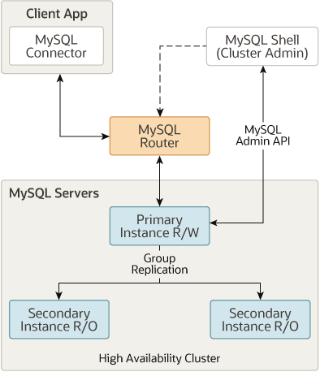
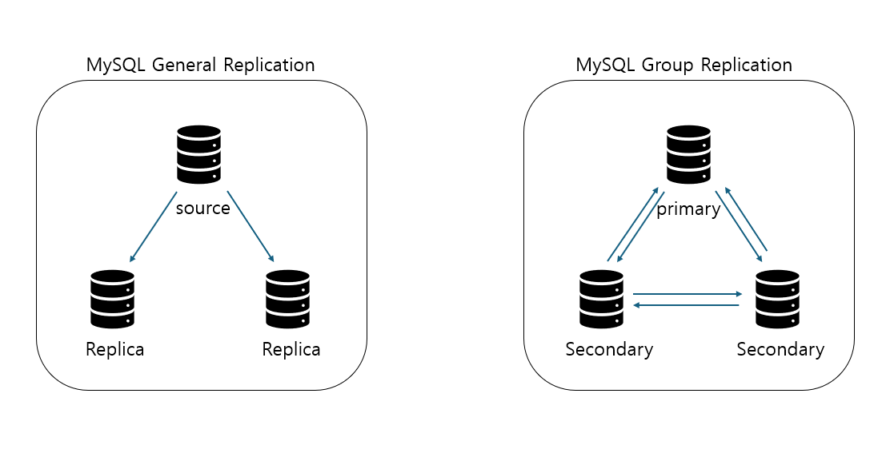
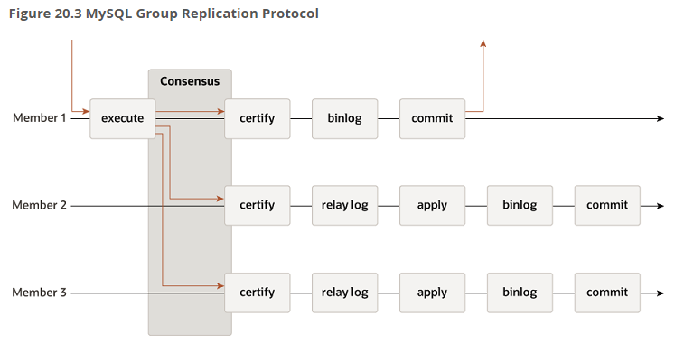
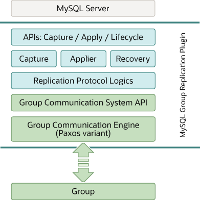
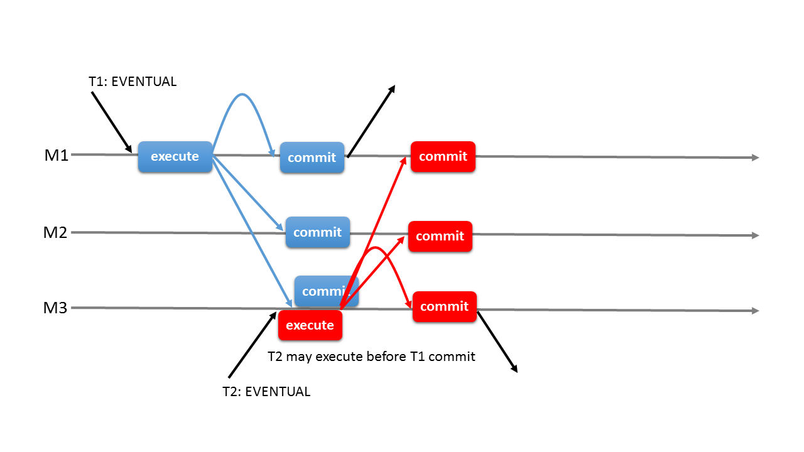
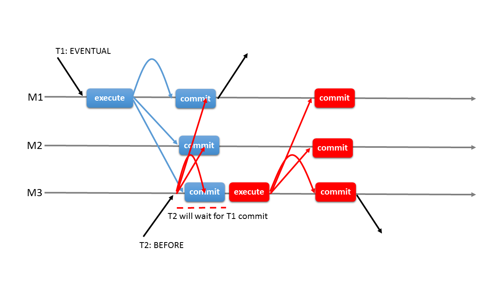
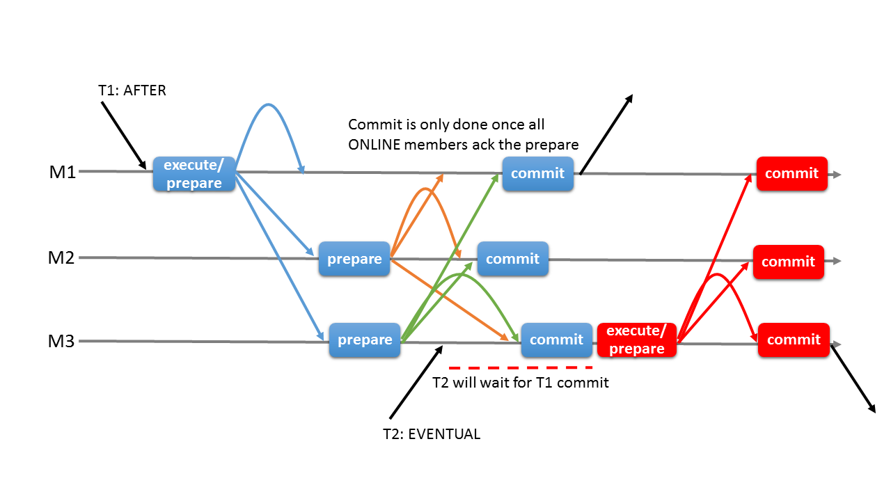
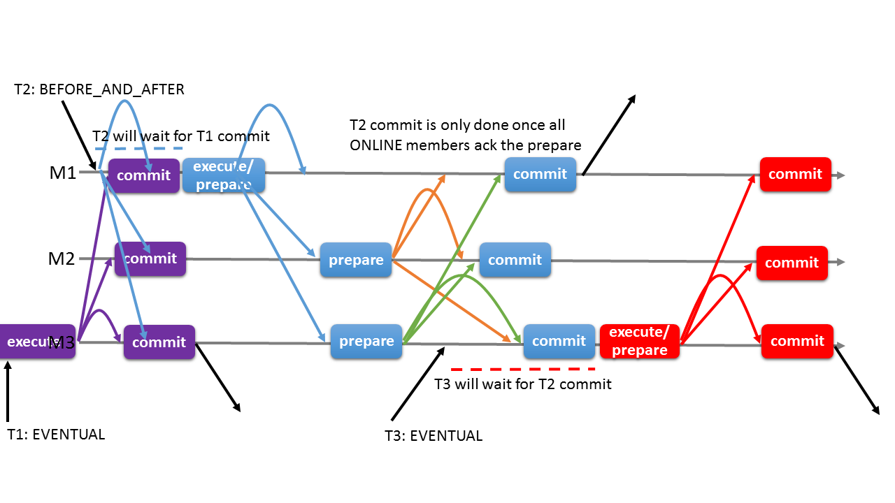
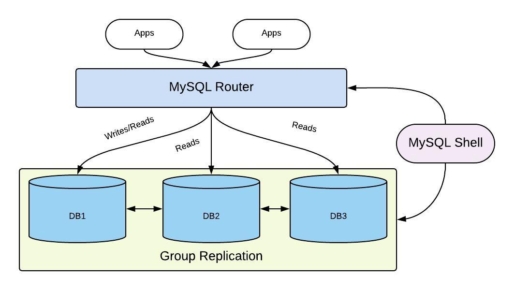

# 📘 곽유섭 - Chapter 17 - InnoDB 클러스터 정리

> Real MySQL 8.0 2권 | Chapter 17 - InnoDB 클러스터

---

## 📝 정리 내용

# 17. InnoDB 클러스터

- 사용 중인 MySQL 서버들을 소스-레플리카 구조의 복제 형태로 구성해놓는다고 고가용성이 실현되는 것은 아니다.

- 어떤 서비스든 장애가 발생한 경우 장애 시간을 최소하하는 것이 제일 중요하므로 대부분의 경우 이 같은 전환 작업을 수동으로 처리하기보다는 자동화하는 것을 고려한다.

- MySQL에선 서버 장애를 감지해 자동으로 페일오버를 처리하는 프로그램을 직접 개발해서 사용하거나 혹은 서드파티 HA 솔루션을 사용했다.

- 5.7.17부턴 빌트인 형태 HA 솔루션인 InnoDB 클러스터가 도입되면서 사용자는 좀 더 쉽고 편리하게 고가용성을 실현할 수 있게 됐다.

## 17-1. InnoDB 클러스터 아키텍처

`InnoDB 클러스터` : MySQL 서버 내에서 설정할 수 있는 어떤 특정한 기능이 아닌 MySQL 고가용성실현을 위해 만들어진 여러 구성 요소들의 집합체.

- 그룹 복제(Group Replication)

  기본적인 복제 역할 뿐만 아닌 복제에 참여하는 MySQL 서버들에 대한 자동화된 멤버십 관리(그룹에 새로운 멤버 추가 및 제거) 역할을 담당한다.

- MySQL 라우터(MySQL Router)

  애플리케이션 서버와 MySQL 서버 사이에서 동작하는 미들웨어 프로그램

  애플리케이션이 실행한 쿼리를 적절한 MySQL 서버로 전달하는 프록시 역할을 한다.

- MySQL 셸(MySQL Shell)

  기존 MySQL 클라이언트보다 좀 더 확장된 기능을 가진 새로운 클라이언트 프로그램

  기본적인 SQL문 실행뿐만 아니라 자바스크립트 및 파이썬 기반의 스크립트 작성 기능과 MySQL 서버에 대해 클러스터 구성 등의 어드민 작업을 할 수 있게 API를 제공한다.



- 데이터가 저장되는 MySQL 서버들은 그룹 복제 형태로 복제가 구성되며, 각 서버는 읽기/쓰기가 모두 가능한 프라이머리 혹은 읽기만 가능한 세컨더리 중 하나의 역할로 동작하게 된다.
  - 프라이머리는 기존 MySQL 복제에서의 소스 서버이며, 세컨더리는 레플리카 서버라고 할 수 있다.

  - 그룹 복제를 구성할 때 고가용성을 위해 MySQL 서버를 최소 3대 이상으로 구성해야 한다.

- 클라이언트는 MySQL 서버로 직접 접근해서 쿼리를 실행하는게 아닌 MySQL 라우터에 연결해서 쿼리를 실행한다.
  - MySQL 라우터는 메타데이터를 바탕으로 클라이언트에서 실행된 쿼리를 적절한 서버로 전송한다.

- MySQL 셸은 사용자가 손쉽게 InnoDB 클러스터를 생성하고 관리할 수 있도록 API를 제공하며, 상태를 확인하거나 설정을 변경하는 것과 같은 여러 가지 기능을 제공한다.
  - 셸에서 클러스터 관련 작업을 진행할땐 직접 서버에 연결해야하며, 단순히 쿼리를 실행하는 경우 라우터를 통해 처리할 수 있다.

- MySQL 서버에 장애가 발생하면 그룹 복제가 먼저 이를 감지해서 자동으로 해당 서버를 복제 그룹에서 제외시켜며, MySQL 라우터는 이러한 복제 토폴로지 변경을 인지하고 실행된 쿼리가 현재 복제 그룹에서 정상적으로 동작하는 MySQL 서버로만 전달될 수 있도록 한다.

## 17-2. 그룹 복제(Group Replication)

기존 MySQL 복제 프레임워크를 기반으로 구현되어 내부적으로 Row 포맷의 바이너리 로그와 릴레이 로그, GTID를 사용한다.

그룹 복제는 기존 MySQL 복제와 구조적으로 유사한 부분도 있지만 복제 구성 형태와 트랜잭션 처리 방식 측면에서 완전히 다른 복제 방식이라고 할 수 있다.

    기존 복제의 경우 일반적으로 소스-레플리카 형태로 단방향 복제가 이뤄지지만, 그룹 복제에서는 복제에 참여한 MySQL 서버들이 하나의 복제 그룹으로 묶인 클러스터 형태를 가지며 서로 통신하면서 양방향으로 복제를 처리할 수 있다.



- 기존 복제와 복제 처리 방식에 차이가 있으며, 반동기 방식이면서 기존 반동기 방식과 동일한 방식으로 처리되는 건 아니다.
  - 그룹 복제에서도 반동기처럼 트랜잭션에 대해 다른 멤버들의 응답을 확인하는 단계가 존재한다.

  - 한서버에서 트랜잭션이 커밋될 준비가 되면 트랜잭션 정보를 그룹의 다른 멤버들에 전송하고 과반수 이상의 멤버로부터 응답을 전달받으면 그때 해당 트랜잭션을 인증하고 최종적으로 커밋처리한다.

  - `트랜잭션 인증` : 인증 대상 트랜잭션이 이미 인증을 통과한 선행 트랜잭션과 동시점에 동일한 데이터를 변경했는지 충돌 여부를 검사

  - `합의` : 트랜잭션 커밋을 처리할 때 그룹의 다른 멤버들의 응답을 확인하는 과정

  - 그룹 복제에선 변경 시 매 트랜잭션마다 합의를 거치며, 데이터를 읽기만 할 땐 합의 과정이 필요치 않다.



**그룹 복제에서 제공하는 대표적인 기능**

- 그룹 멤버 관리

- 그룹 단위의 정렬된 트랜잭션 적용 및 트랜잭션 충돌 감지

- 자동 페일오버

- 자동 분산 복구

### 17-2-1. 그룹 복제 아키텍처

- 그룹 복제에 참여하는 MySQL 서버들은 그룹 복제 플러그인을 통해 서로 간에 동신하며 복제 동기화를 처리한다.

- 그룹 복제가 설정되면 `group_replication_applier`라는 복제 채널을 생성하며, MySQL 서버는 이 채널을 통해 그룹에서 실행된 모든 트랜잭션을 전달받아 적용한다.

- 그룹 복제 분산 복구 작업이 필요한 경우 추가로 `group_replication_recovery` 복제 채널을 생성해 분산 복구 작업을 진행한다.



- 최상위 계층에는 그룹 복제 플러그인이 MySQL 서버와 상호작용하기 위해 구현된 인터페이스 플러그인 API 집합이 존재한다.
  - 복제 플러그인으로 혹은 반대 방향으로 요청을 전달

  - MySQL 서버의 시작 또는 복구, 트랜잭션 커밋 등의 이벤트를 플러그인에 전달

  - 플러그인에서 처리 중인 트랜잭션에 대한 커밋 또는 중단, 릴레이 로그 기록을 위한 요청 등을 서버에 전달

- 복제 플러그인 계층
  - 계층 내부는 여러 가지 모듈들로 나눠져 있으며, API를 통해 들어온 요청들은 각각 적절한 모듈로 전달된다.

  - 로컬 및 그룹 복제의 다른 MySQL 서버에서 실행된 원격 트랜잭션들이 처리되며, 층돌 감지 및 그룹 내 전파, 그룹 복제의 분산 복구 작업 등이 수행된다.

- 그룹 통신 시스템 API와 그룹 통신 엔진
  - 상위 플러그인 계층에서는 그룹 통신 시스템 API를 통해 그룹 통신 엔진과 상호작용한다.

  - `그룹 통신 엔진(XCom)` : 그룹 복제에 참여 중인 다른 MySQL 서버들과의 통신 처리를 담당하는 그룹 복제의 핵심 구성 요소
    - MySQL 기본 포트가 아닌 별도의 포트(일반적으로 33061)를 통해 통신을 수행

    - 트랜잭션이 그룹 복제 멤버들에 동일한 순서로 전달될 수 있도록 보장해주며, 그룹 복제 토폴로지의 변경과 그룹 멤버의 장애, 트랜잭션 적용 등을 위한 멤버 간의 합의 처리도 담당한다.

    - 멤버들 간의 합의 처리를 위해 사용하는 대표적인 알고리즘으로 Paxos와 Raft가 있다.
      - `Paxos` : 데이터 변경이 일어나는 서버가 여러 대 존재할 경우

      - `Raft` : 데이터 변경이 한대만 발생하는 경우

- 그룹 복제에서 중요한 부분은 그룹 복제를 구성하는 **MySQL 서버의 수**다.
  - 복제를 처리할 때 그룹 멤버들 간에 합의 절차를 수행되므로 정상적으로 동작하려면 그룹의 과반수에 해당하는 서버가 정상적으로 동작해야 한다.(최소 3대 요구)

  ```
  n = 2f + 1 (n: 전체 서버 수, f: 허용하고자 하는 장애 서버 수)
  ```

### 17-2-2. 그룹 복제 모드

`group_replication_single_primary_mode` : 그룹 복제를 어떤 모드로 동작하게 할 것인지 설정하는 변수. (ON(기본값)이면 싱글 프라이머리, OFF면 멀티 프라이머리)

- 두 가지 모드 중 하나의 모드로 설정되면 그룹 복제에 참여하는 모든 서버들이 동일한 모드 값을 가져야 한다.
  - 동작 중에서도 변경할 수 있으며, UDF를 통해 변경할 수 있다.
    - `group_replication_switch_to_single_primary_mode()` : 싱글 프라이머리로 변경

    - `group_replication_switch_to_multi_primary_mode()` : 멀티 프라이머리로 변경

### 17-2-2-1. 싱글 프라이머리 모드

그룹 내에서 쓰기를 처리할 수 있는 프라이머리 서버가 한 대만 존재하는 형태.

구축을 진행한 MySQL 서버가 프라이머리로 지정된다.

**그룹 내 프라이머리 서버가 변경될 수 있는 상황**

- 자발적으로 혹은 예기치않게 현재 프라이머리 서버가 그룹을 탈퇴하는 경우

- group_replication_set_as_primary() UDF를 사용해 그룹의 특정 멤버를 새로운 프라이머리로 지정한 경우

**새로운 프라이머리를 선출하는 기준과 우선순위**

1. MySQL 서버 버전
   - 선출 시 제일 우선시해서 고려되는 요소

   - 8.0.17 이상은 패치 버전을 기준으로 정렬, 미만은 메이저 버전을 기준으로 정렬되며 패치 버전은 무시된다.

2. 각 멤버의 가중치 값
   - 가장 낮은 버전을 실행 중인 멤버가 둘 이상일 경우 `group_replcation_member_weight` 변수로 지정된 가중치 값을 비교한다.

3. UUID 값의 사전식 순서
   - 가중치를 기준으로 선정된 멤버가 둘 이상일 경우 UUID의 사전식 순서가 가장 낮은 값을 프라이머리 키로 최종 선택한다.

#### 17-2-2-2. 멀티 프라이머리 모드

그룹 복제에서 그룹 멤버들이 전부 프라이머리로 동작하는 형태, 클라이언트는 어떤 MySQL 서버로든 쓰기/읽기 요청을 보낼 수 있다.

- 그룹 내 모든 멤버에서 쓰기가 발생할 수 있으며, 이렇게 발생한 쓰기는 그룹의 다른 멤버들과 전파되어 각 멤버에서 다시 처리되므로 버전 호환성이 중요하다.

- 그룹 복제에 새로 참여하는 멤버는 그룹에 참여할 때 그룹의 기존 멤버들과의 버전 호환성 검사를 수행하며, 정의된 호환 기능 기준에 따라 그룹 참여 가능 여부와 읽기 전용 모드 유지 여부를 결정하게 된다.
  - 새로운 멤버가 그룹에 존재하는 가장 낮은 MySQL 버전보다 낮은 MySQL 버전을 사용 중인 경우 그룹에 참여할 수 없다.

  - 새로운 멤버가 그룹에 존재하는 가장 낮은 MySQL 버전과 동일한 MySQL 버전을 사용 중인 경우 정상적으로 그룹에 참여할 수 있다.

  - 높은 MySQL 버전을 사용 중인 경우 그룹에 참여할 수는 있지만 읽기 전용 모드를 유지하게 된다.

- 8.0.17 이상을 사용하느 멤버들은 호환 가능 여부에 따라 그룹 복제에서 읽기 전용 및 읽기-쓰기 모드 전환을 자동으로 처리한다.

- 그룹에서 한 멤버가 탈퇴하면 멀티 프라이머리 모드의 그룹 복제에서 이를 감지해서 현재 그룹 내에서 가장 낮은 MySQL 버전을 사용하는 멤버를 다시 확인한 후 그 멤버를 자동으로 읽기-쓰기 모드로 전환시킨다.

### 17-2-3. 그룹 멤버 관리(Group Membership)

어떤 서버들이 그룹에 참여하고 있는지 그룹 멤버들에 대한 목록과 상태 정보를 내부적으로 관리하고 있으며, 사용자는 `perfornamce_schema.replication_group_members` 테이블을 통해 그룹 멤버 목록을 확인할 수 있다.

    그룹 멤버들의 호스트명, 사용하는 포트, UUID 값, MySQL 버전, 멤버들의 역할(Role) 등을 알 수 있다.

**MEMBER_STATE칼럼 값**

- ONLINE : 그룹 복제의 한 구성원으로서 정상적으로 동작하고 있음을 나타낸다.

- RECOVERING : 그룹 복제에 참여하기 위해 기존 그룹 멤버로부터 데이터를 전달받는 복구 작업이 진행되고 있음을 나타낸다.

- OFFLINE : MySQL 서버에 그룹 복제 플러그인이 로딩돼 있으나 아직 그룹 복제에 참여하지 않은 상태를 나타낸다.

- ERROR : 그룹 복제에 속해 있으나 정상적으로 복제가 동작하지 않고 있는 상태를 나타낸다.

- UNREACHABLE : 현재 통신이 불가능하다고 판단되는 멤버에 대해 표시하는 상태 값이다.

- `뷰` : 그룹 복제가 관리하는 멤버 목록과 상태 정보
  - 뷰는 뷰 ID라는 고유 식별자를 가지며 그룹 멤버가 변경될 떄마다 새로운 뷰 ID값이 생성된다.

  - 그룹 복제는 뷰 ID를 통해 뷰의 변경을 추적하고 뷰가 변경된 시점을 구분할 수 있다.

  ```
  --// prefix value : 그룹 복제가 초기화될 때 생성되며, 그 시점의 타임스탬프를 기반을 값이 만들어진다.
  --// sequence value : 단조 증가하는 정숫값, 멤버 변경 시 1씩 증가한다.

  View ID = [Prefix value]:[Sequence value]
  ```

- 뷰 ID 값이 변경되면 바이너리 로그에도 "View_change"라는 이벤트로 뷰 변경 내역이 기록된다.
  - 그룹에 새로운 멤버가 추가되어 뷰가 변경되는 경우에만 기록된다.

### 17-2-4. 그룹 복제에서의 트랜잭션 처리

- `합의` : 그룹 내 일관된 트랜잭션 적용을 위해 그룹 멤버들에게 트랜잭션 적용을 제안하고 승낙을 받는 과정, 그룹 멤버 간의 통신 결과를 바탕으로 처리된다.
  - 그룹 통신 엔진(XCom)을 통해 트랜잭션에서 변경한 데이터에 대한 `WriteSet`과 `gtid_executed` 스냅숏 정보, 트랜잭션의 이벤트 로그 데이터 등이 포함된 트랜잭션 데이터를 그룹의 다른 멤버들로 전파한다.

  - Paxos 기반의 프로토골을 바탕으로 그룹 멤버들 간의 합의를 수행하며, 최종적으로 합의가 완료되어 과반수 이상에 해당하는 멤버들로부터 응답(ACK)를 전달받으면 다음 프로세스를 진행하게 된다.

  - 과반수 이상 응답을 받지 못한 경우 트랜잭션은 적용되지 않으며 클라이언트에는 에러가 반환된다.

- `인증` : 전달받은 트랜잭션 WriteSet 데이터와 로컬에서 내부적으로 관리하고 있는 WriteSet 히스토리 데이터를 바탕으로 인증을 거친 선행 트랜잭션과 동시점에 동일한 데이터를 변경한 것인지 검사해서 트랜잭션 충돌 여부를 확인하는 단계
  - 합의 단계를 거친 후 글로벌하게 정렬되어, 각 멤버들에서 모두 동일한 순서로 인증을 거친다.

  - 트랜잭션 충돌은 멀티 프라이머리 모드에서만 발생할 수 있다.

  - 인증 단계에서 충돌이 감지된 트랜잭션은 롤백된다.

  - 인증 단계를 거친 후 바이너리 로그에 트랜잭션을 기록하고 최종적으로 커밋을 완료하며, 클라이언트는 이 시점에 커밋 요청에 대한 응답을 받는다.

  - 원격으로 트랜잭션 데이터를 전달받은 그룹의 다른 멤버들에서는 인증 단계를 수행한 후 함께 전달받은 트랜잭션 로그 데이터를 바탕으로 릴레이 로그 이벤트를 작성한다.

#### 17-2-4-1. 트랜잭션 일관성 수준

- 그룹 복제에서 각 멤버들은 모두 동일한 트랜잭션을 적용하지만 실제 적용 시점까지 완전히 일치하는 것은 아니다.

- 8.0.14부터 그룹 복제에서 트랜잭션의 일관성 수준을 설정할 수 기능이 도입됐다.

- `group_replication_consistency` : 그룹 복제에서의 트랜잭션 일관성 수준을 설정할 수 있으며, 적용 범위는 글로벌 또는 세션 모두 가능하다.

##### 17-2-4-1-1. EVENRUAL 일관성 수준

`group_replication_consistency` 변수의 기본 설정값으로, 해당 변수가 추가되기 전의 그룹 복제에서의 트랜잭션 일관성 수준과 동일하다.

- 최종적으로 그룹 멤버들이 일관된 데이터를 가지게 된다.

- 읽기 전용 및 읽기-쓰기 트랜잭션이 별도의 제약 없이 바로 실행 가능하다.

- 페일오버 발생 시, 읽기 트랜잭션이 오래된 데이터를 읽을 수 있고 충돌로 트랜잭션 충돌로 인해 롤백될 수 있음을 의미한다.



##### 17-2-4-1-2. BEFORE_ON_PRIMARY_FAILOVER 일관성 수준

싱글 프라이머리 모드로 설정된 그룹 복제에서 프라이머리 페일오버가 발생해서 신규 프라이머리가 선출됐을 때만 트랜잭션에 영향을 미친다.

- 이전 프라이머리의 트랜잭션을 적용하고 있는 경우 새로운 프라이머리로 유입된 읽기 전용 및 읽기-쓰기 트랜잭션은 이전 트랜잭션이 모두 적용될 때까지 처리되지 못하고 대기하게 된다.

- 트랜잭션 갭이 큰 경우 트랜잭션들의 대기 시간이 길어져 응답 지연을 겪을 수 있으니 클라이언트 단에 지연을 대비한 코드가 구현돼 있으면 좋다.

- 트랜잭션 대기 시간은 `wait_timeout`(기본값 : 8시간)으로 설정하면 된다.

- 신규 프라이머리가 이전 프라이머리의 트랜잭션을 적용하고 있을 때 새로 유입된 읽기-쓰기 트랜잭션들은 처리가 지연되지만 읽기 전용 트랜잭션에서 일부 쿼리는 실행가능하다.


##### 17-2-4-1-3. BEFORE 일관성 수준

- 읽기 전용 및 읽기-쓰기 트랜잭션은 모든 선행 트랜잭션이 완료될 때까지 대기 후 처리된다.

- BEFORE 일관성 수준으로 설정된 트랜잭션은 항상 최신 데이터를 읽으며, 트랜잭션의 처리 시간은 선행 트랜잭션의 처리 시간에 영향받는다.

- 대기 시간은 `wait_timeout` 변수로 설정되며, 초과할 경우 에러를 클라이언트에 반환한다.



##### 17-2-4-1-4. AFTER 일관성 수준

- 트랜잭션이 적용되면 해당 시점에 그룹 멤버들이 모두 동기화된 데이터를 갖게 한다.
  - 읽기-쓰기 트랜잭션은 다른 모든 멤버들에서도 해당 트랜잭션이 커밋될 준비가 됐을 때까지 대기 후 처리된다.

  - 읽기 전용 트랜잭션은 별도의 제약 없이 바로 처리된다.

- `AFTER` 일관성 수준은 다른 멤버에서 동시점에 실행되는 트랜잭션에 영향을 미친다.
  - 다른 멤버에서 새로운 트랜잭션을 실행 시 AFTER 일관성 수준의 트랜잭션이 완전히 커밋될 때까지 대기하게 된다.

  - 최종적으로 후속 트랜잭션들은 어떤 멤버에서든 일관된 최신 데이터를 얻을 수 있다.

- 본래의 처리 시간보다 많은 시간이 소요되니, 쓰기 요청보다 읽기 요청이 많고 분산된 최신 읽기를 수행하고자 할때 사용하는 것이 좋다.



##### 17-2-4-1-5. BEFORE_AND_AFTER 일관성 수준

- BEFORE 수준과 AFTER 수준이 결합된 형태
  - 읽기-쓰기 트랜잭션은 모든 선행 트랜잭션이 적용될 때까지 대기 후 실행, 트랜잭션이 다른 모든 멤버들에서도 커밋이 준비되어 응답을 보내면 최종적으로 커밋

  - 읽기 전용 트랜잭션은 모든 선행 트랜잭션이 적용될 때까지 대기한 후 실행된다.



#### 17-2-4-2. 흐름 제어(Flow Control)

- `흐름 제어` : 그룹 멤버 간의 트랜잭션 적용 불균형으로 인해 발생하는 문제를 방지하기 위해 그룹 멤버들의 쓰기 처리량을 조절하는 메커니즘
  - 멤버 간 트랜잭션 갭을 적게 유지해서 데이터가 최대한 동기화된 상태를 유지될 수 있게 되며, 그룹에 평소와 다른 변화에도 빠르게 적응해서 멤버들의 쓰기 처리량이 균등할 수 있게 한다.

  - 필요 이상으로 처리량을 줄이지 않음으로서 자원이 불필요하게 유휴 상태에 있지 않게 한다.

  - `group_replication_flow_control_mode` : 멤버에서 흐름 제어 기능의 사용 여부 설정(`QUOTA`와 `DISABLED`)
    - `QUOTA` : 기본값. 그룹에서 쓰기를 처리하는 멤버가 정해진 할당량만큼만 쓰기를 처리하도록 제어하는 방식.

      **QUOTA 흐름 제어의 동작 방식**
      1. 모든 그룹 멤버들의 쓰기 처리량 및 처리 대기 중인 트랜잭션에 대한 통계를 수집해서 멤버의 처리량을 조절할 필요가 있는지 확인

      2. 처리량 조절이 필요한 경우 수집된 통계 데이터를 바탕으로 멤버에게 할당된 쓰기 처리량을 계산한 후 멤버가 계산된 최대 쓰기 처리량을 넘어 쓰기를 처리하지 않도록 멤버의 쓰기 처리를 제한한다.

    - 비활성화돼 있는 멤버가 있는 경우 이 멤버로 인해 다른 멤버들의 쓰기 처리량이 조정되지는 않는다.

**흐름제어에서 수집하는 통계정보**

- 인증 큐 크기
- 적용 큐 크기
- 인증된 총 트랜잭션 수
- 적용된 원격 트랜잭션 수
- 로컬 트랜잭션 수
  - 통계 정보 데이터는 `group_replication_flow_control_period` 변수에 지정된 시간마다 수집 및 공유된다.

  - 멤버 로컬에서 수집한 통계 정보와 다른 멤버들로부터 전달받은 통계 정보를 바탕으로 멤버에서 쓰기 처리량 조절이 필요한 상황인지를 판단하고 멤버에게 할당할 쓰기 처리량을 계산한다.

  - 인증 큐 크기와 적용 큐 크기를 바탕으로 멤버의 처리량을 조절할 지를 판단한다.

  - 로컬 멤버를 포함해서 그룹의 모든 멤버에서 인증 단계와 적용 단계에서 얼마나 많은 트랜잭션이 대기하고 있는지 확인하는 것이다.

#### 17-2-5. 그룹 복제의 자동 장애 감지 및 대응

- 일부 멤버에 장애가 발생해 응답 불능 상태에 빠졌다 하더라도 그룹이 정상적으로 동작할 수 있게 하는 장애 감지 매커니즘이 구현돼 있다.
  - 매커니즘에서는 문제 상태에 있는 멤버를 식별하고 해당 멤버를 그룹 복제에서 제외시킴으로써 그룹이 정상적으로 동작 중인 멤버로만 구성될 수 있게 하고 클라이언트 요청을 처리한다.

- 5초 내로 메시지를 받지 못하면 의심하고 과반수가 동의하면 해당 멤버를 5초 이후 추방한다.

  -`group_replication_member_expel_timeout` : 의심을 받고 나서 추방되기 전까지 대기시간

- 추방된 멤버는 자동으로 그룹에 재가입을 시도할 수 있다.
  - `group_replication_autorejoin_tries` : 재가입 시도 횟수

  - 각 시도당 5분의 시간 간격이 있다.

  - 자동 재가입에 실패하거나 시도하지 않은 경우 `group_replication_exit_state_action` 변수에 설정된 종료 작업을 진행한다.
    - READ_ONLY : MySQL 서버를 슈퍼 읽기 전용 모드로 전환

    - OFFLINE_MODE : MySQL 서버를 오프라인 모드로 전환

    - ABORT_SERVER : MySQL 서버를 종료

### 17-2-6. 그룹 복제의 분산 복구

`분산 복구` : 그룹 가입 시 가입 멤버가 다른 그룹 멤버들과 동일한 최신 데이터를 가질 수 있돌고 가입 멤버에서 누락된 트랜잭션들을 다른 그룹 멤버에서 가져와 적용하는 복구 프로세스

`기증자(Donor)` : 분산 복구에서 가입 멤버가 복구 작업을 위해 선택한 기존 그룹 멤버

#### 17-2-6-1. 분산 복구 방식

1. 가입 멤버에서 `group_replication_applier` 복제 채널의 릴레이 로그를 확인해 미처 적용되지 못하고 남아있는 트랜잭션이 있는지 확인하고 이를 먼저 적용하는 작업

2. 온라인 상태로 존재하는 다른 그룹 멤버에 연결해서 분산 복구 작업 진행
   - 바이너리 로그 복제 방식
     - 기증자로 선택된 다른 그룹 멤버와 해당 멤버를 연결해 적용되지 않은 트랜잭션들을 복제해서 적용하는 방식

   - 원격 클론 방식
     - 클론 플러그인을 사용하는 형태, 다른 그룹 멤버의 InnoDB 스토리지 엔진에 저장된 모든 데이터와 메타 데이터를 일관된 스냅숏으로 가져와 가입 멤버를 재구축하는 방식

   - 트랜잭션 갭이 크지 않거나 클론 플러그인이 설치되지 않은 경우 바이너리, 반대면 원격 클론 방식으로 진행한다.

   - 원격 클론 방식을 복구 방식으로 채택하게 되는 트랜잭션 갭의 임곗값은 `group_replication_clone_threshold` 변수에 지정된 값을 사용한다.

   - 바이너리 로그 복제가 불가능한 경우 임곗값 관계없이 원격 클론 방식으로 복구 작업을 진행한다.

#### 17-2-6-2. 분산 복구 프로세스

1. 로컬 복구
   - 가입 멤버가 이전에 그룹에 가입한 적이 잇는 경우 릴레이 로그에 미처 적용하지 못한 트랜잭션이 존재할 수 있다. 따라서 이 트랜잭션들을 먼저 적용한 후 복구 작업을 진행한다.

2. 글로벌 복구
   - 가입 멤버는 기증자 역할을 할 멤버를 선택해서 해당 멤버로부터 데이터 또는 누락된 트랜잭션들을 가져와 자신에게 적용한다.

   - 작업 진행 동안 현재 그룹에서 처리되는 트랜잭션들을 내부적으로 캐싱해둔다.

3. 캐시 트랜잭션 적용
   - 글로벌 복구가 완료되면 캐싱해서 보관해둔 트랜잭션들을 적용해 그룹에 참여

- 가입 멤버가 기증자로 부터 데이터를 모두 전달받으면 MySQL 서버를 재시작한다.
  - `group_replication_start_on_boot=ON`이 설정된 경우, 재시작 시 그룹 복제가 자동으로 시작되고 바이너리 로그 복제 방식의 분산 복구 진행

  - OFF인 경우, 사용자가 수동으로 `START GROUP_REPLICATION` 명령을 실행

#### 17-2-6-3. 분산 복구 설정

- 연결 시도 횟수
  - `group_replication_recovery_retry_count`로 바이너리 로그 복제 방식으로 복구 작업 진행 시 연결 횟수를 제한할 수 있다.

- 연결 시도 간격
  - `group_replication_recovery_reconnect_interval`로 바이너리 로그 복제 방식으로 복구 작업 진행 시 기존 그룹 멤버들에 대한 연결 시도 사이의 대기 시간을 설정

- 가입한 멤버를 온라인 상태로 표기하는 시점
  - `group_replication_recovery_complete_at`변수로 설정 가능

- 변경된 값은 그룹 복제를 중지하고 다시 시작한 후에만 적용된다.

#### 17-2-6-4. 분산 복구 오류 처리

분산 복구에는 복구 작업 도중 문제가 발생하더라도 가능한 경우 자동으로 다시 작업을 시도하는 장애 감지 매커니즘이 구현돼 있다.

- 기증자로 선택한 그룹 멤버로의 연결이 인증 문제 등으로 인해 정상적으로 이뤄지지 않는 경우

- 바이너리 로그 복제 방식으로 복구 작업을 진행하는 중에 레플리케이션 I/O 스레드 또는 SQL스레드에서 에러가 발생한 경우

- 원격 클론 작업이 실패하거나 혹은 완료되기 전에 중단된 경우

- 복구 작업 동안 기증자 멤버에서 그룹 복제가 중단된 경우

`replication_connection_status / replication_applier_status_by_worker` 테이블에서 "LAST*ERROR*"로 시작하는 칼럼들로 에러를 확인할 수 있다.

원격 클론 방식의 분산 복구 작업의 경우, `clone_progress / clone_status` 테이블을 통해 진행 현황, 상태 정보를 확인할 수 있다.

**분산 복구 프로세스를 진행할 수 없는 경우**

- 가입 멤버가 재시도 횟수를 모두 소진한 경우

- 가입 멤버에 필요한 트랜잭션이 그룹 멤버들의 바이너리 로그에 존재하지 않으며, 원격 클론 방식으로도 복구 작업을 진행할 수 없는 경우

- 가입 멤버가 그룹에서는 존재하지 않는 트랜잭션을 가지고 있는 상태에서 바이너리 로그 복제 방식으로 복구 작업이 진행되는 경우

- 가입 멤버가 전체 그룹 멤버에 대해 원격 클론 방식과 바이너리 로그 복제 방식을 모두 시도해봤지만 전부 실패해서 더이상 시도해 볼 멤버가 없는 경우

- 복구 작업이 진행되는 중에 가입 멤버에서 그룹 복제가 중단된 경우

### 17-2-7. 그룹 복제 요구사항

- InnoDB 스토리지 엔진 사용

- 프라이머리 키 사용

- 원활한 네트워크 통신 환경

- 바이너리 로그 활성화

- ROW형태의 바이너리 로그 포맷 사용

- 바이너리 로그 체크섬 설정

- log_slave_updates 활성화

- GTID 사용

- 고유한 server_id 값 사용

- 복제 메타데이터 저장소 설정

- 트랜잭션 WriteSet 설정

- 테이블 스페이스 암호화 설정

- lower_case_table_names 설정

- 멀티 스레드 복제 설정

### 17-2-8. 그룹 복제 제약 사항

그룹 복제는 GTID를 사용하므로 GTID의 제약 사항에도 영향받는다.

- 갭 락은 갭 락을 발생시킨 트랜잭션이 실행된 멤버에서만 유효, 인증 단계에서 해당 락 정보는 공유되지 않는다.
  - 멀티 프라이머리 모드에선 충돌 감지 수준을 일치시키기 위해 갭 락이 사용되지 않는 `READ-COMMITED` 격리 수준으로 사용하는 것이 좋다.

- 테이블 락과 네임드 락도 그룹 단위로 락 정보가 공유되지 않는다.

- 그룹 복제에서 바이너리 로그 체크섬 기능은 8.0.21부터 사용 가능하다.

- 멀티 프라이머리 모드로 동작 중인 그룹에선 `SERIALIZABLE` 격리 수준을 사용할 수 없다.

- 멀티 프라이머리 모드로 동작 중인 그룹에서 동일한 테이블에 대해 서로 다른 멤버에서 동시에 실행되는 DDL 및 DML 문은 지원하지 않는다.

- 멀티 프라이머리 모드로 동작 중인 그룹에서 외래키가 존재하는 테이블 특히 CASCADE 제약 조건이 사용된 테이블은 지원하지 않는다.

- 멀티 프라이머리 모드에서 SELECT ... FOR UPDATE 구문을 사용할 때 데드락이 발생할 수 있다.

- 그룹 복제에서 복제 필터 기능은 사용할 수 없다.

- 그룹 복제는 최대 9개의 서버까지 구성 가능하다.

## 17-3. MySQL 셸

MySQL을 위한 고급 클라이언트 툴로, 단순 SQL 문 실행만 가능했던 기존 툴보다 확장된 기능들을 제공한다.

    대표적으로 SQL뿐만 아니라 자바스크립트와 파이썬 언어 모드를 지원한다.

```sql
// 파이싼 모드로 전환
mysqlsh> \py

// SQL 모드로 전환
mysqlsh> \sql

// 자바스크립트 모드로 전환
mysqlsh> \js
```

**셸에서 제공하는 API**

- X DevAPI : 관계형 데이터와 문서 기반 데이터를 모두 처리

- AdminAPI : MySQL 서버의 설정을 변경하고 InnoDB 클러스터 및 레플리카셋을 구축

**글로벌 객체**

- 글로벌 객체는 자바스크립트 및 파이썬 모드에서만 사용 가능

- session
  - MySQL 서버에 연결했을 때 생성되는 세션에 매핑되는 객체, 트랜잭션 시작과 같이 세션 단위에서 사용할 수 있는 기능들을 제공한다.

- dba
  - InnoDB 클러스터 및 레플리카셋 구축과 관련된 기능을 제공, 내부적으로 AdminAPI를 사용해 처리한다.

- cluster
  - InnoDB 클러스터에 매핑되는 객체, 클러스터 설정 변경 등과 같이 클러스터와 관련해서 사용자가 제어할 수 있는 기능들을 제공한다.

- rs
  - InnoDB 레플리카셋에 매핑되는 객체, 레플리카셋 설정 변경 등과 같이 레플리카셋과 관련해서 사용자가 제어할 수 있는 기능들을 제공한다.

- db
  - 셸에서 X 프로토콜을 사용해 MySQL 서버에 연결한 경우 연결 시 지정했던 데이터베이스에 매핑되는 객체, 데이터베이스와 관련해서 사용할 수 있는 기능들을 제공한다.

- shell
  - MySQL 셸 설정 변경 등과 같이 셸과 관련해서 사용자가 제어할 수 있는 기능들을 제공한다.

- util
  - MySQL 서버가 버전을 업그레이드할 준비가 됐는지 확인하거나 MySQL 서버에 데이터를 로딩 또는 추출하는 등의 유용한 작업 기능들을 제공한다.

## 17-4. MySQL 라우터

`MySQL 라우터` : InnoDB 클러스터에서 애플리케이션 서버로부터 유입된 쿼리 요청을 클러스터 내 적절한 MySQL 서버로 전달하고 MySQL 서버에서 반환된 쿼리 결과를 다시 애플리케이션 서버로 전달하는 프록시 역할.



**중요 기능**

- InnoDB 클러스터의 MySQL 구성 변경 자동 감지

- 쿼리 부하 분산

- 자동 페일오버

중간 계층에서 프록시 역할을 하는 프로그램을 사용하지 않는 애플리케이션 서버에서는 MySQL 서버에 직접 연결해서 쿼리를 실행한다.

애플리케이션 서버에서 도메인이나 VIP를 통해 MySQL 서버에 접근하는 형태가 아니라면 애플리케이션 서버는 MySQL 서버의 IP와 같은 정보를 커넥션 설정에 저장해서 사용하게 된다.

    MySQL 서버 구성 변경 작업이 발생하면 DB 커넥션 설정 정보를 반드시 수정해야 한다.

    InnoDB 클러스터를 사용하는 경우, 라우터 서버 정보를 사용하며 이 정보는 주기적으로 갱신 및 자동 감지하므로 변경할 필요가 없다.

- 애플리케이션에서 실행된 쿼리들을 여러 MySQL 서버에 나눠서 처리되도록 부하 분산을 수행할 수도 있다.

- MySQL 라우터에선 장애가 발생한 경우 자동으로 다른 MySQL 서버로 쿼리 실행을 재시도한다.
  - 지정된 부하 분산 방식에 따라 재시도할 MySQL 서버가 결정된다.

- MySQL 서버에 장애가 발생했을 때 라우터가 이를 감지하고 자동으로 재시도하므로 애플리케이션 단에서는 별도의 장애 조치 없이도 정상적으로 쿼리를 실행할 수 있다.

## 17-5. InnoDB 클러스터 구축

### 17-5-1. InnoDB 클러스터 요구사항

**각 구성 요소들의 최소 버전**

- MySQL 서버 5.7.17 이상

- MySQL 셸 1.0.8 이상

- MySQL 라우터 2.1.2 이상

**요구사항**

- InnoDB 클러스터의 MySQL 서버들은 Performance 스키마가 활성화돼 있어야 한다.

- MySQL 셸을 사용해 InnoDB 클러스터를 구성하기 위해 MySQL 셸이 설치될 서버에 파이썬이 2.7 이상 버전으로 설치돼 있어야 한다.

#### 17-5-2-1. 사전 준비

```
mysqlsh> dba.configureInstance(url주소)
```

`dba.configureInstance()` 메서드는 서버의 현재 설정이 InnoDB 클러스터에서 요구되는 사항들을 충족하는지 확인하며 필요 시 자동으로 서버를 재설정한다.

#### 17-5-2-2. InnoDB 클러스터 생성

`dba.createCluster()` 메서드를 통해 클러스터를 생성한다.

    - InnoDB 클러스터에 대한 정보를 저장할 메타데이터 데이터베이스 생성 및 설정

    - 그룹 복제 설정 및 시작

    - 그룹 복제 분산 복구에서 사용될 DB 계정 생성

#### 17-5-2-3. InnoDB 클러스터 인스턴스 추가

`<Cluster>.addInstance()` 메서드를 통한 인스턴스 추가를 진행한다.

#### 17-5-2-4. MySQL 라우터 설정

InnoDB 클러스터에서 사용할 라우터 서버를 구성하기 위햇 라우터용 서버에서 부트스트랩으로 명령을 실행한다.

```
router_linux> mysqlrouter --bootstrap icadmin@ic-node1:3306 --name icrouter1 \
                --directory /tmp/myrouter --account icrouter --user root
```

## 17-6. InnoDB 클러스터 모니터링

MySQL 셸을 통해 InnoDB 클러스터의 구성 및 전반적인 상태를 확인할 수 있다.

`<Cluster>.describe()` : 클러스터의 복제 토폴로지 구성을 간략하게 확인

`<Cluster>.status()` : 클러스터의 전반적인 상태 확인

## 17-7. InnoDB 클러스터 작업

### 17-7-1. 클러스터 모드 변경

- `<Cluster>.switchToMultiPrimaryMode()` : 클러스터를 멀티 프라이머리 모드로 전환

- `<Cluster>.switchToSinglePrimaryMode([instance])` : 클러스터를 싱글 프라이머리 모드로 전환

### 17-7-2. 프라이머리 변경

`<Cluster>.setPrimaryInstance(instance)` : 인자로 주어진 서버를 클러스터의 새로운 프라이머리 서버로 설정한다.

    이 과정에서 기존 프라이머리 서버로 유입된 쓰기 요청들 중 일부가 에러가 날 수 있다.

### 17-7-3. 인스턴스 제거

`<Cluster>.removeInstance(instance)` : 인자로 지정된 서버를 클러스터에서 제거한다.

### 17-7-4. 클러스터 해체

`<Cluster>.dissolve()` : 메서드를 실행할때 클러스터의 MySQL 서버들에서 클러스터와 관련된 모든 메타데이터 및 설정, 계정 등을 삭제하고 그룹 복제를 중단시킨다.

### 17-7-5. 클러스터 및 인스턴스 설정 변경

`<Cluster>.options()` : 현재 클러스터의 설정 확인

`<Cluster>.setOption(option, value)` : 클러스터의 모든 인스턴스에 대해 설정을 변경하거나 clusterName과 같이 클러스터 단위의 설정을 변경한다.

    option은 값을 변경할 설정을 지정, value에는 새롭게 적용할 값을 지정

`<Cluster>.setInstanceOption(instance, option, value)` : 클러스터 인스턴스별로 설정을 변경한다.

    instance에는 설정을 변경할 인스턴스, option에는 변경할 설정, value는 새롭게 적용할 값을 설정한다.

#### 17-7-5-1. 빌트인 태그

MySQL에서 언더스코어(`_`)로 시작하는 태그는 내부적으로 `빌트인 태그`로 인식한다.

## 17-8. InnoDB 클러스터 트러블슈팅

### 17-8-1. 클러스터 인스턴스 장애

네트워크 통신이 안정화되고 서버에 별다른 문제가 없다면 사용자는 인스턴스에서 MySQL 그룹 복제가 재시작되게 해서 손쉽게 인스턴스를 다시 클러스터에 참여시킬 수 있다.

아예 중단이 됐을 경우, `<Cluster>.rejoinInstance(instance)` 메서드를 실행해 클러스터에 다시 참여할 수 있다.

    해당 메서드는 인자로 지정된 인스턴스에 접속해 그롭 복제와 필요한 설정을 확인 및 재설정하고 인스턴스에서 그룹 복제를 실행한다.

### 17-8-2. 클러스터의 정족수 손실

클러스터에서 과반수 이상의 인스턴스에 장애가 발생한 경우 클러스터는 쓰기 요청을 처리할 수 없다.

`<Cluster>.forceQuorumUsingPartitionOf(instance)` 메서드를 사용해 클러스터를 강제로 재구성할 수 있다.

    인자로 지정한 인스턴스에 접속해 해당 인스턴스에서 정상적인 상태로 인식되는 클러스터 내 다른 인스턴스들을 확인한 후 그 인스턴스들로 클러스터를 재구성한다.

## 17-9. InnoDB 클러스터 버전 업그레이드

**진행 순서**

1. MySQL 라우터 업그레이드
2. MySQL 셸 및 InnoDB 클러스터 메타데이터 스키마 업그레이드
   - `dba.upgradeMetadata()` 메서드를 통해 스키마 버전 업그레이드 가능

3. MySQL 인스턴스 업그레이드

## 17-10. InnoDB 클러스터 제약 사항

- InnoDB 클러스터 인스턴스들에서는 --default-extra-file 옵션을 사용해 추가적인 옵션 파일을 지정해 사용할 수 없다.

- InnoDB 클러스터는 인스턴스에 수동으로 구성된 별도의 복제 채널을 관리하지 않는다.

- InnoDB 클러스터는 샤딩 형태를 지원하지 않으며 MySQL 라우터는 하나의 InnoDB 클러스터에 대해서만 설정 가능하다.

---
