## 0. 개요
- 소스-레플리카 구조를 구성해놓는다고 해서 고사용성이 실현되는 것은 아니다
- MySQL은 페일오버를 처리하는 기능이 없으므로 레플리카 서버를 승격시키도록 별도의 툴을 사용하게 된다
  - 서드파티 HA 솔루션을 사용하는데, 대표적으로 MMM과 MHA 긜고 Orchestrator 등이 있다
  - 하지만 5.8이후에 빌트인 HA 솔루션인 InnoDB 클러스터 도입되면서 좀 더 쉽고 편리하게 고가용성을 실현할 수 있게 됐다

## 1. InnoDB 클러스터 아키텍처
- 클러스터는 특정한 기능이 아닌 고가용성 실현을 위해 만들어진 여러 구성 요소들의 집합체이다
  - 그룹 복제(Group Replication)
    - 소스 서버의 데이터를 레플리카 서버로 동기화하는 기본적인 복제 역할뿐만 아니라 복제에 참여하는 MySQL 서버들에 대한 자동화된 멤버십 관리 역할을 담당한다
  - MySQL 라우터(MySQL Router)
    - 애플리케이션 서버와 MySQL서버 사이의 미들웨어 프로그램으로 애플리케이션이 실행한 쿼리를 적절한 MySQL 서버로 전달하는 프락시 역할을 한다
  - MySQL 셸(MySQL Shell)
    - MySQL 클라이언트보다 좀 더 확장된 기능을 가진 새로운 클라이언트 프로그램이다
    - 기본적인 SQL문 실행뿐만 아니라 자바스크립트 및 파이썬 기반의 스크립트 작성 기능과 MySQL 클러스터 구성 등의 어드민 작업을 할 수 있게 하는 API를 제공한다

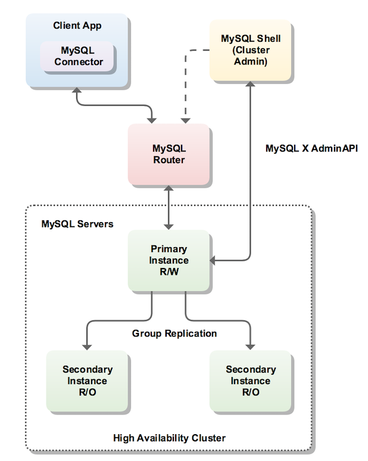

- MySQL 서버들은 **그룹 복제** 형태로 구성되며, 읽기/쓰기가 가능한 프라이머리와 읽기만 가능한 세컨더리중 하나의 역할로 동작하게 된다
  - 프라이머리와 세컨더리는 복제 토폴로지 형태로 여러가지로 구성할 수 있다
  - 고사용성을 위해 최소 3대 이상으로 구성해야 한다
- MySQL 라우터를 통해 쿼리를 실행하여 클러스터 내 적절한 MySQL 서버로 전달한다
- MySQL 셸은 손쉽게 InnoDB 클러스터를 생성하고 관리할 수 있도록 API를 제공하고, 상태 확인 및 설정 변경도 가능하다
- MySQL 서버에 장애가 발생하면 그룹 복제가 이를 감지해서 자동으로 제외시키며, 복제 토폴로지 변경을 인지하고 실행된 쿼리가 복제 그룹에서 정상적으로 동작하는 MySQL 서버로만 전달될 수 있도록 한다
- 이는 전부 자동으로 처리되며 부수적인 작업없이 기존에 설정된 그대로 쿼리를 실행하면 된다

## 2. 그룹 복제(Group Replication)
- 기존 복제 프레임워크 기반으로 구현되어 내부적으로 Row 포맷의 바이너리 로그와 릴레이 로그, GTID를 사용한다
- MySQL 복제와 유사하지만, 복제 구성 형태와 트랜잭션 처리 방식 측면에서는 완전히 다른 복제 방식이라고 할 수 있다
  - 기본 복제는 단방향이지만, 그룹 복제는 서로 통신하면서 양방향 복제를 처리할 수 있다
  - 그룹 복제는 쓰기를 처리하는 서버가 여러 대 있을 수 있고, 프라이머리와 세컨더리로 표현한다

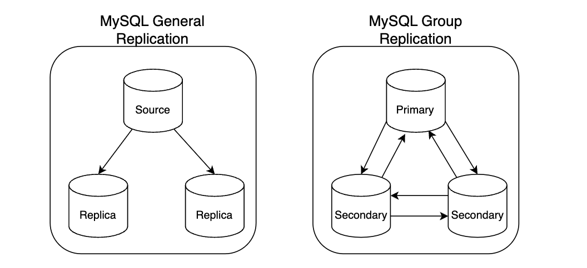

- 복제 처리 방식에서도 차이가 있는데, 그룹 복제는 반동기 방식이지만 기존 반동기 방식과 다르다
- 한 서버에서 트랜잭션이 커밋될 준비가 되면 그룹에 전송하고 과반수 이상 멤버로부터 응답을 받으면 해당 트랜잭션을 `인증`하고 최종적으로 커밋 처리르 완료한다
  - 과반수로 응답받지 못하면 해당 트랜잭션에 그룹에 적용되지 않는다
  - 이처럼 응답을 확인하는 과정을 `합의`라고 하는데, 이는 트랜잭션을 적용하는 것에 동의를 구하는 것이기 때문이다
  - 데이터를 읽기만 하는 트랜잭션에 대해서는 합의 과정이 필요하지 않다
- 그룹 복제에서 제공하는 대표적인 기능이 있다
  - 그룹 멤버 관리
  - 그룹 단위의 정렬된 트랜잭션 적용 및 트랜잭션 충돌 감지
  -  자동 페일오버
  - 자동 분산 복구

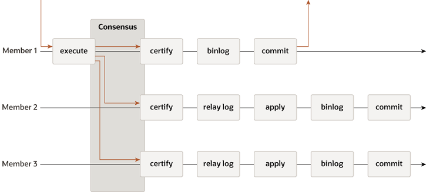

### 1. 그룹 복제 아키텍처
- 그룹 복제는 별도 플러그인으로 구현돼 있다
  - 그룹 복제 멤버들은 그룹 복제 플러그인으로 서로 지속적으로 통신하며 복제 동기화를 처리한다
  - 그룹 복제가 설정되면 `group_replication_applier`라는 복제 채널을 생성하며 해당 채널을 통해 모든 트랜잭션을 전달받아 적용하게 된다
  - 그룹에 새로 가입해서 초기 상태를 맞추는 과정에서는 `group_replication_recovery`라는 복구 채널을 사용한다

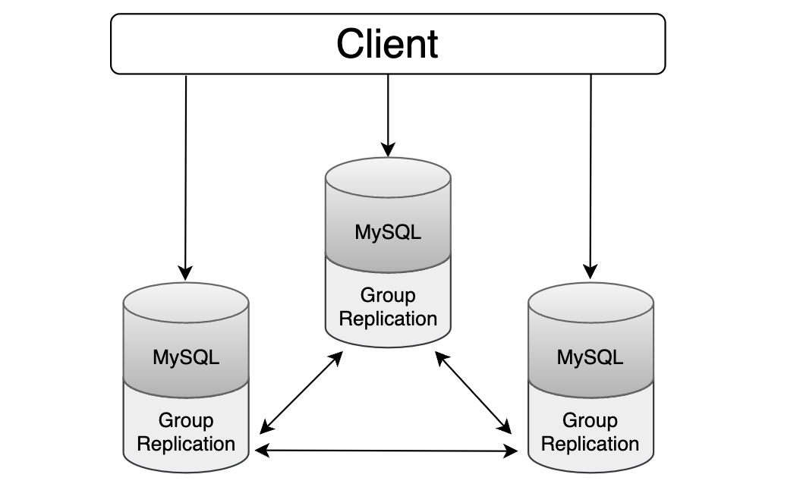

1. 플러그인 최상위는 MySQL 서버와 상호작용하기 위해 구현된 API 집합이 존재한다
    - 이 API를 통해 요청이 전달되며, 서버의 시작 및 트랜잭션 커밋 등 이벤트를 그룹 복제 플러그인에 전달하고, 그룹 복제 플러그인에서는 처리 중인 트랜잭션에 대한 커밋 또는 중단, 릴레이 로그 기록을 위한 요청 등을 서버에 전달한다
2. 그 다음은 그룹 복제의 기능들이 실질적으로 구현돼 있는 복제 플러그인 계층이 존재한다
  - 계층 내부는 여러가지 모듈로 이뤄져 있고 API를 통해 들어온 요청들은 적절한 모듈로 전달된다
  - 이 계층에서 다른 MySQL서버에서 실행된 원격 트랜잭션들이 처리되며, 트랜잭션들에 대한 충돌 감지 및 그룹 내 전파 및 그룹 복제의 분산 복구 작업도 이 계층에서 처리된다
3. 마지막 두 계층은 그룹 통신 시스템 API와 그룹 통신 엔진을 이뤄져 있다
  - 상위 플러그인 계층에서는 `그룹 통신 시스템 API`를 통해 그룹 통신 엔진과 상호작용한다
  - 그룹 통신 엔진은 XCom이라고 하며, 그룹 복제에 참여 중인 다른 MySQL 서버들과의 통신 처리를 담당하는 그룹 복제의 핵심 구성 요소이다
  - 그룹 통신 엔진은 33061 포트를 통해 수행하며 동일한 순서로 전달될 수 있도록 보장해주고 그룹 복제 토폴로지 변경과 장애를 감지한다
  - 트랜잭션 적용 등을 위한 그룹 멤버 간의 합의 처리도 담당하고 대표적인 알고리즘으로 Paxos와 Raft가 있다
- 그룹 복제에서 중요한 부분이 그룹 복제를 구성하는 MySQL 서버의 수다
  - 그룹 복제가 정상적으로 동작하려면 과반수가 정상적으로 동작해야 하므로 적어도 세 대의 서버가 필요하다


### 2. 그룹 복제 모드
- 쓰기를 처리할 수 있는 프라이머리 서버 수에 따라 **싱글 프라이머리 모드** 와 **멀티 프라이머리 모드** 가 있으며, `group_replication_single_primary_mode`를 통해 설정할 수 있다
  - 기본값은 ON으로 싱글로 동작한다
- 두 가지 모드 중 하나로 설정되면 그룹 복제에 참여하는 서버들도 동일한 값으로 설정돼야 한다
  - UDF를 사용해 동작 중인 상황에서도 변경할 수 있다
    - group_replication_switch_to_single_primary_mode(): 그룹 복제의 모드를 싱글 프라이머리 모드로 변경
    - group_replication_switch_to_multi_primary_mode(): 그룹 복제의 모드를 멀티 프라이머리 모드로 변경

#### 1. 싱글 프라이머리 모드
- 쓰기를 처리할 수 있는 프라이머리 서버가 한 대만 존재하는 형태다
- 그룹 복제를 처음 구축하는 경우 구축을 진행한 서버가 프라이머리로 지정된다
- 다음과 같은 상황에서 그룹 내 프라이머리 서버가 변경될 수 있다
  - 프라이머리 서버가 그룹을 탈퇴하는 경우
  - `group_replication_set_as_primary()` UDF를 사용해 그룹의 특정 멤버를 새로운 프라이머리로 지정한 경우
- group_replication_set_as_primary()` UDF 이외로 새로운 프라이머리를 선정하는 경우 고려하는 기준과 우선순위는 다음과 같다
  - MySQL 서버 버전
    - 8.0.17 버전을 기준으로 그 이상은 패치 버전으로 정렬되고 미만은 메이저 버전을 기준으로 정렬된다
  - 각 멤버의 가중치 값
    - 그룹 내에서 가장 낮은 버전 서버가 둘 이상이라면 `group_replication_member_weight` 시스템 변수 값을 기준으로 선택한다
  - UUID 값의 사전식 순서
    - 서버 버전과 가중치 기준으로 선정된 멤버가 둘 이상이면 UUID의 사전식 순서를 바탕으로 가장 낮은 값을 가진 멤버가 프라이머리로 선택된다
    
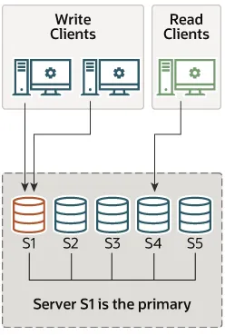

#### 2. 멀티 프라이머리 모드
- 그룹 멤버들이 전부 프라이머리로 동작하는 형태로 클라이언트는 그룹의 어떤 서버든 쓰기와 읽기 요청을 보낼 수 있다
- 모든 멤버가 쓰기가 밠갱할 수 있으므로 버전 호환성이 중요하다
- 그룹 복제에 새로 참여하는 멤버는 그룹에 참여할 때 버전 호환성 검사를 수행하며, 호환 가능 기준에 따라 참여 가능 여부와 읽기 전용 유지 여부를 결정하게 된다
  - 새로운 멤버는 그룹 내 가장 낮은 버전보다 낮을 경우 그룹에 참여할 수 없다
  - 그룹 내 가장 낮은 버전과 같은 버전인 경우 정상적으로 그룹에 참여할 수 있다
  - 높은 버전이라면 그룹에는 참여할 수 있지만 읽기 전용 모드를 유지하게 된다
- 그룹에서 한 멤버가 탈퇴하면 멤버들을 다시 확인해서 자동으로 읽기-쓰기 모드로 전환한다

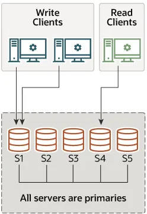

### 3. 그룹 멤버 관리(Group Membership)
- 그룹 멤버들에 대한 목록과 상태 정보를 내부적으로 관리하고 있고, `performance_schema`의 `replication_group_members` 테이블을 통해 그룹 멤버 목록을 확인할 수 있다
  - 호스트명과 사용하는 포트, UUID 값, 버전등과 역할도 알 수 있다
- `MEMBER_STATE`칼럼을 통해 현재 상태도 확인할 수 있다
  - ONLINE: 정상적으로 동작하고 있음을 나타낸다
  - RECOVERING: 그룹 복제에 참여하기 위해 데이터를 전달받는 작업이 진행되고 있음을 나타낸다
  - OFFLINE: 그룹 복제 플러그인이 로딩돼 있으나 아직 참여하지 않은 상태이다
  - ERROR: 그룹 복제에 속해있으나 복제가 정상적으로 동작하지 않는 상태를 나타낸다
  - UNREACHABLE: 현재 통신이 불가능하다고 표시되는 상태 값이다
- 그룹 복제가 관리하는 멤버 목록과 상태 정보를 `뷰`라고도 하는데 뷰는 뷰 ID라는 고유 식별자를 가지며, 그룹 멤버가 변경될 때마다 새로운 뷰 ID 값이 생성된다
  - 따라서 뷰 ID는 각각의 변경된 뷰를 고유하게 식별하는 것이며, 이를 통해 변경을 추적하고 뷰가 변경된 시점을 구분할 수 있다
  - View ID = [Prefix value]:[Sequence value]
  - Prefix value: 뷰 ID의 앞부분으로, 초기화될 때 생성되며 그 시점의 타임스탬프를 기반으로 만들어진다
  - Sequence value: 뷰 ID의 뒷부분으로, 뷰가 변경될 때마다 1씩 증가한다
  
### 4. 그룹 복제에서의 트랜잭션 처리
- 그룹 복제에서 트랜잭션은 합의와 인증을 거친 후 최종적으로 각 서버들에 적용된다
- 합의
  - 그룹 멤버들에게 트랜잭션 적용을 제안하고 승낙을 받는 과정으로 통신 결과를 바탕으로 처리된다
  - 트랜잭션 커밋 요청을 보내면 해당 멤버는 그룹 통신 엔진(XCom)을 통해 변경한 데이터와 스냅샷 정보 등을 다른 멤버들로 전파한다
  - Paxos기반 프로토콜을 바탕으로 그룹 멤버들 간의 합의 수행하며, 과반수로부터 응답을 받으면 그 다음 프로세스로 진행한다
  - 과반수 응답을 받지 못하면 트랜잭션은 적용되지 않으며 클라이언트에는 에러가 반환된다
- 인증
  - 합의 단계를 거친 후 글로벌하게 정렬되어, 각 멤버들에서 모두 동일한 순서로 인증 단계를 거치게 된다
  - 트랜잭션 `WriteSet` 데이터와 로컬 데이터를 비교하여 선형 트랜잭션과 동시점에 변경한 데이터인지 충돌 여부를 확인한다
  - 이러한 트랜잭션 충돌은 그룹 멤버 전체가 쓰기를 처리할 수 있는 멀티 프라이머리 모드에서만 발생할 수 있다
  - 인증 단계에서 충돌이 감지된 트랜잭션 커밋되지 못하고 롤백된다
  - 인증 단계를 거친 후 바이너리 로그에 트랜잭션을 기록하고 최종적으로 커밋을 완료하며, 클라이언트는 이 시점에 커밋 요청에 대한 응답을 받게 된다
  - 트랜잭션 데이터를 전달받은 다른 멤버들은 인증 단계 수행한 후 해당 데이터를 바탕으로 릴레이 로그 이벤트를 작성한다

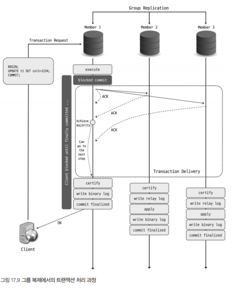

#### 1. 트랜잭션 일관성 수준
- `group_replication_consistency`를 통해 트랜잭션 일관성 수준을 설정할 수 있다

#### 1). EVENTUAL 일관성 수준
- 기본값으로 이름 그대로 최종적인 일관성을 보장하는 수준이다
- 읽기 전용 및 읽기-쓰기 트랜잭션이 별도의 제약없이 바로 실행 가능하다
- 기존 프라이머리가 페일오버 발생하여 새로운 프라이머리에서 읽기를 했을 때 오래된 데이터를 읽을 수 있다
  - 또한 이전 프라이머리 트랜잭션 충돌로 롤백될 수도 있다

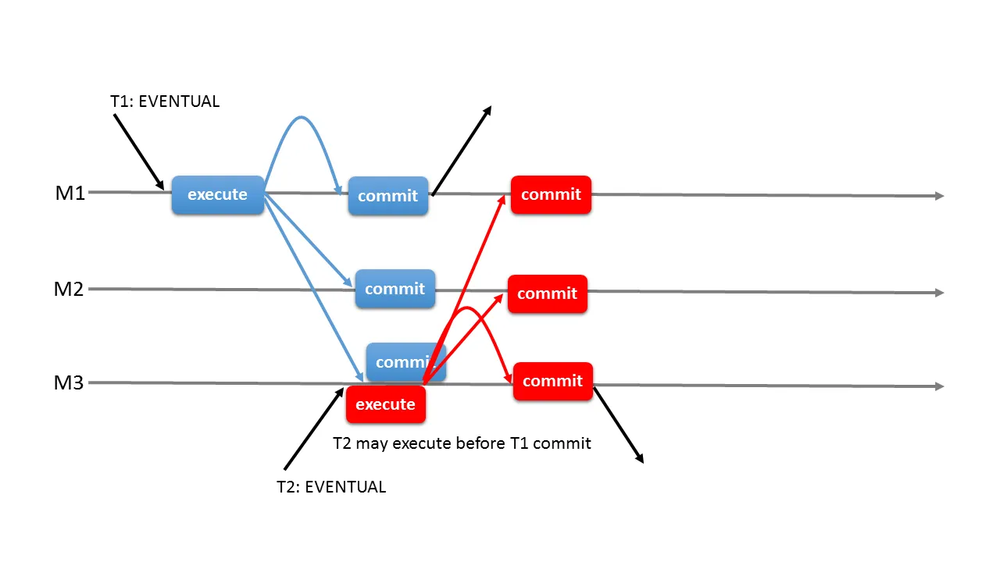

#### 2). BEFORE_ON_PRIMARY_FAILOVER 일관성 수준
- 싱글 프라이머리 모드에서 페일오버가 발생해서 신규 프라이머리가 선출됐을 때만 트랜잭션에 영향을 미친다
- 페일오버 후 이전 프라이머리의 트랜잭션을 적용하고 있는 경우 새로운 프라이머리는 모두 적용될 때까지 처리되지 못하고 대기하게 된다
- 대기시간이 길어져 응답 지연이 발생할 수 있으므로 이를 대비하는 코드가 구현돼 있는 것이 좋다
  - 또한 `wait_timeout` 변수를 통해 대기시간을 설정해야 한다
- 새로 유입된 읽기-쓰기 트랜잭션은 처리가 지연되지만 읽기 전용 트랜잭션의 일부 쿼리는 바로 실행이 가능하다
  - performance_schema 및 sys 데이터베이스에 대한 SELECT 문
  - 테이블 또는 사용자 정의 함수를 사용하지 않은 SELECT 문 등

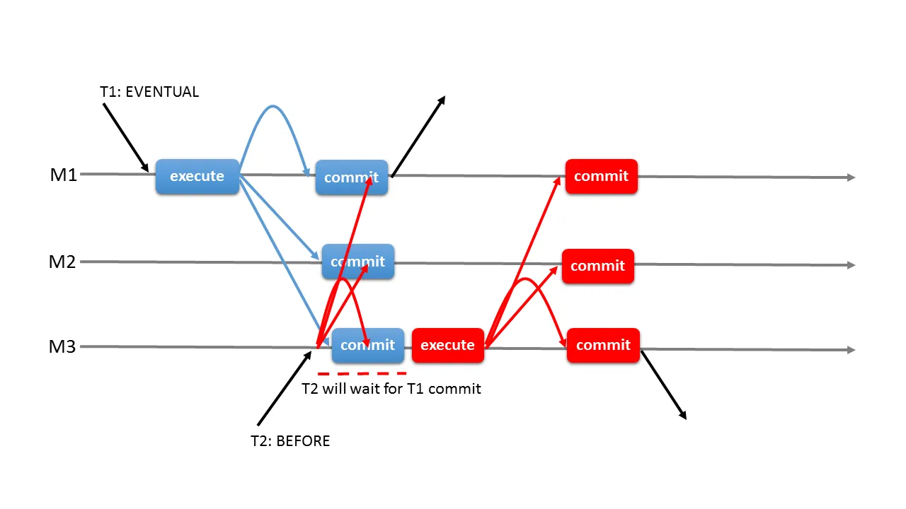

#### 3). BEFORE 일관성 수준
- 읽기 전용 및 읽기-쓰기 트랜잭션은 모두 선행 트랜잭션이 완료될 때까지 대기 후 처리된다
- 항상 최신 데이터를 읽으며, 선행 트랜잭션 적용시간이 길어질수록 처리가 지연된다
- `wait_timeout` 변수의 시간만큼 대기할 수 있으며 초과할 경우 에러를 반환한다


#### 4). AFTER 일관성 수준
- 트랜잭션이 적용되면 해당 시점에 그룹 멤버들이 모두 동기화된 데이터를 갖게 된다
- 다른 멤버들이 커밋될 준비가 될 때까지 대기한 후 최종적으로 처리하며, 읽기 전용은 별도의 제약없이 바로 처리된다
- 그룹 모든 멤버에 영향을 미치지만 어떤 멤버에서든 일관된 최신 데이터를 얻을 수 있다
- 다만 다른 멤버들에서 커밋이 준비될 때까지 대기해야 하므로 더 많은 시간을 소요하게 된다
- 쓰기보다 읽기가 많고, 분산된 최신 읽기를 수행하고자 할 때 사용하는 것이 좋다

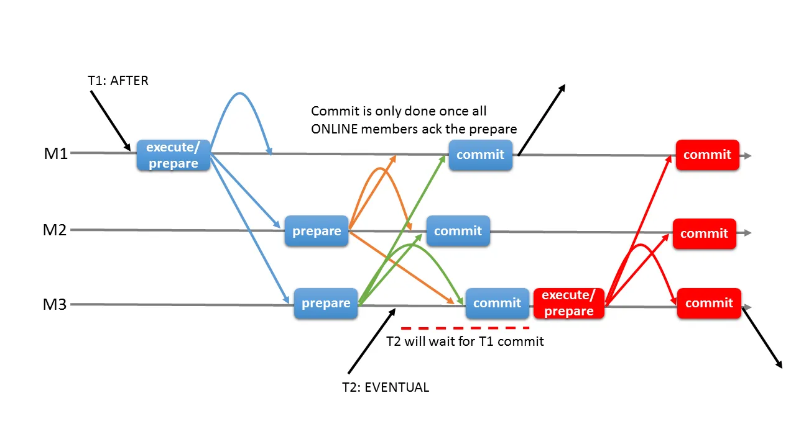

#### 5). BEFORE_AND_AFTER 일관성 수준
- BEFORE 수준과 AFTER 수준이 결합된 형태이다
- 읽기-쓰기 트랜잭션은 모든 선행 트랜잭션이 적용될 때까지 기다린 후 실행되며, 다른 멤버들이 커밋 응답을 보내면 그때 최종적으로 커밋된다

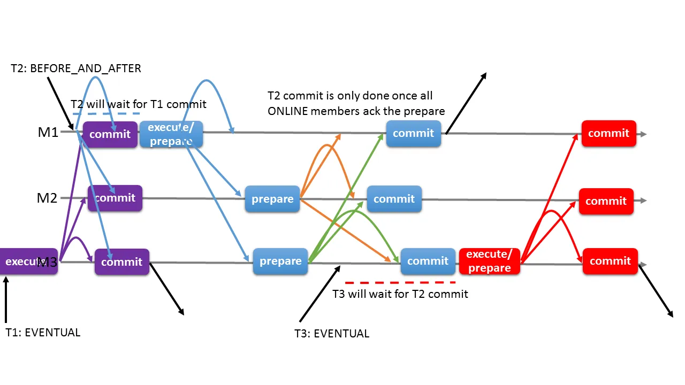

#### 2. 흐름 제어(Flow Control)
- 일부 멤버의 스펙이 낮거나 부하를 더 많이 받는 등 지연이 생기면 해당 멤버에서 오래된 데이터를 읽을 수 있으며, 트랜잭션 충돌이 발생할 수 있다
  - 트랜잭션 일관성 수준으로 조정할 수 있지만 근본적인 원인이 해결되는 것이 아니다
- 이러한 트랜잭선 적용 불균형 문제를 방지하기 위해 그룹 멤버들의 쓰기 처리량을 조절하는 매커니즘을 흐름 제어라고 한다
  - 흐름 제어를 통해 쓰리 처리량을 균등하게 할 수 있다
- `group_replication_flow_control_mode`로 흐름 제어 기능을 사용 여부를 설정할 수 있다
  - 어떤 모드로 사용할 지 설정하는 변수로 현재는 QUOTA와 DISABLED 밖에 없다
  - QUOTA: 흐름 제어의 기본 모드로 그룹에서 쓰기를 처리하는 멤버가 정해진 할당량만큼만 처리하도록 제어하는 방식이다
- QUOTA 모드로 설정된 흐름 제어 동작 방식은 다음과 같다
  1. 모든 그룹 멤버들의 쓰기 처리량 및 처리 대기 중인 트랜잭션의 통계를 수집해서 처리량을 조절할 필요가 있는지 확인한다
  2. 처리량 조절이 필요한 경우 처리량 계산 후 멤버별 최대 쓰기 처리량을 넘지 않도록 제한한다
- 흐름 제어는 그룹 전반에 걸쳐 수행되는 것이 아닌, 각 멤버별 개별적으로 수행된다. 멤버에서 다음과 같은 통계 정보를 수집하며 다른 그룹 멤버들에게도 공유된다
  - 인증 큐 크기
  - 적용 큐 크기
  - 인증된 총 트랜잭션 크기
  - 적용된 원격 트랜잭션 수
  - 로컬 트랜잭션 수
- 통계 정보 데이터는 `group_replication_flow_control_period`에 지정된 시간(초 단위)마다 수집 및 공유되는데, 이는 흐름 제어가 동작하는 주기를 의미한다
- 인증 큐 크기와 적용 큐 크기를 바탕으로 처리량을 조절할 것인지 판단한다

### 5. 그룹 복제의 자동 장애 감지 및 대응
- 일부 멤버가 망가지더라도 그룹이 정상적으로 동작할 수 있게 하는 장애 감지 매커니즘이 있다
  - 문제 멤버를 제외시키고 정상 멤버들로만 구성될 수 있게 하여 클라이언트 요청이 문제없이 처리될 수 있게 한다
- 주기적으로 통신을 주고받으며 5초 내로 의심을 하고 과반수로 동의하여 5초의 대기 시간이 추가되어 추방된다
  - `group_replication_member_expel_timeout` 변수로 대기 시간을 설정할 수 있다
- 추방된 멤버는 재가입 시도할 수 있는데 `group_replication_autorejoin_tries`변수에 설정된 값에 따라 재가입을 시도한다
- 네트워크 단절로 그룹 멤버들과 분리되는 경우에는 `group_replication_exit_state_action` 변수에 설정된 값에 따라 소수로 남겨진 멤버들이 스스로 탈퇴할 수 있도록 설정할 수 있다
  - 소수에 속한 멤버들에서도 트랜잭션은 실행될 수 있지만, 과반수 동의를 얻을 수 없으므로 보류된 상태로 남아 있게 된다
  - `group_replication_unreachable_majority_timeout`에 지정된 시간이 초과되며 모든 트랜잭션을 롤백하고 그룹에서 탈퇴한다
- 타의 혹은 자의로 탈퇴한 상태에서 재가입에 실패하거나 시도하지 않게 설정된 경우 `group_replication_exit_state_action`에 설정된 작업을 진행하게 된다
  - READ_ONLY
    - super_read_only를 ON으로 설정해서 슈퍼 읽기 전용 모드로 전환시킨다
    - 사용자가 ADMIN 권한이 있더라도 데이터 변경 작업을 수행할 수 없다
  - OFFLINE_MODE
    - 서버를 오프라인 모드로 전환시키고 super_read_only도 ON으로 설정한다
    - 세션 요청을 끊어버리고 더 이상 연결을 허용하지 않는다
  - ABORT_SERVER
    - MySQL 서버를 종료시킨다
- 그룹 멤버에서 group_replication_exit_state_action 시스템 변수에 설정된 작업이 동작하게 되는 구체적인 경우는 다음과 같다
  - 그룹 복제 어플라이어 스레드에 에러가 발생한 경우
  - 멤버가 그룹 복제의 분산 복구 프로세스를 정상적으로 완료할 수 없는 경우
  - group_replication_switch_to_single_primary_mode() 같은 그룹 복제 UDF를 사용해 그룹 전체에 대한 설정을 변경하는 중에 에러가 발생한 경우
  - 싱글 프라이머리 모드의 그룹에서 새 프라이머리 선출 과정 중 에러가 발생한 경우
  - 과반수 이상의 다른 그룹 멤버들과 통신이 단절되고, 대기 시간이 초과됐으나 재가입 시도를 하지 않도록 설정된 경우
  - 문제가 발생해서 그룹에서 추방되고 나서 추방됐음을 확인했으나 재가입 시도를 하지 않도록 설정된 경우
  - 자의 혹은 타의로 그룹에서 탈퇴한 후 지정된 횟수동안 그룹에 재가입을 성공하지 못한 경우

### 6. 그룹 복제의 분산 복구
- 멤버가 새로 가입하거나 탈퇴후 다시 가입할 때 등 잠시 그룹을 떠나는 동안 그룹에 적용된 트랜잭션들이 있을 수 있다
  - 그룹 가입 시 다른 멤버들과 동일하게 최신 데이터를 가질 수 있도록 누락된 트랜잭션들을 복구 프로세스를 자동으로 수행하게 되는데 이를 분산 복구라고 한다
- 분산 복구에서 가입 멤버가 복구 작업을 위해 선택한 기존 그룹 멤버를 기증자(Doner) 멤버라고 하며, 그룹에서 온라인 상태로 존재하는 모든 멤버들은 기증자가 될 수 있다

#### 1. 분산 복구 방식
- 분산 복구에서 복구 작업시 먼저 가입 멤버에서 `group_replication_applier` 복제 채널의 릴레이 로그를 확인하는데, 이전에 그룹에 가입한 적 있는 멤버라면 릴레이 로그에 기록돼 있으나 적용되지 않은 트랜잭션이 존재할 수 있기 때문이다
- 바이너리 로그 복제 방식과 원격 클론 방식을 적절히 조합해서 복구를 진행한다
- 바이너리 로그 복제 방식
  - 비동기 복제 기반으로 구현됐으며, 기증자와 `group_replication_recovery`라는 별도의 복제 채널로 연결되어 바이너리 로그에서 적용되지 않은 트랜잭션을 가져와 적용하는 방식이다
- 원격 클론 방식
  - 클론 플러그인을 사용하는 형태로, 기증자의 모든 데이터와 메타데이터를 일관된 스냅숏으로 가져와 재구축하는 방식이다
  - 이 방식은 둘 다 모두 클론 플러그인이 설치돼 있어야 한다
- 가장 적합한 복구 방식을 자동으로 선택하며, 기존 멤버와 트랜잭션 갭이 크거나 혹은 트랜잭션 일부가 손실된 경우에는 원격 클론 방식을 사용한다
  - 원격 클론 방식을 채택하게 되는 트랜잭션 갭의 임계값은 `group_replication_clone_threshold`에 지정된 값을 사용한다
  - 기본값은 아주 큰 값으로, 바이너리 로그 복제 방식이 가능한 환경에서는 원격 클론 방식이 사용되지 않는다

#### 2. 분산 복구 프로세스
- 크게 세 단계로 나눌 수 있다
  1. 로컬 복구
    - 이전에 그룹에 가입한적이 있는 경우 미처 적용되지 못한 트랜잭션이 있을 수 있다. 따라서 이 트랜잭션들을 먼저 적용한 후 본격적인 복구 작업을 진행한다
  2. 글로벌 복구
    - 기증자 멤버를 선택해서 데이터 또는 누락된 트랜잭션들을 가져와 자신에게 적용한다
    - 작업을 진행하는 동안 현재 그룹에서 처리되는 트랜잭션들을 내부적으로 캐싱해둔다
  3. 캐시 트랜잭션 적용
    - 글로벌 복구 단계가 완료되면 캐싱해서 보관하고 있던 트랜잭션들을 적용해 최종적으로 그룹에 참여한다
- 새로운 멤버가 가입하면 그룹 뷰가 변경되어 뷰 변경 로그 이벤트가 생성되고 멤버들의 바이너리 로그에 해당 이벤트가 기록된다
- 로컬 복구가 완료되면 그룹 내 ONLINE 멤버 중 랜덤으로 기증자를 선택해 복구를 진행한다
- 이때 원격 클론 방식 또는 바이너리 로그 복제 방식으로 복구 작업을 하고, 기증자 멤버의 스냅샷 데이터를 모두 받으면 MySQL 서버를 재시작한다
  - `group_replication_start_on_boot='ON'`이라면 재시작할 때 그룹 복제가 자동으로 시작되고, OFF면 수동으로 `START_GROUP_REPLICATION` 명령을 실행해야 한다
- 바이너리 로그 복제 복구 방식은 그룹에 참여한 시점까지만 복구 작업을 진행하며, 복구 작업 동안 그룹에서 처리된 트랜잭션들을 캐싱한다

#### 3. 분산 복구 설정
- 그룹 복제의 분산 복구에서 다음과 같은 부분들을 필요에 맞게 설정할 수 있다
- 연결 시도 횟수
- 연결 시도 간격
- 가입한 멤버를 온라인 상태로 표기하는 시점

#### 4. 분산 복구 오류 처리
- 복구 작업 도중 문제가 발생하더라도 자동으로 다시 작업을 시도하는 장애 감지 매커니즘이 있다
- 다음과 같은 경우들에서 분산 복구는 자동으로 새로운 그룹 멤버로 연결을 전화해서 다시 작업을 시도한다
  - 기증자로 선택한 그룹 멤버로부터 연결이 인증 문제 등으로 인해 정상적으로 이뤄지지 않는 경우
  - 바이너리 로그 복제 방식으로 복구 작업을 진행하는 중에 레플리케이션 I/O 스레드 또는 SQL 스레드에서 에러가 발생한 경우
  - 원격 클론 작업이 실패하거나 혹은 완료되기 전에 중단된 경우
  - 복구 작업 동안 기증자 멤버에서 글부 복제가 중단된 경우
- `replication_applier_status_by_worker` 테이블에서 `LAST_ERROR_`로 시작하는 칼럼으로 에러를 확인할 수 있다
- 다음과 같은 경우 분산 복구 프로세스가 진행되지 않고, 가입 멤버는 그룹을 떠나게 된다
  - 가입 멤버가 재시도 횟수를 모두 소진한 경우
  - 가입 멤버에 필요한 트랜잭션이 바이너리 로그에 존재하지 않고, 원격 클론 방식으로도 복구 작업을 진행할 수 없는 경우
  - 가입 멤버가 그룹에서 존재하지 않는 트랜잭션을 가지고 있는 상태에서 바이너리 로그 복제 방식으로 복구 작업이 진행되는 경우
  - 가입 멤버가 전체 그룹 멤버에 대해 원격 클론 방식과 바이너리 로그 복제 방식을 모두 시도했으나 전부 실패해서 더이상 시도해 볼 멤버가 존재하지 않는 경우
  - 복구 작업이 진행되는 중에 가입 멤버에서 그룹 복제가 중단된 경우

### 7. 그룹 복제 요구사항
- 그룹 복제를 사용하기 위해 다음과 같은 요구사항들을 충족해야 한다
  - InnoDB 스토리지 엔진 사용
  - 프라이머리 키 사용
  - 원활한 네트워크 통신 환경
  - 바이너리 로그 활성화
  - ROW 형태의 바이너리 로그 포맷 사용
  - 바이너리 로그 체크섬 설정
  - log_slave_updates 활성화
  - GTID 사용
  - 고유한 server_id 값 사용
  - 복제 메타데이터 저장소 설정
  - 트랜잭션 WriteSet 설정
  - 테이블 스페이스 암호화 설정
  - 멀티 스레드 복제 설정

### 8. 그룹 복제 제약 사항
- 그룹 복제는 GTID를 사용하므로 그에 수반되는 제약 사항에도 영향을 받는다
  - 갭 락은 갭 락을 발생시킨 트랜잭션이 실행된 멤버에서만 유효하며, 인증 단계에서는 해당 락 정보는 공유되지 않는다
- 테이블 락 및 네임드 락도 그룹 단위로 락 정보가 공유되지 않는다
- 그룹 복제에서 바이너리 로그 체크섬 기능은 8.0.21 버전부터 사용 가능하다
- 멀티 프라이머리 모드로 동작 중인 그룹에서는 SERIALIZABLE을 사용할 수 없다
- 멀티 프라이머리 모드로 동작 중인 그룹에서 동일한 테이블에 대해 서로 다른 멤버가 동시에 실행되는 DDL 및 DML 문은 지원하지 않는다
- 멀티 프라이머리 모드로 동작 중인 그룹에서 외래키가 존재하는 경우 CASCADE 제약 조건이 사용된 테이블은 지원하지 않는다
- 멀티 프라이머리 모드에서 `SELECT ... FOR UPDATE`를 사용하면 데드락이 발생할 수 있다
- 그룹 복제에서 복제 필터 기능은 사용할 수 없다
- 그루 ㅂ복제는 최대 9개까지만 가능하다

## 3. MySQL 셸
- MySQL을 위한 고급 클라이언트 툴로, 좀 더 확장된 기능들을 제공한다
  - 대표적으로 SQL뿐만 아니라 자바스크립트와 파이썬 언어 모드도 지원한다
- MySQL 서버에 쉽고 편리하게 작업할 수 있도록 API를 제공하는데 관계형 데이터와 문서기반 데이터를 처리하는 `X DevAPI`와 클러스터 및 InnoDB 레플리카셋을 구축할 수 있게 하는 `AdminAPI`가 있다
- MySQL 셸에 내장돼 있는 글로벌 객체들과 각 객체에 구현돼 있는 메서드를 통해 API를 사용할 수 있다

```sql
// 파이썬 모드로 전환
mysqlsh> \py

// SQL 모드로 전환
mysqlsh> \sql
```

- 글로벌 객체는 다음과 같고 자바스크립트 및 파이썬 모드에서만 사용 가능하다
  - session
    - 셸에서 MySQL 서버에 연결했을 때 생성된 세션에 매핑되는 객체로, 트랜잭션 시작과 같이 세션 단위로 사용할 수 있는 기능들을 제공한다
  - dba
    - InnoDB 클러스터 및 InnoDB 레플리카셋 구축과 관련된 기능을 제공하며, 내부적으로 AdminAPI를 사용해 처리한다
  - cluster
    - InnoDB 클러스터에 매핑되는 객체로, 클러스터 설정 변경 등과 같이 클러스터와 관련해서 사용자가 제어할 수 있는 기능등를 제공한다
  - rs
    - InnoDB 레플리카셋에 매핑되는 객체로, 레플리카셋 설정 변경 등과 같이 레플리카셋과 관련해서 사용자가 제어할 수 있는 기능등를 제공한다
  - db
    - 셸에서 X 프로토콜을 사용해 MySQL 서버에 연결한 경우 연결 시 지정했던 데이터베이스에 매핑되는 객체다. 데이터베이스와 관련해서 사용할 수 있는 기능들을 제공한다
  - shell
    - MySQL 셸 설정 변경 등과 같이 셸과 관련해서 사용자가 제어할 수 있는 기능을 제공한다
  - util
    - MySQL 버전을 업그레이드할 준비가 됐는지 확인하거나 MySQL 서버에 데이터 로딩 또는 추출하는 등의 유용한 작업 기능들을 제공한다

## 4. MySQL 라우터
- 클러스터에서 애플리케이션 서버로부터 받은 쿼리를 적절한 MySQL 서버로 전달하고 다시 반환하는 Proxy 역할을 수행한다
- 중요기능으로는 클러스터의 구성 변경 자동 감지, 쿼리 부하 분산, 자동 페일오버가 있다
- 중간 계층에서 프락시 역할을 하는 프로그램을 사용하지 않은 애플리케이션 서버에서는 MySQL 서버에 직접 연결해서 쿼리를 실행한다
- VIP(Virutal IP)를 통해 MySQL 서버에 접근하는 형태가 아니라면 IP와 같은 정보를 커넥션 설정에 저장해서 사용하게 된다
  - 이럴경우 다른 서버로 교체되거나 추가가 되면 DB 커넥션 설정 정보를 반드시 수정해야 한다
  - 반면 InnoDB 클러스터를 사용하는 경우에는 라우터를 통해 접근하므로 자동 감지해서 갱신한다
- 장애 발생 감지및 자동 재시도와 커넥션별 부하 분산 방식을 지정하는 등 자동으로 설정할 수 있다

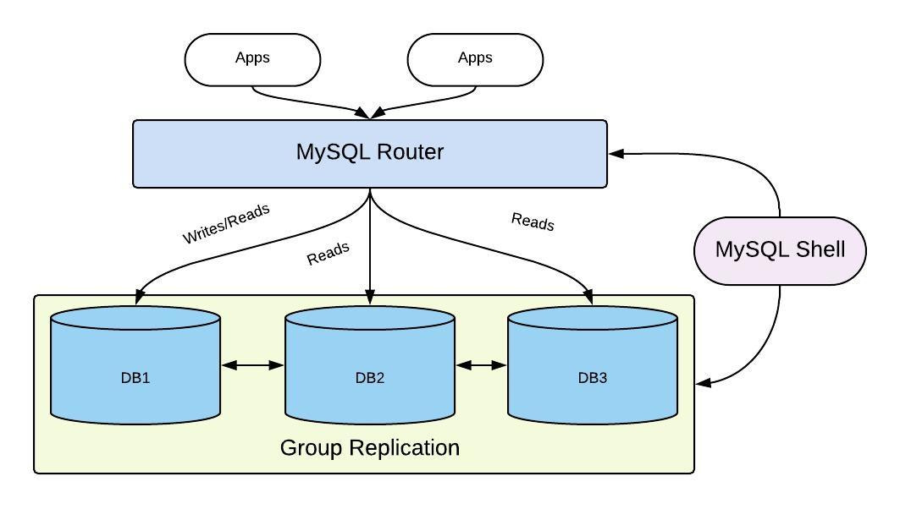

## 5. InnoDB 클러스터 구축

### 1. InnoDB 클러스터 요구사항
- MySQL 5.7.17 이상
- MySQL 셸 1.0.8 이상
- MySQL 라우터 2.1.2 이상
- 모든 서버들은 Performance 스키마가 활성화돼 있어야 한다
- MySQL 셸이 설치될 서버에 파이썬이 2.7 이상 버전으로 설치돼 있어야 한다
