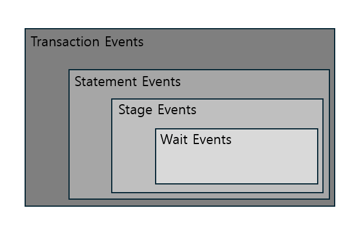
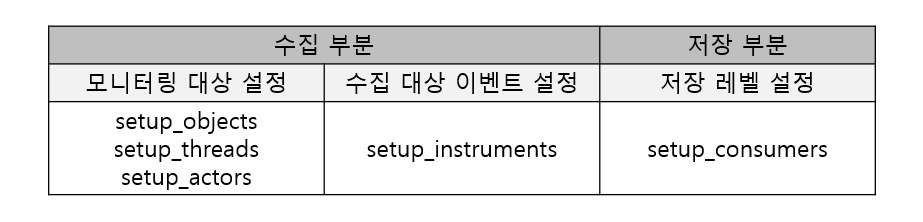

# 📘 곽유섭 - Chapter 18 - Performance 스키마 & Sys 스키마

> Real MySQL 8.0 2권 | Chapter 18 - Performance 스키마 & Sys 스키마

---

## 📝 정리 내용

> # 18. Performance 스키마 & Sys 스키마

`Performance 스키마와 Sys 스키마` : 데이터베이스 상태 분석을 수월하게 할 수 있게 내부에서 발생하는 이벤트에 대한 상세한 정보를 수집해서 한 곳에 모아 사용자들이 손쉽게 접근해서 확인할 수 있게 하는 기능

## 18-1. Performance 스키마란?

MySQL 서버 내부 동작 및 쿼리 처리와 관련된 세부 정보들이 저장되는 테이블들이 존재하며, 이러한 테이블들을 통해 MySQL 서버의 성능을 분석하고 내부 처리 과정 등을 모니터링할 수 있다.

`Performance`스키마를 위해 별도로 구현된 전용 스토리지 엔진인 `PERFORMANCE_SCHEMA` 스토리지 엔진에 의해 수행된다.

- `PERFORMANCE_SCHEMA` 스토리지 엔진 : MySQL 서버가 동작 중인 상태에서 실시간으로 정보를 수집하며, 수집한 정보를 디스크가 아닌 메모리에 저장한다.
  - 활성화하면 CPU와 메모리 등의 서버 리소스를 좀 더 소모하게 된다.

  - 특정 이벤트에 대한 데이터들만 수집할 수 있도록 설정해서 오버헤드를 줄일 수 있다.

  - Performance 스키마는 디스크에 테이블 구조만 저장되므로, 재시작 시 데이터가 초기화되어 복구할 수 없다.

  - Performance 스키마에서 발생한 데이터 변경은 바이너리 로그에 반영되지 않는다.

## 18-2. Performance 스키마 구성

Performance 스키마 설정과 관련된 테이블과 Performance 스키마가 수집한 데이터가 저장되는 테이블로 나눌 수 있다.

### 18-2-1. Setup 테이블

Performance 스키마의 데이터 수집 및 저장과 관련된 설정 정보가 저장, 이 테이블을 통해 Performance 스키마의 설정을 동적으로 변경할 수 있다.

- setup_actors
  - Performance 스키마가 모니터링하며 데이터를 수집할 대상 유저 목록이 저장

- setup_consumers
  - Performance 스키마가 얼마나 상세한 수준으로 데이터를 수집하고 저장할 것인지를 결정하는 데이터 저장 레벨 설정이 저장돼 있다.

- setup_instruments
  - Performance 스키마가 데이터를 수집할 수 있는 MySQL 내부 객체들의 클래스 목록과 클래스별 데이터 수집 여부 설정이 저장돼 있다.

- setup_objects
  - Performance 스키마가 모니터링하며 데이터를 수집할 대상 데이터베이스 객체(프로시저, 테이블, 트리거 등과 같은) 목록이 저장돼 있다.

- setup_threads
  - Performance 스키마에서 모니터링하며 데이터를 수집할 수 있는 MySQL 내부 스레드의 목록과 스레드별 데이터 수집 여부 설정이 저장돼 있다.

### 18-2-2. Instance 테이블

Performance 스키마가 데이터를 수집하는 대상인 실체화된 인스턴스들에 대한 정보를 제공하며, 인스턴스 종류별로 테이블이 구분돼 있다.

- cond_instances
  - 현재 MySQL 서버에서 동작 중인 스레드들이 대기하는 조건 인스턴스들의 목록을 확인할 수 있다.

  - 조건은 스레드 간 동기화 처리와 관련해 특정 이벤트가 발생했음을 알리기 위해 사용되는 것으로, 스레드들은 자신들이 기다리고 있는 조건이 참이 되면 작업을 재개한다.

- file_instances
  - 현재 MySQL 서버가 열어서 사용 중인 파일들의 목록을 확인할 수 있다.

  - 사용하던 파일이 삭제되면 데이터도 삭제된다.

- mutex_instances
  - 현재 MySQL 서버에서 사용 중인 뮤텍스 인스턴스들의 목록을 확인할 수 있다.

- rwlock_instances
  - 현재 MySQL 서버에서 사용 중인 읽기 및 쓰기 잠금 인스턴스들의 목록을 확인할 수 있다.

- socket_instances
  - 현재 MySQL 서버가 클라이언트 요청을 대기하고 있는 소켓 인스턴스들의 목록을 확인할 수 있다.

### 18-2-3. Connection 테이블

MySQL에서 생성된 커넥션들에 대한 통계 및 속성 정보를 제공한다.

- accounts
  - DB 계정명과 MySQL 서버로 연결한 클라이언트 호스트 단위의 커넥션 통계 정보를 확인할 수 있다.

- host
  - 호스트별 커넥션 통계 정보를 확인할 수 있다.

- users
  - DB 계정명별 커넥션 통계 정보를 확인할 수 있다.

- session_account_connect_attrs
  - 현재 세션 및 세션에서 MySQL에 접속하기 위해 사용한 DB 계정과 동일한 계정으로 접속한 다른 세션들의 커넥션 속성 정보를 확인할 수 있다.

- session_connect_attrs
  - MySQL에 연결된 전체 세션들의 커넥션 속성 정보를 확인할 수 있다.

### 18-2-4. Variable 테이블

MySQL 서버의 시스템 변수 및 사용자 정의 변수와 상태 변수들에 대한 정보를 제공한다.

- global_variables
  - 전역 시스템 변수들에 대한 정보가 저장돼 있다.

- session_variables
  - 현재 세션에 대한 세션 범위의 시스템 변수들의 정보가 저장돼 있으며, 현재 세션에서 설정한 값들을 확인할 수 있다.

- variables_by_thread
  - 현재 MySQL에 연결돼 있는 전체 세션에 대한 세션 범위의 시스템 변수들의 정보가 저장돼 있다.

- persisted_variables
  - `SET PERSIST` 또는 `SET PERSIST_ONLY` 구문을 통해 영구적으로 설정된 시스템 변수에 대한 정보가 저장돼 있다.

  - mysqld_auto.cnf 파일에 저장돼 있는 내용을 테이블 형태로 나타낸 것, SQL문을 사용해 해당 파일의 내용을 수정할 수 있게 한다.

- variables_info
  - 전체 시스템 변수에 대해 설정 가능한 값 범위 및 가장 최근에 변수의 값을 변경한 계정 정보 등이 저장돼 있다.

- user_variables_by_thread
  - 현재 MySQL에 연결돼 있는 세션들에서 생성한 사용자 정븨 변수들에 대한 정보(변수명 및 값)가 저장돼 있다.

- global_status
  - 전역 상태 변수들에 대한 정보가 저장돼 있다.

- session_status
  - 현재 세션에 대한 세션 범위의 상태 변수들의 정보가 저장돼 있다.

- status_by_thread
  - 현재 MySQL에 연결돼 있는 전체 세션들에 대한 세션 범위의 상태 변수들의 정보가 저장돼 있으며, 세션별로 구분될 수 있는 상태변수만 저장된다.

### 18-2-5. Event 테이블

Wait, Stage, Statement, Transaction 이벤트 테이블로 구분돼 있다.

스레드에서 실행된 쿼리 처리와 관련된 이벤트로서 다음과 같은 계층 구조를 가진다.



- 테이블명 후미에 해당 테이블이 속해있는 유형의 이름이 표시된다.
  - current
    - 스레드별로 가장 최신의 이벤트 1건만 저장되며, 스레드가 종료되면 이벤트 데이터는 바로 삭제된다.

  - history
    - 스레드별로 가장 최신의 이벤트가 지정된 최대 개수만큼 저장된다.

    - 스레드가 종료되면 이벤트 데이터는 바로 삭제되며, 사용 중 최대 저장 개수를 넘은 경우 이전 이벤트를 삭제하고 최근 이벤트를 저장함.

  - history_long
    - 전체 스레드에 대한 최근 이벤트들을 모두 저장하며, 지정된 전체 최대 개수만큼 데이터가 저장된다.

    - 스레드가 종료되는 것과 관계없이 이벤트 데이터를 가지고 있으며, 전체 최대 저장 개수를 넘어가면 이전 이벤트를 삭제하고 최근 이벤트를 저장해서 최대 개수를 유지한다.

- 이벤트 타입별로 이벤트 데이터가 저장되는 테이블 목록
  - Wait Event 테이블
    - 각 스레드에서 대기하고 있는 이벤트들에 대한 정보를 확인할 수 있다.

    - 일반적으로 잠금 경합 또는 I/O 작업 등으로 스레드가 대기한다.

  - Stage Event 테이블
    - 각 스레드에서 실행한 쿼리들의 처리 단계에 대한 정보를 확인할 수 있다.

    - 실행된 쿼리가 구문 분석, 테이블 열기, 정렬 등과 같은 쿼리 처리 단계 중 현재 어느 단계를 수행하고 있는지와 처리 단계별 소요 시간 등을 알 수 있다.

  - Statement Event 테이블
    - 각 스레드에서 실행한 쿼리들에 대한 정보를 확인할 수 있다.

    - 실행된 쿼리와 쿼리에서 반환된 레코드 수, 인덱스 사용 유무 및 처리된 방식 등의 다양한 정보를 함께 확인할 수 있다.

  - Transaciton Event 테이블
    - 각 스레드에서 실행된 트랜잭션에 대한 정보를 확인할 수 있다.

    - 트랜잭션별로 트랜잭션 종류와 현재 상태, 격리 수준 등을 알 수 있다.

- 네 가지 이벤트들은 계층 구조를 가지므로 각 이벤트 테이블에는 상위 계층에 대한 정보가 저장되는 칼럼들이 존재한다.("NESTING*EVENT*"로 시작하는 칼럼들)

### 18-2-6. Summary 테이블

Performance 스키마가 수집한 이벤트들을 특정 기준별로 집계한 후 요약한 정보를 제공한다.

이벤트 타입별, 집계 기준별로 다양한 Summary 테이블들이 존재한다.

### 18-2-7. Lock 테이블

MySQL에서 발생한 잠금과 관련된 정보를 제공한다.

- data_locks
  - 현재 잠금이 점유됐거나 잠금이 요청된 상태에 있는 데이터 관련 락(레코드 락 및 갭 락)에 대한 정보를 보여준다.

- data_lock_waits
  - 이미 점유된 데이터 락과 이로 인해 잠금 요청이 차단된 데이터 락 간의 관계 정보를 보여준다.

- metadata_locks
  - 현재 잠금이 점유된 메타데이터 락들에 대한 정보를 보여준다.

- table_handles
  - 현재 잠금이 점유된 테이블 락에 대한 정보를 보여준다.

### 18-2-8. Replication 테이블

Replication 테이블에서는 `SHOW [REPLICA | SLAVE] STATUS` 명령문에서 제공하는 것보다 더 상세한 복제 관련 정보를 제공한다.

### 18-2-9. Clone 테이블

Clone 플러그인을 통해 수행되는 복제 작업에 대한 정보를 제공한다.

Clone 플러그인이 설치될 때 자동으로 설치되고, 플러그인이 삭제될 때 함께 제거된다.

### 18-2-10. 기타 테이블

- error_log
  - MySQL 에러 로그 파일의 내용이 저장돼 있다.

- log_status
  - MySQL 서버 로그 파일들의 포지션 정보가 저장돼 있으며, 온라인 백업 시 활용될 수 있다.

- processlist
  - MySQL 서버에 연결된 세션 목록과 각 세션의 현재 상태, 세션에서 실행 중인 쿼리 정보가 저장돼 있다.

  - `SHOW PROCESSLIST`나 `information_schema.PROCESSLIST` 테이블을 조회해서 얻은 결과 데이터와 동일하다.

- threads
  - 서버 내부의 백그라운드 스레드 및 포그라운드 스레드들에 대한 정보가 저장돼 있으며, 스레드별로 모니터링 및 과거 이벤트 데이터 보관 설정 여부도 확인할 수 있다.

- user_defined_functions
  - 컴포넌트나 플러그인에 의해 자동으로 등록됐거나 `CREATE FUNCTION` 명령문으로 생성된 사용자 정의 함수들에 대한 정보가 저장된다.

## 18-3. Performance 스키마 설정

사용자가 별도로 설정하지 않아도 MySQL 시작 시 Performance 스키마는 자동으로 활성화된다.

```
--//비활성화
[mysqld]
performance_schema=OFF

--//활성화
[mysqld]
performance_schema=ON
```

Performance 스키마에서는 수집한 데이터들을 모두 메모리에 저장하므로 Performance 스키마가 MySQL 서버 동작에 영향을 줄 만큼 메모리를 사용하지 않게 제한하는 것이 좋다.

    ex) 사용자가 필요로 하는 이벤트들에 대해서만 수집하도록 설정

### 18-3-1. 메모리 사용량 설정

메모리 사용량 설정은 얼마만큼의 데이터를 저장할 것인지를 설정하는 것이다.

Performance 스키마의 메모리 사용량 설정과 관련된 변수들은 MySQL 서버 시작 시 설정 파일에 명시하는 형태로만 적용할 수 있다.

### 18-3-2. 데이터 수집 및 저장 설정

- Performance 스키마가 어떤 대상에 대해 모니터링하며 어떤 이벤트들에 대한 데이터를 수집하고, 수집한 데이터를 어느 정도 상세한 수준으로 저장하게 할 것인지를 제어할 수 있다.

- 생산자(Producer)-소비자(Consumer) 방식으로 구현되어 데이터를 수집하는 부분과 저장하는 부분으로 나눠 동작한다.

#### 18-3-2-1. 런타임 설정 적용

- MySQL 서버 구동 중에 바로 적용할 수 있다.

- Performance 스키마의 "setup\_"으로 시작하는 설정 테이블을 통해 이뤄진다.



##### 18-3-2-1-1. 저장 레벨 설정

저장 레벨이 설정돼 있으면 Performance 스키마에서 설정된 모니터링 대상 및 수집 대상 이벤트들을 바탕으로 데이터를 수집하고 설정된 저장 레벨에 따라 적절한 테이블에 수집한 데이터를 저장한다.

- `setup_consumers`테이블에서 데이터 저장 레벨을 설정할 수 있다.

- 상위 레벨에서 하위 레벨로 갈수록 데이터가 상세히 저장되며, 상위 레벨이 비활성화돼 있다면 하위 레벨을 활성화해도 적용이 되지 않는다.

##### 18-3-2-1-2. 수집 대상 이벤트 설정

- `setup_instruments`테이블을 통해 수집 대상 이벤트를 설정할 수 있다.

- 전체 이벤트 클래스들을 수집 대상으로 설정하는 것은 성능 저하를 초래한다.

- 이름이 'memory/performance_schema'로 시작하는 이벤트 클래스들은 항상 활성화돼 있으며, 비활성화할 수 없다.

##### 18-3-2-1-3. 모니터링 대상 설정

- `setup_objects`, `setup_threads`, `setup_actors` 테이블을 통해 모니터링 대상을 설정할 수 있다.
  - `setup_objects` : 서버 내 존재하는 데이터베이스 객체들

  - `setup_threads` : Performance 스키마가 데이터를 수집할 수 있는 스레드 객체의 클래스 목록

  - `setup_actors` : 모니터링 대상 DB 계정을 설정.

#### 18-3-2-2. Performance 스키마 설정의 영구 적용

`setup` 테이블을 통해 동적으로 변경한 Performance 스키마 설정은 MySQL 서버가 재시작되면 모두 초기화된다.

서버가 재시작하더라도 유지하고 싶거나 서버 시작 시 Performance 스키마에 대한 설정이 적용되게 하고 싶은 경우, MySQL 설정 파일을 이용할 수 있다.

스타트업 설정은 수집 대상 이벤트 및 데이터 저장 레벨에 대해서만 가능하다.

```
--// 수집 대상 이벤트
[mysqld]
performance_schema_instrument='instrument_name=value'

--// 데이터 저장 레벨
[mysqld]
performance_schema_consumer_consumer_name=value
```

## 18-4. Sys 스키마란?

Performance 스키마의 불편한 사용성을 보완하기 위해 도입됐으며, 데이터를 사용자들이 쉽게 이해할 수 있는 형태로 출력하는 뷰, 스토어드 프로시저, 함수들을 제공한다.

## 18-5. Sys 스키마 사용을 위한 사전 설정

기본적으로 Performance 스키마에 저장된 데이터를 참조하므로 Performance 기능을 활성화해야 한다.

MySQL 서버가 구동 중인 상태에서 Performance 스키마에 대한 설정 변경은 Sys 스키마에서 제공하는 프로시저들을 통해서 진행할 수 있다.

```sql
--// Performance 스키마의 설정을 기본 설정으로 초기화
mysql> CALL sys.ps_setup_reset_to_default(TRUE);
```

제한적인 권한을 가진 DB 계정으로 Sys스키마를 사용하기 위해선 추가 권한이 필요할 수 있다.

```sql
mysql> GRANT PROCESS ON *.* TO `user`@`host`;
mysql> GRANT SYSTEM_VARIABLES_ADMIN ON *.* TO `user`@`host`;
mysql> GRANT ALL PRIVILEGES ON `sys`.* TO `user`@`host`;
mysql> GRANT SELECT, INSERT, UPDATE, DELETE, DROP ON `performance_sche,a`.* TO `user`@`host`;
```

## 18-6. Sys 스키마 구성

- 테이블
  - Sys 스키마에서는 데이터베이스 객체에서 사용되는 옵션의 정보가 저장돼 있는 테이블 하나만 존재하며, InnoDB로 설정돼 있어 데이터가 영구적으로 보존된다.

  ```sql
  --// Sys 스키마의 함수, 프로시저에 참조되는 옵션들이 저장돼 있는 테이블
  mysql> SELECT * FROM sys_config;
  ```

- 뷰
  - Formatted-View : 출력되는 결과에서 시간이나 용량과 같은 값들을 사람이 쉽게 읽을 수 있는 수치로 변환해서 보여주는 뷰

  - Raw-View : "x$"라는 접두사로 시작하며, 데이터를 저장된 원본 형태 그대로 출력해서 보여준다.

- 스토어드 프로시저
  - Sys 스키마에서 제공하는 프로시저를 통해 설정을 확인 및 변경할 수 있다.

- 함수
  - Sys 스키마에서는 값의 단위를 변환하고, Performance 스키마의 설정 및 데이터를 조회하는 등의 다양한 기능을 가진 함수들을 제공한다.

## 18-7. Performance 스키마 및 Sys 스키마 활용 예제

### 18-7-1. 호스트 접속 이력 확인

MySQL 서버가 구동된 시점부터 현재까지 MySQL에 접속했던 호스트들의 전체 목록을 얻고자 할때 사용

```sql
mysql> SELECT * FROM performance_schema.hosts;
```

### 18-7-2. 미사용 DB 계정 확인

MySQL 서버가 구동된 시점부터 현재까지 사용되지 않은 DB 계정들을 확인하고자 할 때 사용

```sql
mysql> SELECT DISTINCT m_u.user, m_u.host
        FROM mysql.user m_u
        LEFT JOIN performance_schema.accounts ps_a ON m_u.user=ps_a.user AND ps_a.host=m_u.host
        LEFT JOIN information_schema.views is_v ON is_v.definer=concat(m_u.user,'@',m_u.host)
        AND is_v.security_type='DEFINER'
        LEFT JOIN information_schema.routines is_r ON is_r.definer=concat(m_u.user,'@',m_u.host)
        AND is_r.security_type='DEFINER'
        LEFT JOIN information_schema.events is_e ON is_e.definer=concat(m_u.user,'@',m_u.host)
        LEFT JOIN information_schema.triggers is_t ON is_t.definer=concat(m_u.user,'@',m_u.host)
        WHERE ps_a.user IS NULL
        AND is_v.definer IS NULL
        AND is_r.definer IS NULL
        AND is_e.definer IS NULL
        AND is_t.definer IS NULL
        ORDER BY m_u.user, m_u.host;
```

### 18-7-3. MySQL 총 메모리 사용량 확인

MySQL 서버가 사용하고 있는 메모리의 전체 사용량을 확인하고자 할 때 사용

```sql
mysql> SELECT * FROM sys.memory_global_total;
```

### 18-7-5. 미사용 인덱스 확인

schema_unused_indexes 뷰를 통해 사용되지 않은 인덱스 목록을 확인

```sql
mysql> SELECT * FROM sys.schema_unused_indexes;
```

제거할 땐 안전하게 인덱스가 쿼리에 사용되지 않는 INVISIBLE 상태로 먼저 변경해서 일정 기간 문제가 없음을 확인한 후 제거하는 게 좋다.

```sql
mysql> ALTER TABLE users ALTER INDEX ix_name INVISIBLE;
```

### 18-7-8. I/O 요청이 많은 테이블 목록 확인

`io_global_by_file_by_bytes` 뷰를 조회해서 테이블들에 대한 I/O 발생량을 종합적으로 확인해볼 수 있다.

```sql
mysql> SELECT * FROM sys.io_global_by_file_by_bytes WHERE file LIKE '%ibd';
```

### 18-7-9. 테이블별 작업량 통계 확인

MySQL 서버에 존재하는 각 테이블에 대해 데이터 작업 유형 및 I/O 유형별 전체 통계 정보를 확인할 수 있다.

```sql
mysql> SELECT table_schema, table_name,
            rows_fetched, rows_inserted, rows_updated, rows_deleted, io_read, io_write
         FROM sys.schema_table_statistics WHERE table_schema NOT IN ('mysql','performance_schema','sys') \G
```

### 18-7-11. 풀 테이블 스캔 쿼리 확인

테이블 풀스캔을 발생시키는 쿼리는 실행 시간이 긴 경우 슬로우 쿼리 로그 파일에서 확인할 수 있지만, 테이블 풀스캔 쿼리 뿐만 아니라 실행 시간이 오래 걸리는 쿼리도 기록된다.

```sql
mysql> SELECT db, query, exec_count,
            sys.format_time(total_latency) as "formatted_total_latency",
            rows_sent_avg, rows_examined_avg, last_seen
        FROM sys.x$statements_with_full_table_scans
        ORDER BY total_latency DESC \G
```

### 18-7-12. 자주 실행되는 쿼리 목록 확인

```sql
mysql> SELECT db, exec_count, query
        FROM sys.statement_analysis
        ORDER BY exec_count DESC;
```

### 18-7-13. 실행 시간이 긴 쿼리 목록 확인

```sql
mysql> SELECT query, exec_count, sys.format_time(avg_latency) as "formatted_avg_latency", rows_sent_avg, rows_examined_avg, last_seen
        FROM sys.x$statement_analysis
        ORDER BY avg_latency DESC;
```

### 18-7-18. ALTER 작업 진행률 확인

ALTER TABLE 명령문을 통해 테이블 스키마를 변경하는 작업을 진행하는 경우 경과를 Performance 스키마에 저장된 이벤트 데이터를 통해 확인할 수 있다.

```sql
--// Performance 스키마에서 ALTER 작업 관련 설정들 확인
mysql> SELECT NAME, ENABLED, TIMED
        FROM performance_schema.setup_instruments
        WHERE NAME LIKE 'stage/innodb/alter%';

mysql> SELECT *
        FROM performance_schema.setup_consumers WHERE NAME LIKE '%stages$';

--// 비활성화일 경우 설정 활성화
mysql> UPDATE performance_schema.setup_instruments
        SET ENABLED = 'YES', TIMED = 'YES'
        WHERE NAME LIKE 'stage/innodb/alter%';

mysql> UPDATE performance_schema.setup_consumers
        SET ENABLED = 'YES'
        WHERE NAME LIKE '%stages%';

--// 진행률 확인
mysql> SELECT ps_estc.NESTING_EVENT_ID,
            ps_esmc.SQL_TEXT,
            ps_estc.EVENT_NAME,
            ps_estc.WORK_COMPLETED,
            ps_extc.WORK_EXTIMATED,
            ROUND((WORK_COMPLETED/WORK_ESTIMATED)*100,2) as "PROGRESS(%)"
        FROM performance_schema.events_stages_current ps_estc
        INNER JOIN performance_schema.events_statements_current ps_esmc
            ON ps_estc.NESTING_EVENT_ID = ps_esmc.EVENT_ID
        WHERE ps_estc.EVENT_NAME LIKE 'stage/innodb/alter%' \G

mysql> SELECT NESTING_EVENT_ID, EVENT_ID, EVENT_NAME,
            sys.format_time(TIMER_WAIT) AS 'ELAPSED_TIME'
        FROM performance_schema.events_stages_history_long
        WHERE NESTING_EVENT_ID=78
        ORDER BY TIMER_START \G
```

### 18-7-19. 메타데이터 락 대기 확인

ALTER TABLE 명령문을 통해 테이블 스키마를 변경할 때 다른 세션에서 변경 대상 테이블에 대해 메타데이터 락을 점유하고 있는 경우 대기하게 된다.

이때 Sys 스키마의 `schema_table_lock_waits`뷰를 조회해서 현재 ALTER TABLE 작업을 대기하게 만든 세션에 대한 정보를 확인할 수 있다.

### 18-7-20. 데이터 락 대기 확인

Sys스키마의 `innodb_lock_waits`뷰를 조회해서 대기가 발생한 데이터 락과 관련된 종합적인 정보를 확인할 수 있다.

---
