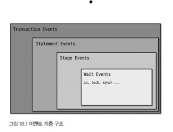
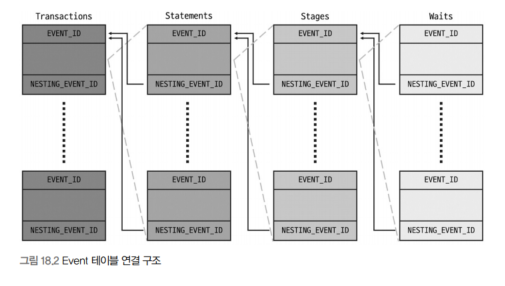
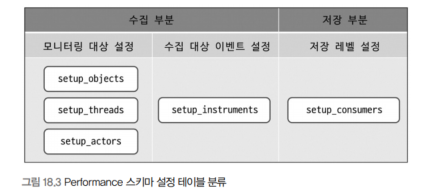
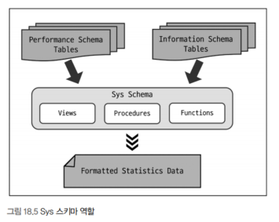

## 0. 개요
- DB의 대표문제는 문제 중 하나는 성능 이슈다
- 성능을 향상시키기 위해서는 현재 데이터베이스가 어떤 상태인지 분석하고 성능을 향상시킬 수 있는 튜닝 요소를 찾는 것이다
- 이를 MySQL에서는 `Performance` 스키마와 `Sys` 스키마로 수집된 정보를 조회할 수 있다

## 1. Performance 스키마란?
- performance_schema라는 이름의 데이터베이스로 확인할 수 있다
- MySQL 서버 내부 동작 및 쿼리 처리와 관련된 정보들이 저장되고, 서버의 성능을 분석하고 내부 처리 과정을 모니터링할 수 있다
- Performance 스키마에 저장되는 데이터는 MySQL 서버 소스코드 곳곳에 존재하는 성능 측정 코드로부터 수집되며 `PERFORMANCE_SCHEMA` 스토리지 엔진에 의해 수행된다
  - 해당 스토리지 엔진은 메모리에 저장하기 때문에 활성화하면 CPU와 메모리 등의 리소스를 더 소모하게 된다
  - 특정 이벤트만 데이터만 수집할 수 있도록 설정할 수 있고, 메모리에 저장하기 때문에 복구할 수 없고 Performance 스키마에서 발생하는 데이터 변경은 바이너리 로그에 기록되지 않기 때문에 복제되지 않는다

## 2. Performance 스키마 구성
- 크게 Performance 스키마 설정 관련 테이블과 Performance 스키마가 수집한 데이터가 저장되는 테이블로 나눌 수 있다

### 1. Setup 테이블
- Performance 스키마의 데이터 수집과 저장과 관련된 **설정 정보** 가 저장돼 있으며 이 테이블을 통해 Performance 스키마의 설정을 동적으로 변경할 수 있다
  - setup_actors
    - 모니터링하여 데이터를 수집할 대상 유저 목록이 저장돼 있다
  - setup_consumers
    - 얼마나 상세한 수준으로 데이터를 수집하고 저장할 것인지 결정하는 저장 레벨을 설정이 저장돼 있다
  - setup_instruments
    - 데이터를 수집할 수 있는 MySQL 내부 객체들의 클래스 목록들과 클래스별 데이터 수집 여부 설정이 저장돼 있다
  - setup_objects
    - 모니터링하며 데이터를 수집할 대상 데이터베이스 객체(프로시저, 테이블, 트리거 등) 목록이 저장돼 있다
  - setup_threads
    - 모니터랑하며 데이터를 수집할 수 있는 MySQL 내부 스레드 목록과 스레드별 데이터 수집 여부 설정이 저장돼 있다

### 2. Instance 테이블
- 데이터를 수집하는 대상인 실체화된 객체들, 즉 인스턴스들에 대한 정보를 제공하며, 인스턴스 종류별 테이블이 구분돼 있다
  - cond_instances
    - 현재 MySQL 서버에서 동작중인 스레드들이 대기하는 조건 인스턴스들의 목록을 확인할 수 있다
    - 조건은 스레드 간 동기화 처리와 관련해 특정 이벤트드링 발생했음을 알릭위해 사용되는 것으로, 스레드들은 자신들이 기다리고 있는 조건이 참이 되면 작업을 재개한다
  - file_instances
    - 현재 MySQL 서버가 열어서 사용중인 파일들의 목록을 확인할 수 있다
  - mutex_instances
    - 사용중인 뮤텍스 인스턴스들의 목록을 확인할 수 있다
  - rwlock_instances
    - 사용중인 읽기/쓰기 잠금 인스턴스들의 목록을 확인할 수 있다
  - socket_instances
    - 클라이언트의 요청을 대기할 수 있는 소켓 인스턴스들의 목록을 확인할 수 있다

### 3. Connection 테이블
- MySQL에서 생성된 커넥션들에 대한 통게 및 속성 정보를 제공한다
  - accounts
    - DB 계정명과 MySQL 서버로 연결한 클라이언트 호스트 단위의 커넥션 통계 정보를 확인할 수 있다
  - hosts
    - 호스트별 커넥션 통계 정보를 확인할 수 있다
  - users
    - DB 계정명별 커넥션 통계 정보를 확인할 수 있다
  - session_account_connect_attrs
    - 현재 세션 및 현재 세션에서 MySQL에 접속하기 위해 사용한 DB 계정과 동일한 계정으로 접속한 다른 세션들의 커넥션 속성 정보를 확인할 수 있다
  - session_connect_attrs
    - MySQL에 연결된 전체 세션들의 커넥션 속성 정보를 확인할 수 있다

### 4. Variable 테이블
- MySQL 서버의 시스템 변수 및 사용자 정의 변수와 상태 변수들에 대한 정보를 제공한다
  - global_variables
    - 전역 시스템 변수들에 대한 정보가 저장돼 있다
  - session_variables
    - 현재 세션에 대한 세션 범위의 시스템 변수들의 정보가 저장돼 있으며 설정된 값들을 확인할 수 있다
  - variables_by_thread
    - 현재 MySQL에 연결돼 있는 전체 세션에 대한 세션 범위의 시스템 변수들의 정보가 저장돼 있다
  - persisted_variables
    - mysqld-auto.cnf 파일에 저장돼 있는 내용을 테이블 형태로 나타낸 것으로 SQL문을 사용해 해당 파일을 수정할 수 있다

### 5. Event 테이블
- 크게 Wait, Stage, Statement, Transaction 이벤트 테이블로 구분돼 있다
- 각 이벤트들은 계층 구조를 가진다



- Wait Event 테이블
  - 각 스레드에서 대기하고 있는 이벤트들에 대한 정보를 확인할 수 있다
  - 일반적으로 잠금 경합 또는 I/O 작업 등으로 인해 스레드가 대기한다
- Stage Event 테이블
  - 각 스레드에서 실행한 쿼리들의 처리 돤계에 대한 정보를 확인할 수 있다
  - 실행 쿼리가 구문 분석, 테이블 열기, 정렬 등 현재 어느 단계를 수행하고 있는지와 처리 단계별 소요 시간 등을 알 수 있다
- Statement Event 테이블
  - 각 스레드에서 실행한 쿼리들에 대한 정보를 확인할 수 있다
  - 실행된 쿼리와 쿼리에서 반환된 레코드 수, 인덱스 사용 유무 및 처리된 방식 등의 다양한 정보를 함께 확인할 수 있다
- Transaction Event 테이블
  - 각 스레드에서 실행한 트랜잭션들에 대한 정보를 확인할 수 있다. 트랜잭션 종류와 현재 상태, 격리 수준을 알 수 있다
- 네 가지 이벤트들은 계층 구조를 가지고, 각 이벤트 테이블에는 상위 계층에 대한 정보가 저장되는 칼럼들이 존재한다
  - `NESTING_EVENT_`로 시작되는 칼럼들이 이에 해당되는 사진과 같이 연결돼 있다



### 6. Summary 테이블
- Performance 스키마가 수집한 테이블들을 특정 기준별로 집계한 후 요약한 정보를 제공한다
- 집계 기준별 다양한 Summary 테이블들이 존재한다

### 7. Lock 테이블
- MySQL에서 발생한 잠금과 관련된 정보를 제공한다
  - data_locks
    - 현재 잠금이 점유됐거나 잠금이 요청된 상태에 있는 데이터 관련 락(레코드 락 및 갭 락)에 대한 정보를 보여준다
  - data_lock_waits
    - 이미 점유된 데이터 락과 이로 인해 잠금 요청이 차단된 데이터 락 간의 관계 정보를 보여준다

### 8. Replication 테이블
- 상세한 복제 관련 정보를 제공한다

### 9. Clone 테이블
- Clone 플러그인을 통해 수행되는 복제 작업에 대한 정보를 제공한다
- Clone 플러그인이 설치될 때 자동으로 생성되고, 삭제될 때 함께 제거된다

### 10. 기타 테이블
- 앞서 분류된 범주들에 속하지 않는 나머지 테이블들을 의미한다
  - error_log
    - MySQL 에러 로그 파일의 내용이 저장돼 있다
  - log_status
    - MySQL 서버 로그 파일들의 포지션 정보가 저장돼 있으며, 온라인 백업 시 활용할 수 있다
  - processlist
    - 연결된 세션 목록과 각 세션의 현재 상태, 세션에서 실행 중인 쿼리 정보가 저장돼 있다
    - `SHOW PROCESSLIST` 명령문을 실행한 것과 동일하다

## 3. Performance 스키마 설정
- Performance 스키마는 기본적으로 활성화되어 있고, 제어하고 싶다면 mysqld 파일에 `performance_schema=OFF` 옵션을 추가하면 된다
- Performance 스키마를 활성화하면 CPU와 메모리 등의 리소스를 더 소모하게 되므로 서버 동작에 영향을 줄 만큼 메모리를 사용하지 않게 제한하는 것이 좋다
  - 또한 모든 이벤트에 대해 수집하는 것보다 필요한 이벤트에 대해서만 수집하는 것이 오버헤드를 줄이고 성능저하를 유발하지 않는다

### 1. 메모리 사용량 설정

### 2. 데이터 수집 및 저장 설정
- 어떤 대상에 대해 모니터링하며 어떤 이벤트들에 대한 데이터를 수집하고 또 수집한 데이터를 어느 정도의 수준으로 저장할 것인지 제어할 수 있다
- Performance 스키마는 생산자-소비자 방식으로 구현되어 내부적으로 데이터를 수집하는 부분과 저장하는 부분으로 나뉘어 동작한다
  - 수집 부분에서 모니터링 대상과 수집 대상 이벤트들을 설정할 수 있다
  - 저장 부분에서는 얼마나 상세하게 저장할 것인지 저장 레벨을 설정할 수 있다

#### 1. 런타임 설정 적용



#### 1). 저장 레벨 설정
- 저장 레벨이 아예 설정돼 있으면 데이터가 저장되지 않는다
- 상위 레벨이 비활성화돼 있으면 하위 레벨이 활성화돼 있더라도 적용되지 않는다

#### 2. Performance 스키마 설정의 영구 적용
- setup 테이블을 통해 동적으로 변경한 서정은 재시작하면 모두 초기화된다
- Performance 스키마에 대한 설정이 적용되게 하고 싶은 경우에는 MySQL 설정 파일을 사용할 수 있다

## 4. Sys 스키마란?
- Performance 스키마의 불편한 사용성을 보완하기 위해 도입되었다
- 사용자들이 쉽게 이해할 수 있는 형태로 출력하는 뷰어와 스토어드 프로시저, 함수들을 제공한다



## 5. Sys 스키마 사용을 위한 사전 설정
- Sys 스키마의 데이터베이스 객체들은 기본적으로 Performance 스키마에 저장된 데이터를 참조하므로, Performance 스키마 기능이 활성화돼 있어야 한다
- Performance 스키마에 대한 설정 변경은 `Sys 스키마`에서 제공하는 프로시저를 통해서도 진행할 수 있다
- 제한적인 권한을 가진 계정은 Sys스키마를 사용하기 위한 추가 권한이 필요할 수 있다

```sql
// Performance 스키마에서 비활성화된 설정 전체를 확인
CALL sys.ps_setup_show_disabled(TRUE, TRUE)

//  Performance 스키마에서 활성화된 저장 레벨 설정을 확인
CALL sys.ps_setup_show_enabled_soncumers();

//  Performance 스키마에서 백그라운드 스레드에 대해 모니터링을 비활성화
CALL sys.ps_setup_disable_background_threads();

//  Performance 스키마에서 wait 문자열이 포함된 저장 레벨들을 모두 비활성화
CALL sys.ps_setup_disable_consumer('wait');
```

## 6. Sys 스키마 구성
- 테이블과 뷰, 프로시저 그리고 다양한 함수로 구성돼 있다
- 테이블
  - Sys 스키마의 데이터베이스 객체에서 사용된 옵션의 정보가 저장돼 있는 테이블 하나만 존재한다
  - InnoDB 엔진으로 설정돼 있어 데이터가 영구적으로 보존된다
  - `SELECT * FROM sys_config;`
- 뷰
  - Formatted-View: 시간이나 용량같은 값들을 사람이 쉽게 읽을 수 있는 수치로 변환해서 보여주는 뷰이다
  - Raw-View: `x$`접두사로 시작하는데, 원본 형태로 그대로 출력해서 보여준다
- 스토어드 프로시저
  - Performance 스키마의 테이블들을 참조하여 다양한 정보를 제공한다
- 함수
  - Sys 스키마에서는 값의 단위를 변환하고, Performance 스키마의 설정 및 데이터를 조회하는 등 다양한 기능을 가진 함수들을 제공한다

## 7. Performance 스키마 및 Sys 스키마 활용 예제

### 8. I/O 요청이 많은 테이블 목록 확인
- 테이블에 대한 I/O 발생량을 종합적으로 확실할 수 있다
- 파일별로 발생한 읽기 및 쓰기 전체 총량을 기준으로 내림차순해서 결과를 출력한다

```sql
SELECT *
FROM sys_io_global_by_file_by_bytes
WHERE file LIKE '%ibd';
```

### 11. 풀 테이블 스캔 쿼리 확인
- 슬로우 쿼리 로그에서도 확인할 수 있지만, 해당 로그는 테이블 풀스캔 쿼리뿐만 아니라 실행 시간이 오래 걸리는 다양한 쿼리가 기록된다
- 테이블만 풀스캔하는 쿼리들만 확인하고 싶은 경우에 사용할 수 있다

```sql
SELECT db, query,exec_count,
        sys.format_time(total_latency) as 'formatted_total_latency',
        rows_sent_avg, rows_examined_avg, last_seen
FROM sys.x$statements_with_full_table_scans
ORDER BY total_latency DESC
```

### 12. 자주 실행되는 쿼리 목록 확인
- 자주 실행되는 쿼리 목록을 확인할 수 있고, 예상한 것과 다르게 너무 과도하게 실행되고 있는 쿼리가 존재하지도 살펴볼 수 있다
```sql
SELECT db, exec_count, query
FROM sys_statement_anlysis
ORDER BY exec_count DESC;
```

### 17. 쿼리 프로파일링
- 쿼리의 처리 단계별 소요 시간을 확인할 수 있다
- 쿼리 프로파일링을 하기위해서는 Performance 스키마의 **특정 설정** 이 반드시 활성화돼 있어야 한다

```sql
// 쿼리 프로파일링을 위해 설정 변경을 진행
UPDATE performance_schema.setup_instruments
SET ENABLES = 'YES', TIMED = 'YES'
WHERE NAME LIKE '%statement\%' OR NAME LIKE '%stage\%';

// 실행된 쿼리에 매핑되는 이벤트 ID값 확인
SELECT EVENT_ID, SQL_TEXT,
        sys.format_time(TIMER_WAIT) AS "Duration"
FROM performance_schema.events_statements_history_long
WHERE SQL_TEXT LIKE '%200725%';

// 확인한 이벤트 ID 바탕으로 조회하면 쿼리 프로파일링 정보를 확인할 수 있다
SELECT EVENT_NAME AS 'Stage',
       sys.format_time(TIMER_WAIT) AS 'Duration'
FROM performance_schema.events_stages_history_long
WHERE NESTING_EVENT_ID = 123456789;
ORDER BY TIMER_START
```

### 20. 데이터 락 대기 확인
- Sys 스키마의 innodb_lock_waits 뷰를 조회해서 데이터 락과 관련된 종합적인 정보를 확인할 수 있다
- `SELECT * FROM sys.innodb_lock_waits;`